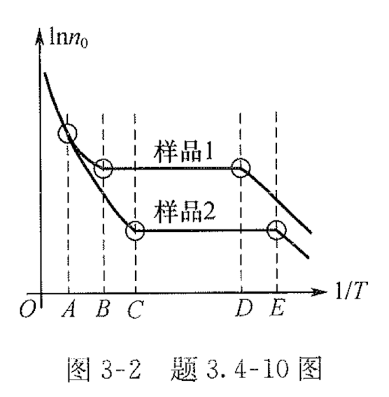
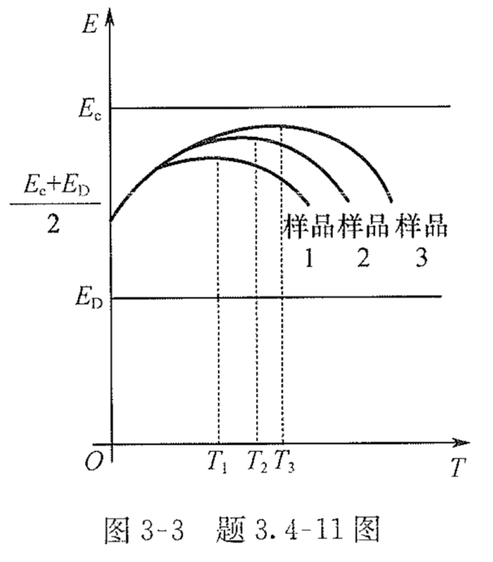

# 3-半导体中载流子的统计分布

## TODO

update: 2024-06-25: yanfen group chat messages

* [ ] 第三章习题册：
  * [x] 简答题：1、2、3、4、6、7、9、10、11、12、13、19.

## 半导体物理刘恩科书后习题

### 书后习题 3.1

1 计算能量在 $E = E_c$ 到 $E = E_c + 100 (\pi \hbar^2 / 2 m_n^* L^2)$ 之间单位体积中的量子态数。

### 书后习题 3.7

7（1）在室温下，锗的有效态密度 $N_c = 1.05 \times 10^{19} \, \mathrm{cm}^{-3}$，$N_v = 0.39 \times 10^{19} \, \mathrm{cm}^{-3}$，求锗的载流子有效质量 $m_n^*$ 和 $m_p^*$。计算 $77K$ 时的 $N_c$ 和 $N_v$。已知 $300K$ 时，$E_g = 0.67 \, \mathrm{eV}$。$77K$ 时，$E_g = 0.76 \, \mathrm{eV}$。求这两种温度下锗的本征载流子浓度。
（2）$77K$ 时，锗的电子浓度为 $10^{17} \, \mathrm{cm}^{-3}$，假定受主浓度为零，而 $E_c - E_D = 0.01 \, \mathrm{eV}$，求锗中施主浓度 $N_D$。

7【答】

(1) 由 $N_c = 1.05 \times 10^{19} \, \mathrm{cm}^{-3}$，$N_v = 0.39 \times 10^{19} \, \mathrm{cm}^{-3}$，$E_g = 0.67 \, \mathrm{eV}$，可得

$$
N_c = 2 \frac{(2 \pi m_n^* k_0 T)^{\frac{3}{2}}}{h^3} \\
\Rightarrow m_n^* = \frac{2 \pi \hbar^2}{ k_0 T} \left(\frac{N_c}{2}\right)^{\frac{2}{3}} = 0.56 m_0 \\
= 5.1 \times 10^{-31} \, \mathrm{kg}
$$

$$
N_v = 2 \frac{(2 \pi m_p^* k_0 T)^{\frac{3}{2}}}{h^3} \\
\Rightarrow m_p^* = \frac{2 \pi \hbar^2}{ k_0 T} \left(\frac{N_v}{2}\right)^{\frac{2}{3}} = 0.29 m_0 \\
= 2.6 \times 10^{-31} \, \mathrm{kg}
$$

在 77K 时

$$
\frac{N_c^{'}(77k)}{N_c(300k)} = \left(\frac{T^{'}(300k)}{T(77k)}\right)^{\frac{3}{2}}
$$

$N_c^{'}(77k) = N_c \times \sqrt{\left(\frac{77}{300}\right)^{3}} = 1.37 \times 10^{18} \, \mathrm{cm}^{-3}$
$N_v^{'}(77k) = N_v \times \sqrt{\left(\frac{77}{300}\right)^{3}} = 0.508 \times 10^{18} \, \mathrm{cm}^{-3}$

(2)

$$
n_i = (N_c N_v)^{\frac{1}{2}} \exp\left(- \frac{E_g}{k_0 T}\right)
$$

在 300K 时，$n_i = 1.7 \times 10^{13} \, \mathrm{cm}^{-3}$；
在 77K 时，$n_i = 1.98 \times 10^{7} \, \mathrm{cm}^{-3}$。

$$
\begin{align*}
  n_0
  &= \frac{N_{\text{D}}}{1 + 2 \exp\left(-\frac{E_D - E_F}{k_0 T}\right)} \\
  &= \frac{N_{\text{D}}}{1 + 2 \exp\left(-\frac{E_\text{D} - E_\text{C} + E_\text{C} - E_\text{F}}{k_0 T}\right)} \\
  &= \frac{N_{\text{D}}}{1 + 2 \exp\left(-\frac{E_\text{D} - E_\text{C}}{k_0 T} \cdot \frac{n_0}{N_c}\right)} \\
\end{align*}
$$

于是有

$$
\begin{align*}
  N_D
  &= n_0 \left(1 + 2 \exp\left(-\frac{E_D - E_C}{k_0 T} \cdot \frac{n_0}{N_c}\right)\right) \\
  &= 10^{17} \left(1 + 2 \exp\left(-\frac{0.01}{k_0 \cdot 77} \cdot \frac{10^{17}}{1.37 \times 10^{18}}\right)\right) \\
  &= 1.17 \times 10^{17} \, \mathrm{cm}^{-3}
\end{align*}
$$

### 书后习题 3.12

若硅中施主杂质电离能  $ \Delta E_{D} = 0.04 \, \text{eV} $ ，施主杂质浓度分别为  $ 10^{15} \, \text{cm}^{-3} $  和  $ 10^{18} \, \text{cm}^{-3} $ 。计算：

1. $ 99\% $  电离时的温度；
2. $ 90\% $  电离时的温度；
3. $ 50\% $  电离时的温度。

### 书后习题 3.13

有一块掺磷的n型硅， $ N_{D} = 10^{15} \, \text{cm}^{-3} $ ，分别计算温度为：

1. $ 77 \, \text{K} $ ；
2. $ 300 \, \text{K} $ ；
3. $ 500 \, \text{K} $ ；
4. $ 800 \, \text{K} $  时导带中电子浓度（本征载流子浓度数值查图 3-7）。

13【答】

(1) 77K 时 -> 低温弱电离区

$n_0 = \left(\frac{N_D N_C}{2}\right)^{2} \exp\left(-\frac{E_D - E_F}{k_0 T}\right)$

......

TODO: 补全答案

(2) 300K 时，$n_i = 1.0 \times 10^{10} \, \mathrm{cm}^{-3} \ll N_D = 10^{15} \, \mathrm{cm}^{-3}$ -> 强电离区

此时 $n_0 \approx N_D = 10^{15} \, \mathrm{cm}^{-3}$

(3) 500K 时，$n_i = 4 \times 10^{14} \, \mathrm{cm}^{-3}$ -> 过渡区

此时 $n_0 = \frac{N_D + \sqrt{N_D + 4 n_i^2}}{2} = 1.14 \times 10^{15} \, \mathrm{cm}^{-3}$

(4) 800K 时，$n_i = 1.0 \times 10^{17} \, \mathrm{cm}^{-3} \gg N_D = 10^{15} \, \mathrm{cm}^{-3}$ -> 本征激发区

$n_0 \approx n_i = 1.0 \times 10^{17} \, \mathrm{cm}^{-3}$

### 书后习题 3.14

14、计算含有施主杂质浓度  $N_{D} = 9 \times 10^{15} \, \text{cm}^{-3} $  及受主杂质浓度为  $N_{A} = 1.1 \times 10^{16} \, \text{cm}^{-3} $  的硅在  $ 300 \, \text{K} $  时的电子和空穴浓度以及费米能级的位置。

14【答】

T = 300K时，Si的本征载流子浓度 $n_i = 1.5 \times 10^{10} \, \mathrm{cm}^{-3}$

掺杂浓度远大于本征载流子浓度，处于强电离饱和区

$p_0 = N_A - N_D = 2 \times 10^{15} \, \mathrm{cm}^{-3}$

$n_0 = \frac{n_i^2}{p_0} = 1.125 \times 10^{10} \, \mathrm{cm}^{-3}$

$$
E_F = E_v - k_0 T \ln\left(\frac{p_0}{N_v}\right) = 0.224 \, \mathrm{eV}
$$

### 书后习题 3.15

15、掺有浓度为每立方米  $10^{22}$  硼原子的硅材料，分别计算：

1. $ 300 \, \text{K} $ ；
2. $ 600 \, \text{K} $  时费米能级的位置及多子和少子浓度（本征载流子浓度数值查图 3-7）。

15【答】

(1) 300K 时，$n_i = 1.5 \times 10^{10} \, \mathrm{cm}^{-3}$ 杂质全部电离

$p_0 = 10^{16} \, \mathrm{cm}^{-3}$

$n_0 = \frac{n_i^2}{p_0} = 2.25 \times 10^{4} \, \mathrm{cm}^{-3}$

$$
E_F - E_i = -k_0 T \ln\left(\frac{p_0}{n_i}\right) = -0.359 \, \mathrm{eV}
$$

或

$$
E_F - E_v = -k_0 T \ln\left(\frac{p_0}{N_v}\right) = −0.184 \, \mathrm{eV}
$$

(2) 600K 时，$n_i = 1 \times 10^{16} \, \mathrm{cm}^{-3}$ 处于过渡区

$p_0 = n_0 + N_A$

$n_0 p_0 = n_i^2$

$p_0 = 1.62 \times 10^{16} \, \mathrm{cm}^{-3}$

$n_0 = 6.17 \times 10^{15} \, \mathrm{cm}^{-3}$

$$
E_F - E_i = -k_0 T \ln\left(\frac{p_0}{n_i}\right) = -0.025 \, \mathrm{eV}
$$

## 半导体物理学习题集习题

### 3.1 名词解释

状态密度

状态密度有效质量

费米能级

电子的费米分布函数

导带的有效状态密度

价带的有效状态密度

本征半导体

非简并半导体

简并半导体

低温载流子冻析效应

禁带

变窄效应

---

#### 状态密度

将能带分为一个一个能量很小的间隔来处理，假定在能带中能量 \(E \sim (E + dE)\) 之间无限小的能量间隔内有 \(dZ\) 个量子态，则状态密度 \(g(E) = \frac{dZ}{dE}\)，即在能带中能量 \(E\) 附近每单位能量间隔内的量子态数。

#### 状态密度有效质量

为了方便讨论，导带底不在布里渊区中心的半导体（如硅）中载流子的能态密度函数，还引入了所谓状态密度有效质量。这种半导体的导带底等能面是旋转椭球面，则其中电子的有效质量不是一个分量（有一个纵向有效质量 \(m_{l}\) 和两个横向有效质量 \(m_{t}\)）；这种非球形导带底的能态密度分布函数比较复杂，但是如果把电子有效质量代换为所谓状态密度有效质量 \(m_{n}^{*} = m_{dn} = s^{2/3} \left(m_{l} m_{t}^{2}\right)^{1/3}\)，则可认为它的能态密度分布函数为球形等能面。对于价带顶附近的情况，可同样求得相同形式的能态密度分布函数，并且空穴的状态密度有效质量为 $m_{\mathrm{p}}^{*} = m_{\mathrm{dp}} = \left[\left(m_{\mathrm{p}}\right)_{l} + \left(m_{\mathrm{p}}\right)_{h}\right]^{2/3}$。

#### 费米能级

费米能级等于费米子系统在趋于热力学温度零度时的化学势，也可以理解成热力学温度零度时固体能带中充满电子的最高能级，它标志了电子填充能级的水平，常用 \(E_{F}\) 表示。

#### 电子的费米分布函数

是描写热平衡状态下，电子在允许的量子态上如何分布的一个统计分布函数，即表示一个电子占据能量为 \(E\) 的一个量子态的概率，其值为0~1，其函数形式为：

\[
f(E) = \frac{1}{1 + \exp\left[\frac{(E - E_{F})}{k_{0}T}\right]}
\]

#### 导带的有效状态密度

按照玻耳兹曼分布函数，电子在导带内占据量子态的概率随量子态具有的能量升高而迅速下降，可以近似认为导带中的所有量子态都集中在导带底 \(E_{c}\) 附近，因此，导带的有效状态密度也就是导带的有效能级密度。

#### 价带的有效状态密度

按照玻耳兹曼分布函数，空穴在价带内占据量子态的概率随量子态具有的能量升高而迅速下降，可以近似认为价带中的所有量子态都集中在价带顶 \(E_{s}\) 附近，因此，价带的有效状态密度也就是价带的有效能级密度。

#### 本征半导体

完全不含杂质且无晶格缺陷的纯净半导体，称为本征半导体。

#### 非简并半导体

是指掺入一定量杂质的半导体，其电子系统服从玻耳兹曼统计律。

对于n型半导体，有 \(E_{c} - E_{F} > 2k_{0}T\)；对于p型半导体，有 \(E_{F} - E_{v} > 2k_{0}T\)。

#### 简并半导体

是杂质半导体的一种，它具有较高的掺杂浓度，其电子系统服从费米统计律。对于n型半导体，导带底附近的量子态基本上已被电子占据，有 \(E_{c} - E_{F} \leqslant 0\)；对于p型半导体，价带顶附近的量子态基本上已被空穴占据，有 \(E_{F} - E_{v} \leqslant 0\)。

#### 低温载流子冻析效应

在温度低于100K时，施主或受主杂质只有部分电离，尚有部分载流子被冻析在杂质能级上，对导电没有贡献，这种现象称为低温载流子冻析效应。

#### 禁带变窄效应

当杂质浓度较高时，杂质原子之间电子波函数发生交叠，使孤立的杂质能级扩展为杂质能带，导致杂质电离能减少，杂质能带进入了导带或价带，并与导带或价带相连，形成了新的简并能带，使能带的状态密度发生了变化，简并能带的尾部伸入禁带中，导致禁带宽度减小。这种由于重掺杂导致禁带宽度变窄的效应称为禁带变窄效应。

### 3.4 简答题

#### 3.4.1 简答题

1、简述半导体的热平衡状态。（中国科学院大学 2013 考研真题）

1、【答】一定的温度下，若没有受到外界作用(即无光照、电压、电场、磁场和温度梯度等)，半导体的导电电子和空穴是依靠电子的热激发作用雨产生的，电子从不断振动的晶格中获得一定的能量，就可能从低能量的量子态跃迁到高能量的量子态，主要方式是本征激发电子从价带跃迁到导带形成导带电子和价带空穴，以及电子从施主能级跃迁到导带产生导电电子和电子从价带激发到受主能级产生空穴；同时，电 子也会从高能量的量子态跃迁到低能量的量子态，向晶格释放一定的能量，使导带电子、价带空穴不断减少，这一过程称为载流子复合。在一定温度下，两个相反过程建立起动态平衡，称为热平衡状态。

#### 3.4.2 简答题

2、写出导带状态密度 $g_c(E)$ 和价带状态密度 $g_v(E)$ 表达式，式中 $m_n^*$ 和 $m_p^*$ 分别称为什么？对硅、锗和砷化镓，分别说明 $m_n^*$ 和 $m_p^*$ 含义是否相同，为什么？（西安电子科技大学 2013 年考研真题）

2、【答】硅、锗的导带状态密度分别为

$$
g_c(E) = \frac{V}{2 \pi^2} \frac{\left(2 m_n^*\right)^{3/2}}{\hbar^3} \sqrt{E - E_c}
$$

其中，$m_n^* = m_{dn} = s^{3/2} (m_l m_t^2)^{1/3}$ 为导带底电子状态密度有效质量，$m_l$ 和 $m_t$ 分别为电子的纵向和横向有效质量。s 为晶格常数，硅、锗的价带状态密度分别为 6 和 4.

硅、锗的价带状态密度分别为

$$
g_v(E) = \frac{V}{2 \pi^2} \frac{\left(2 m_p^*\right)^{3/2}}{\hbar^3} \sqrt{E_v - E}
$$

其中，$m_p^* = m_{\mathrm{dp}} = s^{3/2} \left[(m_p)_l^{3/2} + (m_p)_h^{3/2}\right]^{2/3}$ 为价带顶空穴状态密度有效质量。

对于 $m_{\mathrm{p}}^{*}$，硅、锗和砷化镓三者含义相同，因为三者的价带均由一个重空穴带、一个轻空穴带和一个自旋一轨道耦合分裂出来的第三能带构成；对于 $m_{n}^{*}$，硅、锗导带底附近等能面为旋转的椭球面，各向异性；而砷化镓导带底附近等能面为球面，各向同性。

#### 3.4.3 简答题

3、费米能级的物理意义是什么？当 $E - E_\text{F} \gg kT$ 时，就可以把电子从服从费米统计分布转化为服从玻耳兹曼统计分布，为什么？两者的区别是什么？（西安电子科技大学 2013、2017 年考研真题）

3、【答】费米能级 $E_\text{F}$ 等于费米子系统在趋于热力学零度时的化学势，也可以理解为温度为热力学零度时固体能带中充满电子的最高能级。当 $E - E_\text{F} \gg k_0 T$ 时，有 $\exp[(E-Er)/(k_0 T)]\gg 1$，电子从服从费米统计分布转化服从玻耳兹曼统计分布；费米统计分布主要适用于杂质浓度较高的简并半导体，玻耳兹曼统计分布主要适用于杂质浓度较低的非简并半导体。

#### 3.4.4 简答题

4、一个能量为 $E$ 的独立量子态被一个电子占据的概率为 $f(E)$，称 $f(E)$ 为费米分布函数。

(1) 请写出费米分布函数表达式，指出电子占据某一能级概率与哪些因素有关，推出空穴占据能量为 $E$ 的量子态的概率表达式。
(2) 图 3-1 中 A、B、C 是 3 种材料的导带状态密度 $g_c(E)$ 和价带状态密度 $g_v(E)$ 曲线，不同温度下的 $f(E)$ 曲线，请指出它们的温度高低顺序。（西安电子科技大学 2009 年考研真题）

4、【答】

（1）费米分布函数表达式 $f(E) = \frac{1}{1 + \exp(\frac{E - E_\text{F}}{k_0 T})}$，电子占据某一能级的概率主要与能级能量、费米能级及温度有关。
空穴占据能量为E的量子态的概率表达式

$$
1 - f(E) = \frac{1}{1 + \exp(\frac{E_\text{F} - E}{k_0 T})}
$$

（2） 曲线 A、B、C的顺序为低温到高温的过程。

#### 3.4.6 简答题

6、在半导体材料中，费米能级的位置受哪些因素的影响？变化趋势怎样？

6、【答】费米能级的位置受半导体材料的温度、导电类型、杂质含量及能量零点的选取等因素的影响。对于n型半导体，当杂质浓度升高时，费米能级向导带底Ec移动；对于p型半导体，费米能级的位置随杂质浓度的增加向价带顶 $E_\text{v}$ 移动；无论是n型半导体、p型半导体，费米能级均会随温度的增加向本征费米能级移动。

#### 3.4.7 简答题

7、对只有一种施主杂质的 $n$ 型半导体：

1. 导出在低温弱电离条件下 $n_0$ 和 $E_\text{F}$ 的表达式
2. 试述测定施主杂质电离能 $\Delta E_D$ 实验的理论基础。

7、【答】
(1) 对于n型半导体，在低温弱电离区电子浓度为$n_0 = n_D^+$，即

$$
n_0 = N_c \exp\left(-\frac{E_c - E_\text{F}}{k_0 T}\right) = \frac{N_D}{1 + 2\exp\left(\frac{E_D - E_\text{F}}{k_0 T}\right)}
$$

因为杂质远比 $N_D$ 小，所以 $\exp(-\frac{E_\text{F} - E_D}{k_0 T}) \gg 1$，则有

$$
N_c \exp\left(-\frac{E_c - E_\text{F}}{k_0 T}\right) = \frac{1}{2} N_D \exp\left(-\frac{E_D - E_\text{F}}{k_0 T}\right)
$$

两边取对数化简得

$$
E_\text{F} = \frac{1}{2}(E_c + E_D) + \frac{1}{2}k_0 T \ln\left(\frac{N_D}{2N_c}\right)
$$

故有

$$
n_0 = \left(\frac{N_D N_c}{2}\right)^{1/2} \exp\left(-\frac{E_D - E_\text{F}}{2 k_0 T}\right) = \left(\frac{N_D N_c}{2}\right)^{1/2} \exp\left(-\frac{\Delta E_D}{2 k_0 T}\right)
$$

(2) 根据以上计算公式及 $N_c \propto T^{3/2}$，设 $A$ 是一个与温度无关的常数，则有

$$
n_0 = \left(\frac{N_D N_c}{2}\right)^{1/2} \exp\left(-\frac{\Delta E_D}{2 k_0 T}\right) = A T^{-3/4} \exp\left(-\frac{\Delta E_D}{2 k_0 T}\right)
$$

对两边同时取对数，则有

$$
\ln A^{-1} n_0 T^{- 3/4} = -\frac{\Delta E_D}{2 k_0 T}
$$

测定低温弱电离区的霍耳系数和电导率，从而得到低温范围内多子载流子的浓度，作出 $\ln A^{-1} n_0 T^{-3/4} \sim 1/T$ 关系直线，从直线斜率 $-\Delta E_D/(2 k_0)$ 可求出施主杂质电离能 $\Delta E_D$。

#### 3.4.9 简答题

9、电子浓度 $n_0 = N_c \exp(-\frac{E_c - E_\text{F}}{k_0 T})$ 在什么条件下使用？$N_c$ 称做什么？与哪些因素有关？（西安电子科技大学 2011 年考研真题）

9、【答】电子浓度 $n_0 = N_c \exp(-\frac{E_c - E_\text{F}}{k_0 T})$ 中，$\exp(-\frac{E_c - E_\text{F}}{k_0 T})$ 称为电子的玻耳兹曼分布函数，应用于半导体载流子浓度不太高，$(E_c - E_\text{F}) \gg k_0 T$ 情况下，在温度为 $T$ 时平衡状态下的载流子计算。$N_c$ 称为导带底有效态密度，受电子有效质量、温度等因素的影响，并与二者成 $3/2$ 幂的指数关系。

#### 3.4.10 简答题

10、掺有相同杂质但浓度不同的两个 $n$ 型半导体硅样品，其电子浓度和温度的关系曲线如图 3-2 所示。请就以下问题加以说明：

(1) 样品 1 和样品 2 哪个掺杂更高？
(2) 在 $T_{A}$ 以左区域两条曲线重合；
(3) $T_{C}$ 和 $T_{D}$ 之间两条曲线平行；
(4) $T_{B}$ 在 $T_{C}$ 左边；
(5) $T_{E}$ 在 $T_{D}$ 右边；
(6) 在 $T_E$ 以右区域曲线斜率相同，此时的斜率表示什么？（西安电子科技大学 2013 年考研真题）

10、【答】

1. 相比样品 2，样品 1 浓度更高，主要因为在强电离区，多子电子的浓度近似等于杂质浓度。样品 1 的电子浓度比样品 2 高，故杂质浓度较高。
2. 在 \( T_A \) 以左区域，为高温本征激发区，在该区域载流子的浓度随温度的升高而迅速增加，本征激发产生的载流子数远多于杂质电离产生的载流子数。
3. \( T_{C} \) 和 \( T_{D} \) 之间为强电离区，杂质全部电离，本征激发没有开始，载流子的数量不发生变化，故两条曲线趋向于平行。
4. 样品的杂质浓度较高，产生本征激发的温度也相对较高；相比样品 2，样品 1 的杂质浓度大，产生本征激发的温度相对较高，故 \( T_{B} \) 在 \( T_{C} \) 左边。
5. 样品的杂质浓度较高，达到强电离的温度也相对较高；相比样品 2，样品 1 的杂质浓度大，故达到强电离时的温度较高，\( T_{E} \) 在 \( T_{D} \) 右边。
6. 根据低温弱电离区电子浓度

\[ n_0 = \left(\frac{N_{D} N_{c}}{2}\right)^{1/2} \exp\left(-\frac{\Delta E_{D}}{2 k_0 T}\right) \]

已知 \( N_{c} \propto T^{3/2} \)，设 A 是一个与温度无关的常数，则有

\[ n_0 = A T^{3/4} \exp\left(-\frac{\Delta E_{D}}{2 k_0 T}\right) \]

对两边求对数，函数 \( \ln A^{-1} n_0 T^{-3/4} \sim 1/T \) 关系曲线在 \( T_{E} \) 以右区域（低温弱电离区）的曲线斜率为 \( -\Delta E_{D} / (2 k_0) \)，相同杂质在同种半导体材料中电离能 \( \Delta E_{D} \) 相等，故斜率相等。

#### 3.4.11 简答题

11、处于低温弱电离区的n型半导体：

(1) 指出低温弱电离的含义，列出此时的电中性条件；
(2) 如果3块不同施主浓度的样品在低温弱电离区的 $E_\text{F} - T$ 关系曲线如图3-3所示，请指出它们的施主浓度高低顺序。（西安电子科技大学2009年考研真题）

11、【答】

(1) 当温度很低时，大部分施主杂质能级仍为电子所占据，只有很少量施主杂质发生电离，这少量的电子进入了导带，这种情况称为弱电离。

电中性条件 $n_0 = N_D^+$

(2) 杂质含量越高，$E_\text{F}$ 达到极值的温度越高，故样品 1 2 3 的施主浓度由低到高。

#### 3.4.12 简答题

12、n型半导体硅在强电离区电子浓度等于施主杂质浓度，讨论在强电离区少子浓度是否随温度变化？如果少子浓度是变化的，在器件或集成电路中是否有益？为什么？（西安电子科技大学2013年考研真题）

12、【答】当 $n_0 = N_D$ 时，根据 $n_0 p_0 = n_i^2$，有 $p_0 = n_i^2 / N_D$，即少子浓度随温度变化。

#### 3.4.13 简答题

13、相比锗，为什么硅半导体器件具有更高的工作温度？为什么半导体器件会有一个极限工作温度？对于一个n型硅器件，若其杂质浓度为 $N_D$，如何大致判定其最高工作温度？

13、【答】相比锗，硅半导体材料的禁带宽度更大，其对应的器件具有更高的工作温度。
当温度足够高时，本征激发占主导地位，器件将不能正常工作。因此，每种半导体材料制成的器件都有一定的极限工作温度。为了保证器件的正常工作，必须保证载流子主要来源于杂质电离，要求本征载流子浓度至少比杂质浓度低一个数量级，故有

$$
n_i = \sqrt{N_c N_v} \exp\left(-\frac{E_g}{2 k_0 T}\right) < 0.1 N_D
$$

则有

$$
T < \frac{E_g}{2 k_0 [\ln(10) (N_c N_v)^{1/2} - \ln N_D]}
$$

故此，可以大致判定器件的最高工作温度。

#### 3.4.19 简答题

19、重掺杂半导体的能带结构有什么特点? 试解释重掺杂半导体使禁带变窄的原因。

19、【答】当掺杂的浓度较低时，杂质之间的相互作用可以忽略，某一种杂质的施主能级是一些具有相同能量的孤立能级。对于重掺杂的半导体，杂质原子相互间就比较靠近，导致杂质原子波函数交叠，使孤立的杂质能级扩展杂质能带，从而使杂质电离能减少，杂质能带进入导带或价带，并与导带或价带相连，形成新的简并能带，能带的状态密度发生了变化，简并能带的尾部伸入禁带中，导致禁带宽度减小。

### 3.5 计算题
