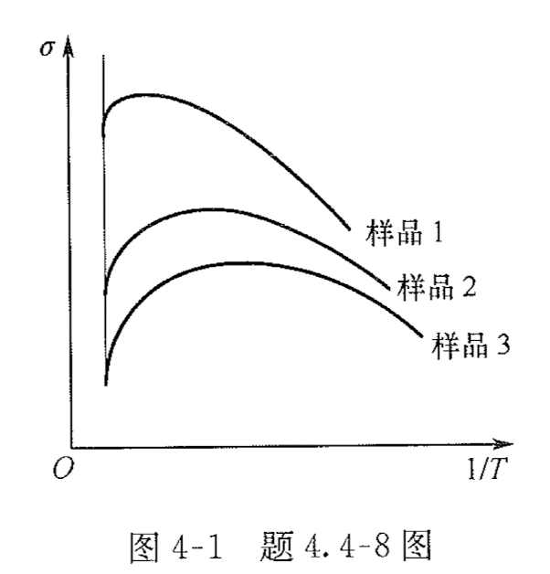
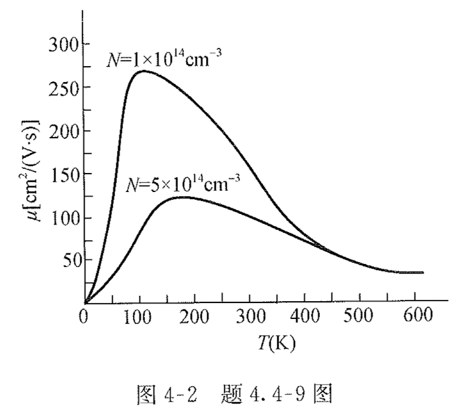
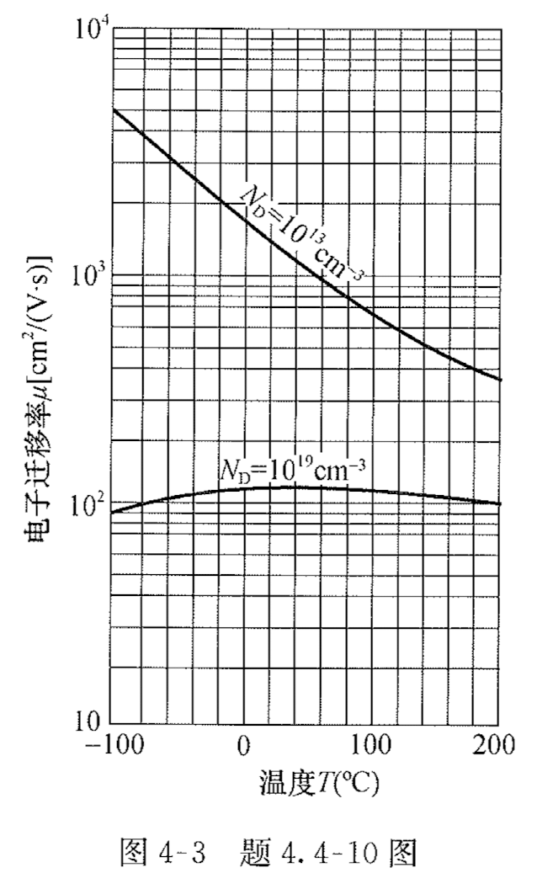
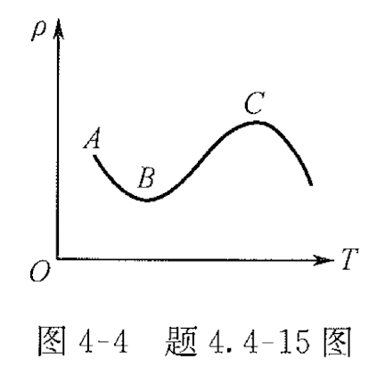
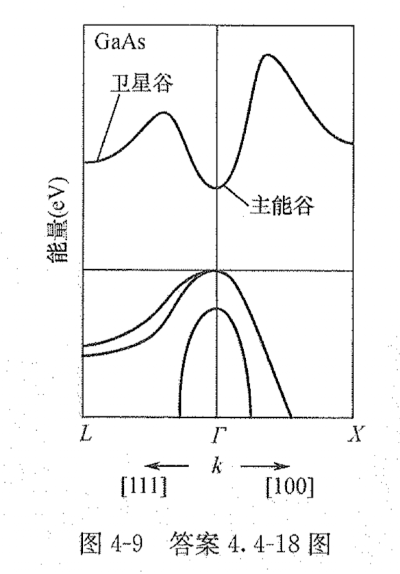

# 4-半导体的导电性

## TODO

update: 2024-06-25: yanfen group chat messages

* [ ] 第四章习题册：
  * [x] 简答题：1、2、3、4、5、6、7、8、9、10、11、12、14、15、16、18、19、20
  * [x] 计算题：3、4、7、14、15、16

## 半导体物理刘恩科书后习题

1、300K 时，Ge 的本征电阻率为 $47 \, \Omega \cdot \mathrm{cm}$，如电子和空穴迁移率分别为 $3800 \, \mathrm{cm}^2/(\mathrm{V} \cdot \mathrm{s})$ 和 $1800 \, \mathrm{cm}^2/(\mathrm{V} \cdot \mathrm{s})$，试求本征 Ge 的载流子浓度。

---

2、试计算本征 Si 在室温时的电导率，设电子和空穴迁移率分别为 $1450 \, \mathrm{cm}^2/(\mathrm{V} \cdot \mathrm{s})$ 和 $500 \, \mathrm{cm}^2/(\mathrm{V} \cdot \mathrm{s})$。
当掺入百万分之一的 As 后，设杂质全部电离，试计算其电导率。比本征 Si 的电导率增大了多少倍？

---

3、电阻率为 $10^2 \, \Omega \cdot \mathrm{cm}$ 的 p 型 Si 样品，试计算室温时多数载流子和少数载流子浓度。

---

4、0.1kg 的 Ge 单晶，掺有 $3.2 \times 10^{20} \, \mathrm{kg}$ 的 Sb，设杂质全部电离，试求该材料的电阻率 【设 $p_n = 0.38 \, \mathrm{m}^2/(\mathrm{V} \cdot \mathrm{s})$，Ge 单晶的密度为 $5.32 \, \mathrm{g/cm}^3$。Sb 原子量为 $121.8$】。

---

5、500g 的 Si 单晶，掺有 $4.5 \times 10^{-6} \, \mathrm{g}$ 的 B，设杂质全部电离，试求该材料的电阻率 【设 $p = 500 \, \mathrm{cm}^2/(\mathrm{V} \cdot \mathrm{s})$，硅单晶的密度为 $2.33 \, \mathrm{g/cm}^3$，B 原子量为 $10.8$】。

---

6、设电子迁移率为 $0.1 \, \mathrm{m}^2/(\mathrm{V} \cdot \mathrm{s})$，Si 的电导有效质量 $m^* = 0.26 m_0$，加以强度 $10^4 \, \mathrm{V/m}$ 的电场，试求平均自由时间和平均自由程。

---

7、长为 $2 \, \mathrm{cm}$ 的具有矩形截面的 Ge 样品，截面线度分别 $1 \, \mathrm{mm}$ 和 $2 \, \mathrm{mm}$，掺有 $10^{22} \, \mathrm{m}^{-3}$ 受主，试求室温时样品的电导率和电阻。再掺入 $5 \times 10^{22} \, \mathrm{m}^{-3}$ 施主后，求室温时样品的电导率和电阻。

---

8、截面积为 $0.001 \, \mathrm{cm}^2$ 的圆柱形纯 Si 样品，长 $1 \, \mathrm{mm}$，接于 $10 \, \mathrm{V}$ 的电源上，室温下希望通过 $0.1 \, \mathrm{A}$ 的电流，问：

1. 样品的电阻是多少？
2. 样品的电导率应是多少？
3. 应该掺入浓度为多少的施主？

---

9、试从图 4-14（a）计算【8】

1. 本征硅的电阻率。
2. 非补偿的 n 型硅杂质浓度为 $10^{17} \, \mathrm{cm}^{-3}$ 时的电阻率（设杂质全电离）。
3. 非补偿的 p 型硅杂质浓度为 $10^{17} \, \mathrm{cm}^{-3}$ 时的电阻率（设杂质全电离）。

---

10、试求本征 Si 在 $473 \, \mathrm{K}$ 时的电阻率。

---

11、截面积为 $10^{-3} \, \mathrm{cm}^2$，掺有浓度 $10^{13} \, \mathrm{cm}^{-3}$ 的 p 型 Si 样品，样品内部加有强度为 $10^3 \, \mathrm{V/cm}$ 的电场，求：

1. 室温时样品的电导率及流过样品的电流密度和电流。
2. $400 \, \mathrm{K}$ 时样品的电导率及流过样品的电流密度和电流。

---

12、试从图 4-14（a）求室温时杂质浓度分别为 $10^{16}$，$10^{17}$，$10^{18} \, \mathrm{cm}^{-3}$ 的 p 型和 n 型 Si 样品的多子空穴和电子迁移率，并分别计算它们的电阻率。再从图 4-15（b）分别求它们的电阻率。

---

13、掺有 $1.1 \times 10^{16}$ 硼原子 $\mathrm{cm}^{-3}$ 和 $9 \times 10^{15}$ 磷原子 $\mathrm{cm}^{-3}$ 的 Si 样品，试计算室温时多数载流子和少数载流子浓度及样品的电阻率。

---

14、截面积为 $0.6 \, \mathrm{cm}^2$、长为 $1 \, \mathrm{cm}$ 的 n 型 GaAs 样品，设 $\mu_n = 8000 \, \mathrm{cm}^2/(\mathrm{V} \cdot \mathrm{s})$，$n = 10^{15} \, \mathrm{cm}^{-3}$，试求样品的电阻。

---

15、施主浓度分别为 $10^{14}$ 和 $10^{17} \, \mathrm{cm}^{-3}$ 的两个 Ge 样品，设杂质全部电离。

1. 分别计算室温时的电导率。
2. 若两个 GaAs 样品，分别计算室温时的电导率。

---

16、分别计算掺有下列杂质的 Si，在室温时的载流子浓度、迁移率和电阻率：

1. 硼原子 $3 \times 10^{15} \, \mathrm{cm}^{-3}$；
2. 硼原子 $1.3 \times 10^{16} \, \mathrm{cm}^{-3}$ + 磷原子 $1.0 \times 10^{16} \, \mathrm{cm}^{-3}$；
3. 磷原子 $1.3 \times 10^{16} \, \mathrm{cm}^{-3}$ + 硼原子 $1.0 \times 10^{16} \, \mathrm{cm}^{-3}$；
4. 磷原子 $3 \times 10^{15} \, \mathrm{cm}^{-3}$ + 镓原子 $1 \times 10^{17} \, \mathrm{cm}^{-3}$ + 砷原子 $1 \times 10^{17} \, \mathrm{cm}^{-3}$。

---

17、

1. 证明当 $\mu_n = \mu_p$ 且电子浓度 $n = n_i \sqrt{\mu_p/\mu_n}$，$p = n_i \sqrt{\mu_n/\mu_p}$ 时，材料的电导率最小，并求 $\sigma_{\min}$ 的表达式；
2. 试求 $300 \, \mathrm{K}$ 时 Ge 和 Si 样品的最小电导率的数值，并和本征电导率相比较。

---

18、InSb 的电子迁移率为 $7.5 \, \mathrm{m}^2/(\mathrm{V} \cdot \mathrm{s})$，空穴迁移率为 $0.075 \, \mathrm{m}^2/(\mathrm{V} \cdot \mathrm{s})$，室温时本征载流子浓度为 $1.6 \times 10^{16} \, \mathrm{cm}^{-3}$，试分别计算本征电导率，电阻率和最小电导率、最大电阻率。什么导电类型的材料电阻率可达最大？

## 半导体物理学习题集习题

### 4.1 名词解释

迁移率

自由时间

电离杂质散射

晶格振动散射

等同的能谷间散射

位错散射

平均自由程

平均自由时间

电导有效质量

多能谷散射

负微分迁移率

负阻效应

#### 电离杂质散射

施主杂质电离后是一个带正电的离子，受主杂质电离后是一个带负电的离子。在电离施主或电离受主周围形成一个库仑势场，这一库仑势场局部地破坏了杂质附近的周期性势场，而载流子运动到电离杂质附近时，使其运动速度和方向均发生改变，即为电离杂质散射。

#### 晶格振动散射

在一定温度下，晶体中原子都各自在其平衡位置附近做微振动，载流子在半导体中运动时，会不断地与这些热振动着的晶格原子发生碰撞，这种由于晶格热振动的碰撞使载流子速度的大小及方向不断地改变即为晶格振动散射，主要包括光学波和声学波散射，其中长纵光学波和长纵声学波在散射中起着主要作用。长纵光学波在离子性晶体中形成疏密相间区域时会造成半个波长区域带正电，另半个波长区域带负电，带正负电区域产生电场，形成一个附加势场；而长纵声学波会造成原子分布的疏密变化，产生体变，即疏处体积膨胀、密处压缩，产生附加势场。这两种附加势场破坏了原来势场的严格周期性，从而产生散射。

#### 等同的能谷间散射

硅的导带具有极值能量相同的6个旋转椭球等能面（锗有4个），载流子在这些能谷中分布相同，这些能谷称为等同的能谷；电子在这种多能谷半导体中从一个极值附近散射到另一个极值附近的散射，即为等同的能谷间散射。

#### 位错散射

在n型(p型)材料中，位错线俘获（释放）电子成为一串负电（正电）中心，其周围形成了一个圆柱形正（负）空间电荷区，其内部存在的电场就是引起载流子散射的附加势场。位错散射具有各向异性，电子垂直于空间电荷圆柱体运动时将受到散射。

#### 平均自由程

半导体中的载流子相邻两次碰撞之间的平均距离，即为载流子的平均自由程。

#### 平均自由时间

载流子在电场中做漂移运动时，只有在连续两次散射之间的时间内才做加速运动，这段时间称为自由时间。自由时间长短不一，若取极值多次而求得其平均值，则称为载流子的平均自由时间。

#### 电导有效质量

对于等能面是旋转椭球面的多极值半导体，沿晶体的不同方向，有效质量不同。例如，硅有6个极值，旋转椭球等能面，横向有效质量 \(m_{1}\) 和纵向有效质量 \(m_{1}\) ，引入电导有效质量 \( m_{c} \) ，关系为 \(m_{c} = \frac{3 m_{1} m_{1}}{2 m_{1} + m_{1}}\) ，引入之后载流子迁移率与有效质量的关系不变。

#### 多能谷散射

在电场作用下，电子从电场中获取能量，可在能谷间转移，即能谷间散射，电子的准动量有较大的改变，伴随散射发射或吸收光学声子。同时，电子的有效质量、迁移率、平均漂移速度、电导率都将发生变化。

#### 负微分迁移率

在电场强度达到 \(3.2 \times 10^3 \, \text{V/cm}\) 时，发生能谷间散射，并随散射发射或吸收一个光学声子。由于两个能谷不完全相同，从能谷1进入能谷2的电子有效质量大为增加，迁移率大大降低，平均漂移速度减小，电导率下降，出现微分负电导区，迁移率为负值。

#### 负阻效应

在n型的砷化镓和磷化铟(InP)等双能谷半导体中，在高电场作用下载流子获得足够的能量从低能谷转移到卫星谷，有效质量增加，迁移率下降，平均漂移速度减小，电导率下降，称为负阻效应。

#### 迁移率

表示单位电场强度下载流子的平均漂移速度，其大小为电场强度和载流子漂移速度的比值，单位为 \(m^2/(V \cdot s)\) 或 \(cm^2/(V \cdot s)\)。迁移率代表了载流子导电能力的大小。

### 4.4 简答题

#### 4.4.1 简答题

1、载流子迁移率的物理意义是什么?并说明其大小主要由哪些因素决定?(浙江大学 1996 年考研真题)

1、【答】迁移率是单位电场强度下载流子的平均漂移速度，是反映半导体中载流子导电能力的重要参数；同样的载流子浓度，载流子的迁移率越大，半导体的导电率越高。迁移率的大小不仅关系着导电能力的强弱，而且还直接决定着载流子运动的快慢，对半导体器件的工作频率有直接的影响。迁移率的大小取决于有效质量和散射概率，而有效质量和材料有关，散射概率取决于杂质浓度和温度。

#### 4.4.2 简答题

2、什么是散射概率?
什么是平均自由时间?
散射概率和平均自由时间的关系是怎样的?
半导体中载流子存在多种散射机构,在怎样的假设下多种散射机构同时存在条件下的散射概率可以简单直接相加?
(⻄安电子科技大学 2009 年考研真题)

2、【答】散射概率：用来描述散射的强弱，它代表单位时间内一个载流子受到散射的次数，其数值与散射机构有关。
平均自由时间：载流子在电场中做漂移运动时，只有在连续两次散射之间的时间内才做加速运动，这段时间称为自由时间。自由时间长短不一，若取极值多次而求得其平均值，则称为载流子的平均自由时间，常用 $\tau$ 来表示。
散射概率和平均自由时间互为倒数。
假设各个散射机制之间不相关，也就是认为散射是（近似）各自独立进行的，则多种散射机构同时存在条件下的散射概率就可以简单直接相加。

#### 4.4.3 简答题

3、从原子的振动方式来看,声学波和光学波有什么不同?

3、【答】声学波是原胞中原子沿同一方向振动，代表原胞质心的振动，振动频率相对较低；光学波是原胞中原子的振动方向相反，代表两个原子的相对振动，振动频率相对较高。

#### 4.4.5 简答题

5、半导体材料硅、锗和砷化镓在室温且较纯的情况下，比较电子迁移率大小顺序如何?试说明为什么对同一样品,电子迁移率 $\mu_n$ 和空穴迁移率 $\mu_p$ 两者并不相等?(⻄安电子科技大学 2010 年考研真题)

5、【答】硅、锗和砷化镓三种半导体材料在室温且较纯的情况下，电子迁移率大小顺序为 $\mu_{n(\mathrm{GaAs})} > \mu_{n(\mathrm{Ge})} > \mu_{n(\mathrm{Si})}$。根据公式，$\mu = \frac{q \tau}{m^*}$ 可知，迁移率与有效质量成反比，因为电子的有效质量小于空穴的有效质量，所以对于同一种样品，电子迁移率大于空穴迁移率。

#### 4.4.6 简答题

6、以硅杂质半导体为例,简述载流子的主要散射机构及迁移率随温度的变化规律。(⻄安交通大学 2005年 考研真题)

6、【答】对掺杂的硅，其主要散射机构包括电离杂质散射和长声学波散射。当杂质浓度较低时，可以忽略电离杂质散射的影响，即迁移率主要受晶格振动散射影响，随温度升高迁移率下降；当杂质浓度较高时，低温时晶格振动散射较弱，主要为电离杂质散射，即随温度升高迁移率缓慢增大；当高温时晶格振动加剧，主要为晶格振动散射，即高温时迁移率随温度升高而降低。

#### 4.4.7 简答题

7、向半导体中进行重掺杂施主杂质,简述这对半导体中的载流子分布、能带结构和迁移率的影响(室温,不考虑杂质补偿效应)。 (中国科学院大学2018年考研真题)

7、【答】对于n型重掺杂，费米能级进入或即将进入导带，一般为费米能级在导带底距离小于 $2k_0T$ 进入弱简并时，玻耳兹曼统计分布不再适用，要用费米统计分布，必须考虑泡利不相容原理。杂质浓度 $N_D$ 在 $10^{13}$ 量级以上，超出导带底状态密度 $N_c$。时，导带底能级基本被电子填满。杂质能级扩展为能带，杂质能级进入导带或价带，形成新的简并能带，使能带的状态密度发生变化，简并能带的尾部深入禁带中，导致禁带宽度变窄。

#### 4.4.8 简答题

8、图 4-1 是测量不同锗样品电导率随温度变化的结果,试分析说明。

8、【答】不同锗样品的电导率不同，主要由杂质浓度不同引起，杂质浓度越高，样品的电导率越大。随温度的变化不同，锗样品的电导率出现先增加后下降的趋势。在高温时，晶格散射是主要的，\(\mu_s \propto T^{-3/2}\)，所以样品的电导率随着温度的增加而减小；在低温时，电离杂质散射是主要的，\(\mu_i \propto T^{3/2}\)，所以样品的电导率随温度的减小而减小。每个样品都出现了温度转折点，对应着样品电导率随温度变化规律的改变。杂质浓度越大的样品，温度转折点越高，这说明对于杂质浓度大的样品，在较高温度下晶格散射比电离杂质散射明显。

#### 4.4.9 简答题

9、图 4-2 是两个样品的迁移率随温度变化的实验数据。指出在什么温度范围内电离杂质散射起主要作用? 指出两条曲线为什么在低温下分开,而在高温时趋于一致? (中国科学院半导体物理研究所 2001 年考研真题)

9、【答】

根据迁移率的定义可知迁移率的大小反比散射率，半导体起主要作用的散射机构为电离杂质和晶格振动散射。根据迁移率的计算公式

\[
\mu = \frac{q}{m^*} \frac{1}{A T^{3/2} + B N_i T^{-3/2}}
\]

当 \(A T^{3/2} + B N_{i} T^{-3/2}\) 具有极小值时，迁移率具有极大值，对温度求导

\[
\frac{d T}{d \mu} = \frac{3}{2} A T^{1/2} - \frac{3}{2} B N_{i} T^{-5/2} = 0
\]

可得 \(T = \sqrt[3]{\frac{B N_{i}}{A}}\)。那么对于电离杂质浓度 \(N_{i}\) 越高的半导体，迁移率 \(\mu\) 对应的温度也越高。在低温时，晶格振动较弱，电离杂质散射起主要作用；根据迁移率与电离杂质散射和温度的关系式 \(\mu_{i} \propto N_{i}^{-1} T^{3/2}\) 可知，当温度相同时，杂质浓度越高迁移率越小、杂质浓度越低迁移率越高；若杂质浓度相同，温度升高，迁移率迅速增大。随着温度的继续升高，晶格振动加剧，晶格散射起主要作用，即迁移率随温度升高而降低，并且随着杂质浓度的增加，迁移率下降趋势变得不大显著。故杂质浓度大的半导体迁移率曲线低于杂质浓度小的曲线，两条曲线分开。当温度大于 400K后，本征激发加剧，半导体表现出本征半导体相似的特性，迁移率曲线趋于一致。

#### 4.4.10 简答题

10、图 4-3 是根据实验结果得到的不同杂质浓度条件下硅中电子迁移率 $\mu_n$ 随温度的变化曲线,请分别解释这两种不同杂质浓度的n型样品的实验曲线。(⻄安电子科技大学2006年考研真题)

10、【答】根据掺杂半导体迁移率公式

\[
\mu = \frac{q}{m^*} \frac{1}{A T^{3/2} + \frac{B N_{i}}{T^{3/2}}}
\]

当杂质浓度 \(N_{D} = 10^{13} cm^{-3}\) 时，为轻掺杂半导体。因为 \(N_{i}\) 很小，故电离杂质散射项 \(\frac{B N_{i}}{T^{3/2}}\) 可略去，晶格散射起主要作用，迁移率随温度升高迅速减小。

当杂质浓度 \(N_{D} = 10^{19} cm^{-3}\) 时，为重掺杂半导体。在低温范围内，电离杂质散射项 \(\frac{B N_{i}}{T^{3/2}}\) 起主要作用，晶格散射与杂质散射相比影响不大，故随着温度的升高电子迁移率缓慢上升；当温度继续上升，以晶格振动散射 \(A T^{3/2}\) 增加较快，迁移率下降。

#### 4.4.11 简答题

11、硅样品 1 中均匀掺入浓度为 $10^{13} cm^{-3}$ 的 n 型杂质砷,其杂质电离能为 $0.049 eV$ ;硅样品 2 中均匀掺入浓度为 $10^{15} cm^{-3}$ 的 n 型杂质锑,其杂质电离能为 $0.039 eV$。 请问:

1. 在 $77K$ 低温弱电离区范围中,同一温度下哪块硅材料样品的电导率高?说明理由
2. 在室温范围内,同一温度下这两块硅材料电导率情况如何?并说明理由。(浙江大学 2006 年考研真题)

11、【答】

(1) 低温弱电离下，有 $n_0 \propto (N_D N_c)^{1/2} \exp(-\frac{\Delta E_D}{2 k_0 T})$，其中 $\Delta E_D$ 为电离能，电离能越大，电离越困难，电导率越小。根据题意，n 型杂质砷的电离能大于n型杂质锑的电离能，因此n型杂质砷产生的载流子浓度小于n型杂质锑产生的载流子浓度，根据电导率公式 $\sigma = n_0 q \mu_n$，可知，样品1的电导率小于样品2的电导率。

(2) 室温下，硅材料杂质基本全部电离，两种杂质浓度相同，迁移率相同，根据电导率公式，
两者电导率相同。

#### 4.4.12 简答题

12、工厂生产超纯硅的室温电阻率总是夏天低、冬天高,试解释其原因

12、【答】对于纯半导体材料，电阻率主要由本征载流子浓度 $n_i$ 决定，即随着 $n_i$ 的增加而减小。而 $n_i$ 随温度上升而急剧增加，因此电阻率随温度升高而下降。夏天温度高，所以测量的电阻率比冬天低。

#### 4.4.14 简答题

14、讨论半导体电阻率 $\rho$ 的大小与哪些因素有关?现有 1 块本征和 2 块杂质补偿半导体硅样品,其杂质补偿浓度分别为 $N_D = N_A = 10^{14} cm^3$ 和 $N_D = N_A = 10^{17} cm^3$,请问在室温下载流子浓度和电阻率是否相同?为什么?(⻄安电子科技大学 2010 年考研真题)

14、【答】

半导体电阻率 $\rho$ 的大小与载流子浓度和迁移率有关。

本征半导体和杂质补偿半导体的杂质浓度相同，电阻率不相同。因为载流子的浓度乘积和杂质浓度无关，两块杂质补偿半导体为高度补偿半导体，载流子电子和空穴浓度相等，三块半导体的载流子浓度相等；对于高度补偿的半导体，杂质电离中心对载流子有散射作用，导致载流子的迁移率下降，故本征半导体电阻率小于杂质补偿半导体；由于杂质电离中心的浓度等于两种杂质浓度之和，高掺杂的半导体对载流子散射作用更大，迁移率下降得更多，故电阻率更高。

#### 4.4.15 简答题

15、图 4-4 为中等掺杂的硅的电阻率 $\rho$ 随温度 $T$ 的变化关系,分析其变化的原因,并说明它与金属电阻率随温度变化不同的本质原因是什么?(华东师范大学2004年考研真题)

15、【答】

**AB段**: 温度很低，本征激发可以忽略，载流子主要由杂质电离提供，它随温度升高而增加，散射以电离杂质为主，迁移率也随温度升高而增大，因此电阻率随温度升高而下降。

**BC段**: 温度继续升高（包括室温），杂质全部电离，本征激发还不十分明显，载流子浓度基本不随温度变化，晶格振动散射开始起主导作用，迁移率随温度升高而降低，电阻率随温度升高而增大。

**C段**: 温度继续升高，本征激发很快增加，本征载流子数量快速增加，远远超过迁移率变化对电阻率的影响，电阻率随温度升高而急剧地下降。

#### 4.4.16 简答题

16、什么是热载流子?随着温度的升高,热载流子的迁移率将怎么变化?为什么?(东南大学 2013年考研真题)

16、【答】在强电场作用下，载流子从电场中获得的能量很多，载流子的平均动能显著超过热平衡载流子的平均动能，因而载流子和晶格系统不再处于热平衡状态，这种状态的载流子称为热载流子。由于热载流子能量高，速度大于热平衡状态下的速度，根据公式 $\tau = \frac{l}{v}$ 可知，在平均自由程保持不变的情况下，平均自由时间减小，因而迁移率下降。

#### 4.4.18 简答题

18、请画出硅的能带结构,并从能带结构的⻆度分析说明,在强电场下,n型砷化镓和n型硅的电子漂移速度随电场的变化规律有何差别?导致这一差别的根本原因是什么?(⻄安电子科技大学 2011年考研真题;东南大学2006年考研真题)

18、【答】

在强电场作用下，n型砷化镓和n型硅的电子漂移速度随电场不再是线性的增加。对n型砷化镓，热电子将从主能谷跃迁到卫星谷，导致电子有效质量增大，迁移率大大降低，平均漂移速度减小，出现负阻效应；对于n型硅，在强电场情况下，载流子从电场中获得的能量很多，成为热载流子，漂移速度大于热平衡状态下的速度，平均自由时间减小，因而迁移率下降，导致平均漂移速度达到饱和，则不出现负电阻。根本原因是两者能带结构的不同导致的，在强电场下砷化镓导带中电子会发生多能谷散射。

#### 4.4.19 简答题

19、由砷化镓的能带结构说明何谓多能谷散射?发生谷间散射后,对砷化镓半导体的电导率有何影响?为什么随电场的增加, 载流子漂移速度会达到饱和? (浙江大学2005年考研真题)

19、【答】

在砷化镓能带结构中，导带最低能谷1位于布里渊区中心波矢 \(k = 0\) 处，在 [111] 方向，布里渊区边界 L 处还有一个极值约高出 0.29 eV 的能谷2，称为卫星谷。当温度不太高、电场不太强时，导带电子大部分位于能谷1。能谷2的曲率比能谷1小，能谷2的有效质量大。当电场强度达到 310 V/cm 后，能谷1中的电子从电场中获得足够的能量而开始转移到能谷2中，因有效质量增大导致迁移率下降，平均漂移速度减小。随着电场继续增大，电子从能谷1进入能谷2的数量不断增加，导致迁移率继续下降，当电场强度增加和迁移率下降相比拟时，载流子的漂移速度会达到饱和。

#### 4.4.20 简答题

20、什么是耿氏效应?分析其形成机制和应用。(华东师范大学2004年考研真题)

20、【答】

在n型砷化镓两端电极上加以电压，当半导体内电场高于 \(3 \times 10^3 V/cm\) 时，半导体电流便以很高频率振荡，这种效应称为耿氏效应。

由于半导体材料的局部掺杂不均匀，形成一个高阻区，当在材料两端施加电压时，高阻区内电场强度比区外强，若外加电压使电场强度超过阈值，位于负微分电导区，则部分电子从低能谷转移到高能谷，高能谷中的电子有效质量大，迁移率小，因而平均漂移速度低；在高阻区面向阳极的一侧，区外电子的平均漂移速度比区内大，缺少电子形成带正电的电离施主耗尽层；在高阻区面向阴极的一侧，区外电子的平均漂移速度比区内大，形成电子的积累层；耗尽层和积累层组成空间电荷偶极层，称为偶极畴，产生一个和外电场同方向的电场，使畴内电场增强、电子的平均漂移速度不断下降；偶极畴向阳极渡越的过程中，积累的电子不断增长，耗尽层宽度也不断加宽，随着畴内电场的增强，畴外电场降低。高场和低场都将越过负微分电导区，当畴外电子的平均漂移速度和畴内电子的平均漂移速度相等时，畴就停止生长而达到稳态，形成一个稳态畴。稳态畴以恒定的速度向阳极漂移，到达阳极后，耗尽层逐渐消失，畴内空间电荷减少，电场降低，相应的畴外电场开始上升，畴内、外电子的平均漂移速度都增大，电流开始上升，最后畴被阳极“吸收”而消失，半导体内电场又恢复到正常，电流达到最大值，同时一个新畴开始形成。

现在主要利用耿氏效应制造出多种工作模式的体效应微波器件。

### 4.5 计算题

#### 4.5.3 计算题

3、已知某半导体中 $n_{i} = 2.3 \times 10^{13}~cm^{-3}, \mu_{n} = 3800~cm^{2}/(V \cdot s), \mu_{p} = 1900~cm^{2}$ 半导体中电子浓度 $n_0$ 和空穴浓度 $p_0$ （除 $n_0 = p_0 = n_{i}$ 外）为何值时，电导率等（东南大学2013年考研真题）

3、【答】

解：根据半导体电导率的定义，则有

$$
\sigma = n_0 q \mu_{n} + p_0 q \mu_{p}, \quad \sigma_{i} = n_{i} q (\mu_{n} + \mu_{p})
$$

若杂质半导体和本征半导体电阻率相等，则有

$$
n_0 q \mu_{n} + p_0 q \mu_{p} = n_{i} q (\mu_{n} + \mu_{p})
$$

将 $\mu_{n} = 3800~cm^2/(V \cdot s)$ 和 $\mu_{p} = 1900~cm^2/(V \cdot s)$ 代入上式，化简可得

$$
2 n_0 + p_0 = 3 n_{i}
$$

再根据载流子浓度乘积 $n_0 p_0 = n_{i}^2$，可得电子浓度 $n_0$ 为

$$
n_{01} = \frac{1}{2} n_{i} = 1.15 \times 10^{13}~cm^{-3}, \quad n_{02} = n_{i} = 2.3 \times 10^{13}~cm^{-3}
$$

$n_{02}$ 不符合题意，则空穴浓度 $p_0$ 有

$$
p_0 = \frac{n_{i}^2}{n_0} = \frac{(2.3 \times 10^{13})^2}{1.15 \times 10^{13}} = 4.6 \times 10^{13}~cm^{-3}
$$

#### 4.5.4 计算题

4、已知 $T = 300 K$ 时硅的实测电子浓度为 $n_0 = 4.5 \times 10^4~cm^{-3}, N_{D} = 5 \times 10^{15}~cm^{-3}$。

1. 请问该半导体是n型还是p型？
2. 样品的电导率是多少？
3. 计算本样品以本征费米能级 $E_{i}$ 为参考点时费米能级的位置。

4、【答】

解：

(1) 根据载流子浓度乘积 $n_0 p_0 = n_{i}^2$，可得

$$
p_0 = \frac{n_{i}^2}{n_0} = \frac{(1.02 \times 10^{10})^2}{4.5 \times 10^4} = 2.31 \times 10^{15}~cm^{-3}
$$

即有 $p_0 \gg n_0$，是 p型半导体。

(2) 根据 p型半导体的电导率公式，可得

$$
\sigma = p_0 q \mu_{p} = 2.31 \times 10^{15} \times 1.602 \times 10^{-19} \times 500 = 0.19~S/ cm
$$

(3) 以本征费米能级 $E_{i}$ 为参考点，费米能级 $E_{F}$ 的位置为

$$
E_{i} - E_{F} = k_0 T \ln \frac{p_0}{n_{i}} = 0.32 eV
$$

#### 4.5.7 计算题

7、若某半导体内存在3种散射机构，只存在第一种散射机构时电子迁移率 $\mu_1 = 2000~cm^2/(V \cdot s)$，只存在第二种散射机构时电子迁移率为 $\mu_2 = 1500~cm^2/(V \cdot s)$，只存在第三种散射机构时电子迁移率为 $\mu_3 = 500~cm^2/(V \cdot s)$，求总迁移率。(西安电子科技大学 2009年考研真题)

7、【答】：根据迁移率公式

$$
\frac{1}{\mu} = \frac{1}{\mu_1} + \frac{1}{\mu_2} + \frac{1}{\mu_3}
$$

将数据代入可得

$$
\mu = 316~cm^2/(V \cdot s)
$$

#### 4.5.14 计算题

14、本征硅是否具有最高的电阻率？如果不是，电阻率最高的硅是 n型的还是 p型的？室温条件下硅的最高电阻率是本征硅电阻率的多少倍？(西安电子科技大学2015年考研真题)

14、【答】：本征硅不具有最高的电阻率，低掺杂的 p型半导体的电阻率最高。根据本征半导体电阻率的计算公式，可得

$$
\rho_i = \frac{1}{n_i q \left( \mu_n + \mu_p \right)}
$$

根据半导体电阻率的计算公式，可得

$$
\rho = \frac{1}{\sigma} = \frac{1}{n_0 q \mu_{n} + p_0 q \mu_{p}} = \frac{1}{n_0 q \mu_{n} + \frac{n_i^2}{n_0} q \mu_{p}}
$$

若求电阻率 $\rho$ 有最大值，电导率 $\sigma$ 必须有最小值，则有

$$
\frac{d\sigma}{d n_0} = q \mu_{n} - q \frac{n_i^2}{n_0^2} \mu_{p} = 0
$$

可得 $n_0 = n_{i} \sqrt{\frac{\mu_p}{\mu_n}}, p_0 = n_{i} \sqrt{\frac{\mu_n}{\mu_p}}$ ，则有

$$
\rho_{\max} = \frac{1}{\sigma_{\min}} = \frac{1}{2 q n_{i} \sqrt{\mu_{n} \mu_{p}}}
$$

那么

$$
\frac{\rho_{\max}}{\rho_i} = \frac{n_i q \left( \mu_n + \mu_p \right)}{2 q n_i \sqrt{\mu_n \mu_p}} = \frac{\mu_n + \mu_p}{2 \sqrt{\mu_n \mu_p}} = \frac{1450 + 500}{2 \sqrt{1450 \times 500}} = 1.15
$$

故室温下硅的最高电阻率是本征电阻率的 1.15 倍。

#### 4.5.15 计算题

15、若某一半导体材料，电子和空穴迁移率为 $\mu_{n} = 3\mu_{p}$，材料电阻率与载流子浓度有关，试求当电阻率达最大值时空穴浓度是电子浓度的几倍？

15、【答】

根据电阻率计算公式和载流子的浓度乘积，则有

$$
\rho = \frac{1}{\sigma} = \frac{1}{n_0 q \mu_n + p_0 q \mu_p}
$$

又知 $\mu_n = 3\mu_p$，那么有
$$
\rho = \frac{1}{\sigma} = \frac{1}{n_0 q \mu_n + \frac{n_i^2}{n_0} q \mu_p}
$$

当电阻率 $\rho$ 达到最大值，则要求 $\sigma$ 最小，即有
$$
\frac{d\sigma}{d n_0} = q \mu_n - q \frac{n_i^2}{n_0^2} \mu_p = 0
$$

解得

$$
n_0 = \frac{\sqrt{3}}{3} n_i
$$

根据载流子浓度乘积 $n_0 p_0 = n_i^2$，则有

$$
p_0 = \frac{n_i^2}{n_0} = 3 n_i
$$

故有

$$
\frac{p_0}{n_0} = 3
$$

#### 4.5.16 计算题

16、在某种半导体中掺入受主杂质 $N_{A} = 1.74 \times 10^{13}~cm^{-3}$，在室温时，该半导体的电导率正好取得最小值 $\sigma_{\min} = 2.1 \times 10^{-6}~S/cm$，求这块半导体的空穴迁移率 $\mu_{\text{p}}$ 和电子迁移率 $\mu_{\text{n}}$。

16、【答】：根据电导率和载流子浓度乘积的计算公式

$$
\left\{
\begin{array}{l}
\sigma = n_0 q \mu_n + p_0 q \mu_p \\
n_0 p_0 = n_{i}^2
\end{array}
\right.
$$

可得

$$
\sigma = q\left(n_0 \mu_n + \frac{n_{i}^2}{n_0} \mu_p\right)
$$

若要求电导率 $\sigma$ 达到最小值，则有

$$
\frac{d\sigma}{d n_0} = q \mu_n - q \frac{n_{i}^2}{n_0^2} \mu_p = 0
$$

那么，有 $n_0 = n_{i} \sqrt{\frac{\mu_p}{\mu_n}}, p_0 = n_{i} \sqrt{\frac{\mu_n}{\mu_p}}$ ，则

$$
\sigma_{\min} = q n_{i} \sqrt{\frac{\mu_p}{\mu_n}} \mu_n + q n_{i} \sqrt{\frac{\mu_n}{\mu_p}} \mu_p = 2 q n_{i} \sqrt{\mu_{n} \mu_{p}}
$$

室温下杂质基本全部电离，$p_0 = N_{A}$ ，可得

$$
\left\{
\begin{array}{l}
p_0 = n_{i} \sqrt{\frac{\mu_{n}}{\mu_{p}}} = 1.02 \times 10^{10} \sqrt{\frac{\mu_{n}}{\mu_{p}}} = 1.74 \times 10^{13}~cm^{-3} \\
\sigma_{\text{min}} = 2 q n_{i} \sqrt{\mu_{n} \mu_{p}} = 2 \times 1.602 \times 10^{-19} \times 1.02 \times 10^{10} \sqrt{\mu_{n} \mu_{p}} = 2.1 \times 10^{-6}~S/ cm
\end{array}
\right.
$$

解得

$$
\mu_{n} = 1.1 \times 10^6~cm^2/(V \cdot s), \mu_{p} = 0.377~cm^2/(V \cdot s)
$$
