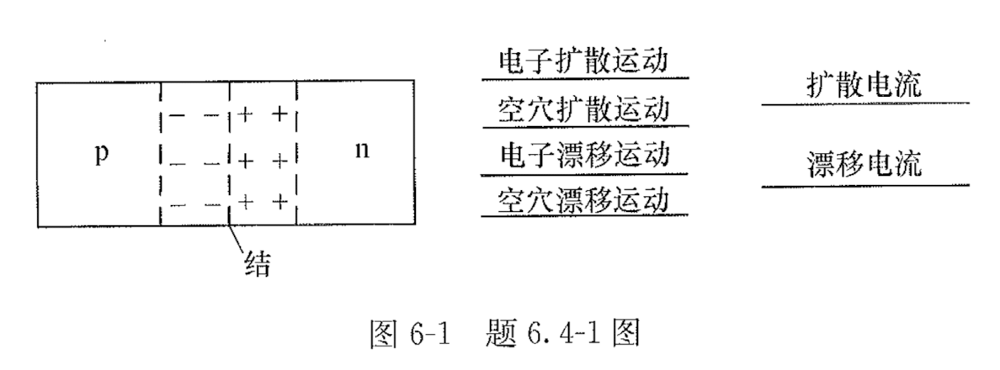
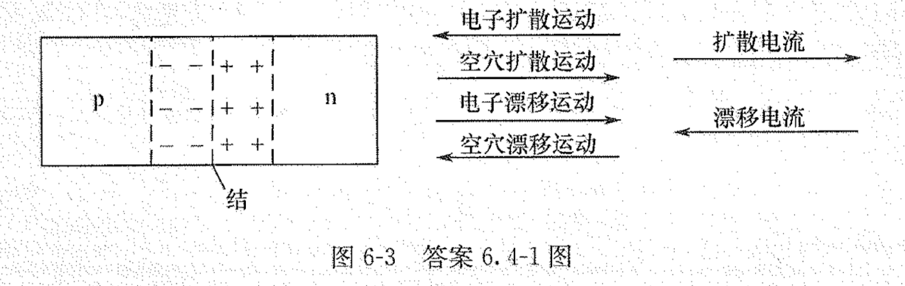
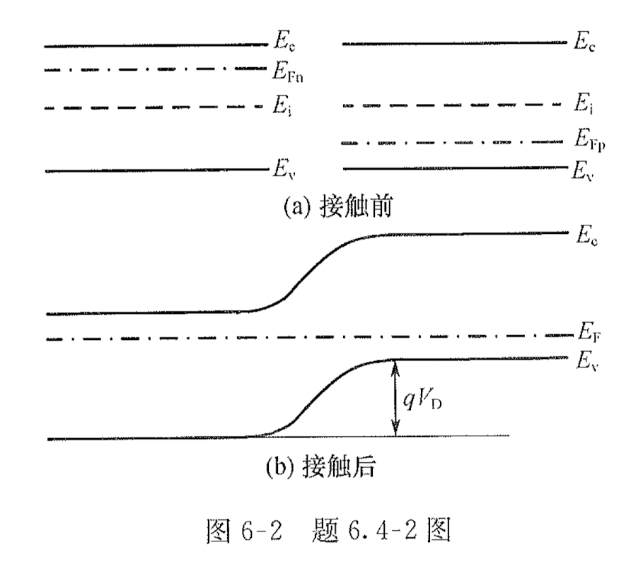
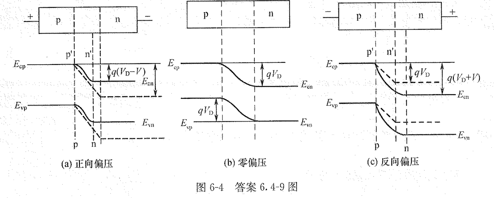
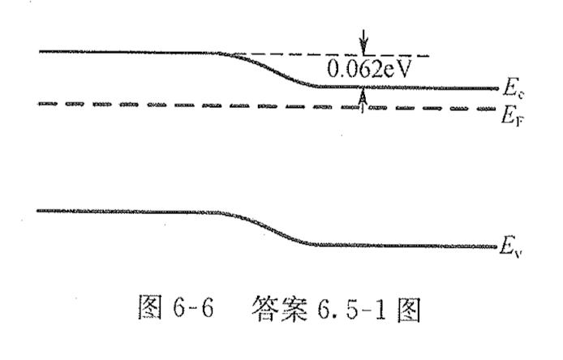
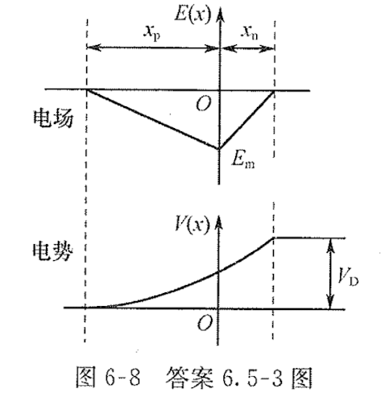

# 6 PN结

## TODO

update: 2024-08-06: yanfen group chat messages

* [ ] 第六章课后习题：1、4、5、7、8、9、10、11、12、13。
* [ ] 第六章习题册：
  * [x] 简答题：简答题：1、2、3、6、7、8、9、14、15。
  * [x] 简答题：计算题：1、3、7、10。

## 半导体物理刘恩科书后习题

### 书后习题 6.1

1、 若 $N_D = 5 \times 10^{15} \, \mathrm{cm}^{-3}$，$N_A = 10^{17} \, \mathrm{cm}^{-3}$，求室温下 Ge 突变 pn 结的 $V_D$。

1、【答】

$V_D = \frac{kT}{q} \ln \frac{N_D N_A}{n_i^2}$

$= 0.026 \ln \frac{5 \times 10^{15} \times 10^{17}}{2.1 \times 10^{13}} = 0.362 \, \mathrm{V}$

### 书后习题 6.4

4、 证明反向饱和电流公式（6-35）可改写为

$$
J_s = \frac{b \sigma_i^{2}}{(1 + b)^{2}} \frac{k_0 T}{q} \left( \frac{1}{\sigma_n L_n} + \frac{1}{\sigma_p L_p} \right)
$$

<!-- 感觉必不会考，直接跳过 -->

### 书后习题 6.5

5、 一硅突变 pn 结，n 区的 $\rho_n = 5 \Omega \cdot \mathrm{cm}$，$\tau_p = 1 \, \mu \mathrm{s}$；p 区的 $\rho_p = 0.1 \Omega \cdot \mathrm{cm}$，$\tau_n = 5 \, \mathrm{ps}$，计算室温下空穴电流与电子电流之比、饱和电流密度，以及在正向电压 $0.3 \, \mathrm{V}$ 时流过 pn 结的电流密度。

5、【答】

当 $\rho_n = 5 \Omega \cdot \mathrm{cm}$，
由图 4-15 可知，$\to N_D = 9 \times 10^{14} \, \mathrm{cm}^{-3}$；
由图 4-14 可知，$\to \mu_p = 460 \, \mathrm{cm}^2/\mathrm{V} \cdot \mathrm{s}$

当 $\rho_p = 0.1 \Omega \cdot \mathrm{cm}$，

$p_{\mathrm{n0}} = \frac{n_i^2}{N_D}$

$n_{\mathrm{p0}} = \frac{n_i^2}{N_A}$

(1) $\dots$

### 书后习题 6.7

7、 计算当温度从 $300 \, \mathrm{K}$ 增加到 $400 \, \mathrm{K}$ 时，硅 pn 结反向电流增加的倍数。

### 书后习题 6.8

8、 设硅线性缓变结的杂质浓度梯度 $5 \times 10^{23} \, \mathrm{cm}^{-3}$，$V_D$ 为 $0.7 \, \mathrm{V}$，求反向电压为 $8 \, \mathrm{V}$ 时的势垒区宽度。

### 书后习题 6.9

9、 已知突变结两边杂质浓度 $N_A = 10^{16} \, \mathrm{cm}^{-3}$，$N_D = 10^{20} \, \mathrm{cm}^{-3}$，

1. 求势垒高度和势垒宽度；
2. 画出 $E(x)$、$V(x)$ 图。

### 书后习题 6.10

10、 已知电荷分布 $\rho(x)$：

1. $\rho(x) = 0$；
2. $\rho(x) = c$；
3. $\rho(x) = q \alpha x$（$x$ 在 $0 \sim d$ 之间），

分别求电场强度 $E(x)$ 及电位 $V(x)$，并作图。

### 书后习题 6.11

11、 分别计算硅 n-p 结在正向电压为 $0.6 \, \mathrm{V}$、反向电压为 $40 \, \mathrm{V}$ 时的势垒区宽度。已知 $N_A = 5 \times 10^{16} \, \mathrm{cm}^{-3}$，$V_D = 0.8 \, \mathrm{V}$。

### 书后习题 6.12

12、 分别计算硅 p-n 结在平衡和反向电压 $45 \, \mathrm{V}$ 时的最大电场强度。已知 $N_p = 5 \times 10^{16} \, \mathrm{cm}^{-3}$，$V_D = 0.7 \, \mathrm{V}$。

### 书后习题 6.13

13、 高阻区杂质浓度为 $N_D = 10^{16} \, \mathrm{cm}^{-3}$，$E_c = 4 \times 10^5 \, \mathrm{V/cm}$，求击穿电压。

## 半导体物理学习题集习题

### 6.1 名词解释

#### 空间电荷区

当两块半导体形成pn结时，由于n区和p区之间存在着载流子浓度梯度，导致空穴从p区向n区、电子从n区向p区的扩散运动。对于p区，空穴离开后，留下不可动的带负电电离受主，在pn结附近p区一侧形成一个负电荷区。同理，在pn结附近n区一侧出现了由电离施主构成的一个正电荷区。通常就把在pn结附近的这些电离施主和电离受主所带的电荷称为空间电荷，它们所在的区域称为空间电荷区。

#### 内建(接触)电势差

平衡pn结的空间电荷区两端间的电势差 $V_D$ 称为接触电势差或内建电势差。

#### 势垒高度

平衡pn结内建(接触)电势差相对应的电子电势能之差，即能带的弯曲量 \( qV_{D} \) 称为pn结的势垒高度。

#### 耗尽层近似

对于一般的pn结，通常在空间电荷区中的载流子数量不会太多，可以近似认为空间电荷区中的电荷绝大多数是由电离杂质中心所提供的，即可简单地把空间电荷区近似看成是耗尽层，这就是所谓的耗尽层近似。

#### 势垒电容

当pn结外加电压变化时，引起电子和空穴在势垒区的存入或取出作用，导致势垒区的空间电荷数量随外加电压而减少或增多。这种现象与电容器的充、放电作用类似，这种耗尽层宽窄变化所等效的电容称为势垒电容，以 \( C_{T} \) 表示。

#### 扩散电容

外加电压变化时，n区扩散区内积累的非平衡空穴增加，与它保持中性的电子也相应增加。同理，p区扩散区内积累的非平衡电子增加，与它保持中性的空穴也相应增加。这种由于扩散区的电荷数量随外加电压的变化所产生的电容效应，称为pn结的扩散电容，以 \( C_{\text{D}} \) 表示。

#### 雪崩击穿

当反向偏压很大时，pn结势垒区内的电子和空穴由于受到内部强电场的漂移作用，具有很大的动能，它们与势垒区内的晶格原子发生碰撞时，能把价键中的价电子碰撞出来，成为导电电子，同时产生一个空穴。新产生的载流子在强电场作用下，再去碰撞其他中性原子，又产生新的自由电子-空穴对，如此继续下去，载流子数量急剧增加。这种繁殖载流子的方式称为载流子的倍增效应。倍增效应使单位时间内产生大量的载流子，迅速增大了反向电流，导致pn结击穿。

#### 隧道(齐纳)击穿

半导体在强电场作用下，由于隧道效应，使大量电子从价带穿过禁带直接进入导带引起反向电流猛增的现象，称为隧道击穿。

### 6.4 简答题

#### 6.4.1 简答题

1、平衡 pn 结的空间电荷区示意图如图6-1所示，画出空间电荷区中载流子漂移运动和扩散运动的方向（在图6-1右侧直线上添加箭头即可），并说明扩散电流和漂移电流之间的关系。

1、【答】

扩散电流与漂移电流之间的关系如图所示：

#### 6.4.2 简答题

2、如图6-2 所示为 pn 结接触前、后的平衡能带图，$E_c$ 为导带底，$E_v$ 为价带顶，$E_i$ 为禁带中心，$E_{Fn}$、$E_{Fp}$ 分别为 n 型和 p 型半导体的费米能级。

(1) 试用本征载流子浓度 $n_i$ 能量 $E_c$、$E_v$ 和 $E_i$ 表示 n 型和 p 型半导体的多数载流子浓度 $n_{n0}$ 和 $p_{p0}$;
(2) 用 $n_{n0}$、$p_{p0}$ 和 $n_i$ 表述 pn 结的接触电势差 $V_D$;
(3) 用接触电势差 $V_D$ 表述 n 区和 p 区半导体的少数载流子浓度 $p_{n0}$ 和 $n_{p0}$。（中国科学院大学 2005 年考研真题）

#### 6.4.3 简答题

3、为什么pn结空间电荷区内会有电场？什么位置的电场最大？

3、【答】n型半导体和p型半导体形成pn结时，由于存在着载流子浓度梯度，导致电子从n区向p区、空穴从p区向n区进行扩散运动，分别留下了不可动的带正电的施主离子和带负电的受主离子，这些电荷产生从n区指向p区的内建电场；在p区和n区的交界面处，电场强度最大。

#### 6.4.6 简答题

6、载流子耗尽假设是pn结物理问题分析中的一个重要假设，试说明其物理依据。（中国科学院大学2002年考研真题）

6、【答】pn结的势垒区
一般在室温附近，pn结的绝大部分势垒区，n区的施主杂质和p区的受主杂质基本全部电离，但载流子浓度比n区和p区的多数载流子浓度小得多，好像已耗尽了。即认为其中载流子浓度很小，可以忽略，空间电荷密度就等于电离杂质浓度。

#### 6.4.7 简答题

7、简述理想pn结模型的4个条件。（浙江大学2002年考研真题）

7、【答】理想pn结模型

理想pn结模型符合以下4个基本条件：

1. **小注入条件**，即注入少数载流子浓度比平衡多数载流子浓度小得多。
2. **突变耗尽层条件**，即外加电压和接触电势差都落在耗尽层上，耗尽层中的电荷由电离施主和电离受主的电荷组成，耗尽层外的半导体是电中性的。因此，注入的少数载流子在p区和n区是纯扩散运动。
3. **通过耗尽层的电子和空穴电流为常量**，不考虑耗尽层中载流子的产生及复合作用。
4. **玻耳兹曼边界条件**，即在耗尽层两端，载流子分布满足玻耳兹曼统计分布。

#### 6.4.8 简答题

8、简述pn结的整流效应。（中国科学院大学2008年考研真题）

8、【答】pn结整流特性
pn结具有单向导电性，正向电流密度随正向偏压呈指数关系迅速增大，反向电流密度为常量，与外加电压无关，称为pn结整流效应。

**pn结加正向偏压时**，产生与之相反的内建电场，势垒区宽度和高度相应减小，势垒区电场减小，破坏了平衡，扩散流大于漂移流，即产生了电子从n区向p区以及空穴从p区向n区的净扩散流。通过pn结的正向电流，就是流入p区电子和流入n区空穴的扩散流之和，它随外加正向偏压的增大而增大。

**pn结加反向偏压时**，产生与之方向一致的内建电场，势垒区电场增强，增强了漂移运动，漂移流大于扩散流。n区空穴和p区电子被势垒区强电场驱走，内部的少子就来补充，形成反向偏压下的电子扩散流和空穴扩散流。通过pn结的反向电流，就是这两种少子扩散流之和。由于少子浓度很低，扩散长度基本不变化，所以反向偏压时少子的浓度梯度也较小。当反向电压很大时，边界处的少子可以认为是零，这时少子的浓度梯度不再随电压变化，所以在反向偏压下，pn结的电流较小且趋于不变。

#### 6.4.9 简答题

9、画出半导体pn结在正偏压、零偏压和反偏压下的能带图，并简述pn结的I-V特性。（中国科学院半导体研究所2003年考研真题）

9、【答】

pn结正向偏压时，外电场与内建电场方向相反，势垒区电场减弱，势垒区变薄；多子扩散大于漂移电流，形成正向导通电流；外偏电压为零时，多子扩散等于漂移电流达到动态平衡，净电流为零；反向偏压时，外电场与内建电场方向相同，势垒区电场增强，势垒区增厚；多子扩散小于漂移电流，形成少子的反向抽取电流，电流很小。

#### 6.4.14 简答题

14、pn结电容主要包括哪两大类？分析说明pn结的电容特性，各自的影响因素有哪些？变化趋势如何？

14、【答】

pn结电容主要包括势垒电容 \(C_{T}\) 和扩散电容 \(C_{D}\) 两大类。当外加电压发生变化时，空间电荷宽度要相应地随之改变，即存储的电荷数量要随之变化，如同电容充、放电。

**势垒电容**：当pn结两端加正向偏压时，势垒区宽度变窄，空间电荷数量减少（n区的电子和p区的空穴中和了势垒区中一部分电离施主和电离受主），即在外加正向偏压增加时，将有一部分电子和空穴“存入”势垒区。反之，正向偏压减小时，势垒区电场增强，其宽度增加，空间电荷数量增多，有一部分电子和空穴从势垒区“取出”。加反向偏压类似。这种势垒区的空间电荷数量随外加电压而变化，如电容器充、放电的电容效应称为势垒电容。

**扩散电容**：正向偏压时，由n区扩散到p区的电子，堆积在p区扩散区内紧靠pn结的附近，到远离交界面处形成一定的浓度梯度分布曲线。正向偏压增加时，n区扩散区内积累的非平衡的电子和与它保持电中性的空穴也要增加，同样p区扩散区内积累的非平衡空穴和与它保持电中性的电子也要增加。这种由于扩散区的电荷数量随外加电压的变化所产生的电容效应就是扩散电容。

势垒电容大小和结面积、杂质浓度有关。突变结的势垒电容与结的面积及轻掺杂一侧的杂质浓度的平方根成正比，和电压 (\(V_{D}-V\)) 的平方根成反比。而线性缓变结的势垒电容与结的面积及杂质浓度梯度的立方根成正比，和电压 (\(V_{D}-V\)) 的立方根成反比。扩散电容随正向偏压按指数关系增加，并随频率的增加而减小。

#### 6.4.15 简答题

15、pn结击穿主要有哪几种形态？

15、【答】

pn结的击穿从机理上可分为雪崩击穿、隧道击穿和热电击穿3类。

**雪崩击穿**：当pn结反向电压增加时，空间电荷区中的电场随之增强，这样通过空间电荷区的电子和空穴就会在电场作用下，使获得的能量增大。在晶体中运行的电子和空穴将不断与晶体原子发生碰撞，通过这样的碰撞可使束缚在共价键中的价电子碰撞出来，产生自由电子-空穴对。新产生的载流子在电场作用下撞出其他价电子，又产生新的自由电子-空穴对。如此连锁反应，使得阻挡层中的载流子的数量雪崩式地增加，流过pn结的电流就急剧增大从而击穿pn结，这种碰撞电离导致击穿称为雪崩击穿，也称为电子雪崩现象。

**隧道击穿 (齐纳击穿)**：当反向电压增大到一定程度时，空间电荷区内就会建立一个很强的电场。这个强电场能把价电子从共价键中拉出来，从而在空间电荷区产生大量电子-空穴对。这些电子-空穴对产生后，空穴被强电场驱赶到p区，电子被强电场驱赶到n区，使反向电流猛增。这种由于强电场的作用，直接产生大量电子-空穴对而使反向电流剧增的现象称为齐纳击穿。齐纳击穿常发生在杂质浓度比较高的pn结中，因为此时空间电荷区比较薄，一个很小的反向电压就可以在空间电荷区内建立一个很强的电场（通常高达 \(108 V/cm\)）。

**热电击穿**：pn结上施加反向电压时，如果没有良好的散热条件，将使结的温度上升，反向电流进一步增大，如此反复循环，最后使pn结发生击穿。由于热不稳定性引起的击穿，称为热电击穿，此类击穿是永久破坏性的。

### 6.5 计算题

#### 6.5.1 计算题

1、n型半导体硅中施主的浓度为 \( 3 \times 10^{15} \text{cm}^{-3} \)，在表面 100 \( \mu m \) 薄层内，均匀掺入同种施主杂质，掺入浓度为 \( 3 \times 10^{16} \text{cm}^{-3} \)。求这种结构的接触电势差，并画出能带结构图。

1、【答】

### 题目 1 解

根据导带电子浓度计算公式 \( n_0 = N_{c} \exp\left[-\left(\frac{E_{c} - E_{F}}{k_0 T}\right)\right] \)，可得

\[
\left\{
\begin{array}{l}
E_{F1} = E_{c} + \frac{k_0 T}{q} \ln\frac{n_{01}}{N_{c}} = E_{c} + \frac{k_0 T}{q} \ln\frac{N_{D1}}{N_{c}} \\
E_{F2} = E_{c} + \frac{k_0 T}{q} \ln\frac{n_{02}}{N_{c}} = E_{c} + \frac{k_0 T}{q} \ln\frac{N_{D1} + N_{D2}}{N_{c}}
\end{array}
\right.
\]

半导体形成 nn同质结，可得接触电势差为

\[
V_{D} = \frac{E_{F2} - E_{F1}}{q} = \frac{k_0 T}{q} \ln\frac{N_{D1} + N_{D2}}{N_{D1}} = 0.026 \ln\frac{3 \times 10^{15} + 3 \times 10^{16}}{3 \times 10^{15}} = 0.062~V
\]

因此，对于同型同质结，内建电势差很小，其能带结构如图 6-6所示。

#### 6.5.3 计算题

3、已知硅突变结两边杂质浓度 \( N_{A} = 10^{16} \text{cm}^{-3}, N_{D} = 10^{20} \text{cm}^{-3} \)。

1. 求势垒高度和势垒宽度(300K时);
2. 空间电荷区的最大电场强度，并画出电场 \( E(x) \) 及电势 \( V(x) \) 分布示意图。(中国科学院大学2003年考研真题)

3、【答】

（1）根据 pn 结的接触电势差，有

\[ V_{D} = \frac{k_0 T}{q} \ln\frac{N_{A} N_{D}}{n_{i}^2} = 0.026 \ln\frac{10^{16} \times 10^{20}}{(1.02 \times 10^{10})^2} = 0.96~V \]

对于 \(pn^{+}\) 结，因 \(N_{D} \gg N_{A}, x_{p} \gg x_{n}\)，则有势垒宽度 \(X_{D}\) 为

\[ X_{D} \approx x_{p} = \sqrt{\frac{2 \varepsilon_{r} \varepsilon_0 V_{D}}{q N_{A}}} = \sqrt{\frac{2 \times 11.9 \times 8.854 \times 10^{-14} \times 0.96}{1.602 \times 10^{-19} \times 10^{16}}} = 3.55 \times 10^{-5}~cm \]

(2) 最大电场强度为

\[ E_{m} = -\frac{q N_{\Lambda} X_{D}}{\varepsilon_{r} \varepsilon_0} = -\frac{1.602 \times 10^{-19} \times 10^{16} \times 3.55 \times 10^{-5}}{11.9 \times 8.854 \times 10^{-14}} = -5.4 \times 10^4~V/ cm \]

根据 \(x_{n} N_{D} = x_{p} N_{A}\)，可得

\[ x_{n} = x_{p} \frac{N_{A}}{N_{D}} = 3.55 \times 10^{-5} \times \frac{10^{16}}{10^{20}} = 3.55 \times 10^{-9}~cm \]

根据突变结势垒区的泊松方程

\[ \left\{ \begin{array}{l} \frac{d V_1^2(x)}{d x^2} = \frac{q N_{A}}{\varepsilon_{r} \varepsilon_0} \quad (-x_{p} < x < 0) \\ \frac{d V_2^2(x)}{d x^2} = -\frac{q N_{D}}{\varepsilon_{r} \varepsilon_0} \quad (0 < x < x_{n}) \end{array} \right. \]

式中，\(V_1(x)、V_2(x)\) 分别为负、正空间电荷区各点电势；根据边界条件 \(E_1(-x_{p}) = 0、E_2(x_{n}) = 0\)，可得

\[ \left\{ \begin{array}{l} E_1(x) = -\frac{d V_1(x)}{d x} = -\frac{q N_{A} (x + x_{p})}{\varepsilon_{r} \varepsilon_0} \\ E_2(x) = -\frac{d V_2(x)}{d x} = \frac{q N_{D} (x - x_{n})}{\varepsilon_{r} \varepsilon_0} \end{array} \right. \]

设 p型中性区的电势为零，即有 \(V_1(-x_{p}) = 0, V_2(x_{n}) = V_{D}\)，同时在 \(x = 0\) 处，电势是连续的，可得

\[ \left\{ \begin{array}{l} V_1(x) = -\frac{q N_{\Lambda} (x^2 + x_{p}^2)}{2 \varepsilon_{r} \varepsilon_0} + \frac{q N_{A} x_{p}}{\varepsilon_{r} \varepsilon_0} x \\ V_2(x) = V_{D} - \frac{q N_{D} (x^2 + x_{n}^2)}{2 \varepsilon_{r} \varepsilon_0} + \frac{q N_{D} x_{n}}{\varepsilon_{r} \varepsilon_0} x \end{array} \right. \]

电场 \(E(x)\) 及电势 \(V(x)\) 分布示意图如图 6-8 所示。

#### 6.5.7 计算题

7、室温下，若pn结在 0.15 V正向偏压通过 5μA电流，计算加上同样大小的反向偏压，其反向电流等于多少？(中国科学院大学2002年考研真题)

7、【答】

pn结在正向偏压作用下, I-V方程为

\[ I_{\text{IE}} = A J = A J_{s} \left[\exp\left(\frac{q V}{k_0 T}\right) - 1\right] \]

可得

\[ A J_{s} = \frac{I_{\text{i.}}}{\left[\exp\left(\frac{q V}{k_0 T}\right) - 1\right]} = \frac{5 \times 10^{-6}}{\left[\exp\left(\frac{0.15}{0.026}\right) - 1\right]} = 1.57 \times 10^{-8}~A \]

pn结在反向电压作用下, I-V方程为

\[ I_{反} = A J_{s} \left[\exp\left(\frac{-q V}{k_0 T}\right) - 1\right] \]

当反向电压为 0.15V时，则有

\[ I_{反} = A J_{s} \left[\exp\left(\frac{-q V}{k_0 T}\right) - 1\right] = 1.57 \times 10^{-8} \left[\exp\left(\frac{-0.15}{0.026}\right) - 1\right] = -1.57 \times 10^{-8}~A \]

#### 6.5.10 计算题

10、在n型锗上合金铟形成 \( \mathrm{p^{+}n} \) 结二极管，结面积为 \( 1 \text{mm}^2 \)。

1. 测量此二极管的势垒电容，得偏置电压 \( V = 0 \) 时，\( C_0 = 300 \text{pF} \)，反向偏置电压 \( V = -1 \text{V} \) 时，\( C_1 = 180 \text{pF} \)，求pn结的接触电势差 \( V_D \);
2. 求零偏压时的势垒区宽度 \( X_D \);
3. \( \mu_{n} = 3600 \text{cm}^2/(\text{V}\cdot\text{s}) \)，求n型衬底的电导率。(中国科学院大学2004年考研真题)

10、【答】

(1) 根据 \( p^{+}n \) 结势垒电容的计算公式

\[ C_{T} = A \sqrt{\frac{q \varepsilon_{r} \varepsilon_0 N_{D}}{2 (V_{D} - V) }} \]

已知偏置电压 \( V = 0~V \) 时, \( C_0 = 300 \) pF; 偏置电压 \( V = -1~V \) 时, \( C_1 = 180 \) pF, 则有

\[ \left\{ \begin{array}{l} 1 \times 10^{-2} \sqrt{\frac{1.602 \times 10^{-19} \times 16.2 \times 8.854 \times 10^{-14} \times N_{D}}{2 (V_{D} - 0)}} = 300 \times 10^{-12} \\ 1 \times 10^{-2} \sqrt{\frac{1.602 \times 10^{-19} \times 16.2 \times 8.854 \times 10^{-14} \times N_{D}}{2 (V_{D} + 1)}} = 180 \times 10^{-12} \end{array} \right. \]

解得接触电势差 \( V_{D} = 0.563~V \), 衬底杂质浓度 \( N_{D} = 4.41 \times 10^{15}~cm^{-3} \)。

(2) 对于 \( p^{+}n \) 结, \( N_{A} \gg N_{D} \), n型区势垒宽度 \( x_{n} \) 远大于 p型区势垒宽度 \( x_{p} \), 则有

\[ X_{D} \approx x_{n} = \sqrt{\frac{2 \varepsilon_{r} \varepsilon_0 V_{D}}{q N_{D}}} = \sqrt{\frac{2 \times 16.2 \times 8.854 \times 10^{-14} \times 0.563}{1.602 \times 10^{-19} \times 4.41 \times 10^{15}}} = 4.78 \times 10^{-5}~cm \]

(3) 根据电导率的计算公式, n型衬底的电导率为

\[ \sigma = n_0 q \mu_{n} = q N_{D} \mu_{n} = 1.602 \times 10^{-19} \times 4.41 \times 10^{15} \times 3600 = 2.54~S/ cm \]
