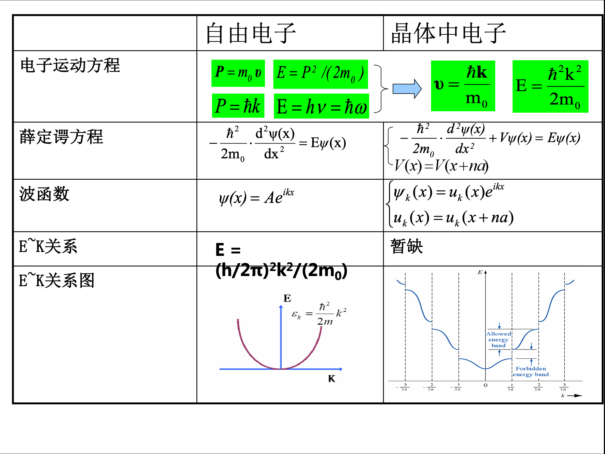
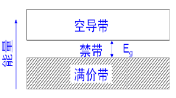
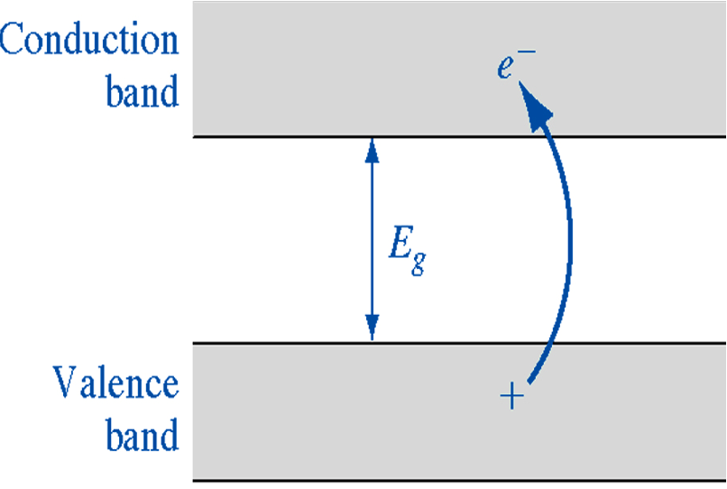
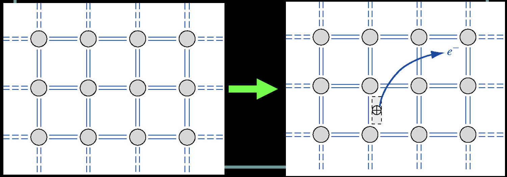

# 1 半导体中的电子状态

## 1.1 半导体的晶格结构和结合性质

晶体&非晶体：长程有序&短程有序

单电子近似&能带论

金刚石结构和共价键：共价键结合、正四面体结构、金刚石型结构的晶胞为立方对称性、相同原子的复式晶格

例子: Ge Si

闪锌矿结构和混合键：3-5族化合物、共价键&离子键、共价性结合占优势、双原子复式晶格

例子: GaAs

纤锌矿型结构：六方对称性、双原子层堆积、ABABABAB、共价键&离子键、离子性结合占优势

---

晶体的基本特点

* **周期排列(规则性)**：组成晶体的原子按一定的方式有规则的排列而成。
* **固定熔点**：硅的熔点:1420摄氏度, 锗的熔点: 941摄氏度
* 单晶体具有**各向异性**

金刚石结构特点 （**考简答题**）

1. 每个原子周围有四个最邻近的原子，构成正四面体结构
2. 任一顶角上的原子和中心原子各贡献一个价电子为该两个原子所共有，并形成稳定的共价键结构
3. 共价键结构，共价键夹角：109˚28’
4. 两个面心立方沿立方体空间对角线互相位移了四分之一的空间对角线长度套构而成。

## 1.2 半导体中的电子状态和能带

共有化运动

准自由电子

准连续

泡利不相容原理：每个能级上最多能容纳自旋方向相反的2个电子

价带&导带&禁带

### 1.2.1 原子的能级和晶体的能带

晶体由原子周期性重复排列而成的

原子和晶体的区别

(1) 电子的区别：
孤立原子：电子在单势场中的运动
晶体：电子在周期性势场中的公有化运动

(2) 能级的区别：
孤立原子：孤立能级
晶体：准连续能带

半导体中**电子共有化运动**

内壳层的电子，轨道交叠少，共有化运动弱。
外层的价电子，轨道交叠多，共有化运动强。

孤立原子中的能级

$$
E_n = - \frac{m_0 q^4}{8 \varepsilon_0^2 h^2}·\frac{1}{n^2} = -13.6\frac{1}{n^2}
$$

其中，m0：电子质量，q：电子电量，h：普朗克常数，ε0：介电常数

原子能级的简并

当2个原子相距很远时，每个原子的电子壳层完全相同，即电子有相同的能级，此时为简并的。

原子能级简并的消失

由于2个电子不能有完全相同的能量，交叠的壳层发生分裂，形成相距很近的能级带以容纳原来能量相同的电子。原子相距越近，分裂越厉害，能级差越大。由此导致简并的消失。

能带特点:
分裂的每一个能带称为允带，允带间的能量范围称为禁带
内层电子受到的束缚强，能级分裂小，能带窄；外层电子受束缚弱，能级分裂明显，能带宽。

### 1.2.2 半导体中的电子状态和能带

单个电子运动满足的规律 （**考试要考**）

由粒子性有 $\color{#E45F59} P = m_0 v$，$\color{#E45F59} E = \frac{P^2}{2 m_0}$
由德布罗意关系 $\color{#E45F59} P = \hbar k$，$\color{#E45F59} E = hv = \hbar \omega$
因此 $\color{#E45F59} v = \frac{\hbar k}{m_0}$，$\color{#E45F59} E = \frac{\hbar^2 k^2}{2 m_0}$

注: $\hbar$ 指普朗克常数，其中 $k$ 为波矢，大小等于波长倒数 $\frac{2\pi}{\lambda}$ ，方向与波面法线平行，即波的传播方向。

自由电子 vs 晶体中的电子

自由电子 $ | \psi (x) \psi'(x) | = A^2 $ 即自由电子在空间等几率出现，也就是作自由运动；

布里渊区: 允带可以出现的波矢范围（？）

当 $k=\frac{n \pi}{a} \  (n= \pm 1, \pm 2 \dots)$ 时，能量不连续，形成一系列相间的允带和禁带。其中允带出现的区域称为布里渊区。每一个布里渊区对应一个能带，禁带出现在 $k = \frac{n \pi}{a}$ 处。
允带的k值位于下列几个称为布里渊区的区域中

第一布里渊区 $－\pi/a < k < \pi/2a$
第二布里渊区 $－2\pi/a < k < -\pi/a, \pi/a < k < 2\pi/a$
第三布里渊区 $－3\pi/a < k < -2\pi/a, 2\pi/a < k < 3\pi/a$

第一布里渊区称为**简约布里渊区**，相应的波矢称为简约波矢

### 1.2.3 金属、半导体、绝缘体的能带

满带: 指完全被电子占据的能带，满带中的电子不会导电
能带半满: 能导电

固体按其导电性分为导体、半导体、绝缘体的机理，可根据电子填充能带的情况来说明
金属、半导体、绝缘体的主要区别（禁带宽度和导带填充程度）：

* 金属导带半满；
* 半导体禁带宽度在1eV左右；
* 绝缘体禁带宽且导带空；

固体导电的原因：
能带理论：电子从一个能级跃迁到另外一个能级。满带电子在外电场下不形成电流(内层电子)(价带),非满带中电子在外电场下跃迁到无电子能级，形成电流(外层电子)(导带)

半导体中能带:

* 高纯半导体在绝对零度时导带是空的，并且由一个能隙 $E_g$ 与充满的价带隔开。
* 能带隙是导带的最低点和价带最高点之间的能量差。
* 导带的最低点称为导带底，价带的最高点称为价带顶。
* 当温度升高时，电子由价带被热激发至导带。导带中的电子和留在价带中的空穴二者都对电导率有贡献。

$E_c$: 导带，空白处，导电
$E_v$: 价带，共价键
$E_g$: 禁带，以上两者之间

半导体能带与温度的关系:

* T=0K的半导体能带见图 (a)，半导体的价带是满带，导带是空带，半导体不导电。
* 当温度升高或其它外界因素作用下，原先空的导带变为半满带，而价带顶附近同时出现了一些空的量子态也成为半满带，见图 (b)。导带和价带中的电子都可以参与导电。

### 1.2.4 本征激发

本征激发是半导体在温度或光照等外界因素的作用下，价带电子获得足够的能量跃迁到导带，同时在价带留下空穴的过程

## 1.3 半导体中电子的运动 有效质量

半导体中的 $E-k$ 关系 （**考填空**）

令 $\color{#E45F59} \frac{1}{m_n^*} = \frac{1}{\hbar^2} (\frac{\mathrm{d}^2 E}{\mathrm{d} k^2}) \rvert_{k=0}$，$m_n^*$ 指导带底电子有效质量，有 $\color{#E45F59}E(k) - E(0) = \frac{\hbar k^2}{2 m_n^*}$

能带宽度对晶体中电子速度及有效质量的影响

原子核外不同壳层电子其有效质量大小不同：
有效质量与能量函数对于k的二次微商成反比，能带越窄，二次微商越小，有效质量越大。

* 内层电子的能带窄，有效质量大
* 外层电子的能带宽，有效质量小

外层电子，在外力的作用下可以获得较大的加速度。

导带: 由于 $E(k) > E_c \Rightarrow m_n^*>0, m_p^*<0$
价带顶: 由于 $E(k) < E(0) \Rightarrow m_n^*<0, m_p^*>0$

导带顶电子有效质量公式：
$$
m_e^* = \frac{{\hbar^2}}{{\left(\frac{{d^2E}}{{dk^2}}\right)_{E=E_c}}}
$$

价带顶电子有效质量公式：
$$
m_h^* = \frac{{\hbar^2}}{{\left(\frac{{d^2E}}{{dk^2}}\right)_{E=E_v}}}
$$

空穴有效质量公式：
$$
m_p^* = \frac{{\hbar^2}}{{\left(\frac{{d^2E}}{{dk^2}}\right)_{E=E_v}}}
$$

其中，$\hbar$ 是约化普朗克常数，$d^2E/dk^2$ 表示能带的二阶导数，$E_c$ 表示导带底能级，$E_v$ 表示价带顶能级。这些公式用于计算半导体中导带顶和价带顶电子的有效质量，以及空穴的有效质量。请注意，这些公式的具体形式可能因材料和能带结构而异。在实际应用中，需要根据具体的半导体材料和能带结构来选择适当的公式和参数值。

## 1.4 本征半导体的导电机构 空穴

本征的含义：本征方程、本征值，即本来的特征，100%纯的，无外来杂质的

空穴直观解释：电子从价带跃迁到导带底，在外场作用下，导带电子参与导电；同时，价带不满的状态——空穴也参与导电

在结构上理解：原共价电子逃离所处的位置，产生了一个空的位置，称为空穴

空穴的电性：产生了一个正电荷的空状态

绝对零度 $\rightarrow$ 室温下

强电离区杂质基本电离标准: **90%杂质电离**

## 1.5 回旋共振

以电磁波通过半导体样品，交变电场频率等于回旋频率时，发生共振吸收。测出频率和电磁感应强度便可得到 $m_n^*$

磁场强度为 $B$ 作用在速度为 $v$ 的电子上，磁场力为 $f = -qv \times B$

电子作回旋运动，回旋速度和加速度分别为 $v = r\omega_c, a = \frac{v^2}{r}$

得出，半导体样品置于均匀恒定磁场中，电子回旋频率为

$$\color{#E45F59}\omega_c = \frac{qB}{m_n^*}$$

## 1.6 硅和锗的能带结构

### 1.6.1 硅和锗的导带结构

硅的导带结构（Si的回旋共振结果） （**考试要考**）

* B沿[111]方向，有**1**个吸收峰
* B沿[110]方向，有**2**个吸收峰
* B沿[100]方向，有**2**个吸收峰
* B沿任意方向，有**3**个吸收峰

## 1.7 III-V族化合物半导体的能带结构

原子序数较高的化合物，禁带宽度较窄，在禁带宽度最窄的III-V族化合物中，由于价带和导带的相互作用使得导带底不呈抛物线形状。

## 1.10 宽禁带半导体材料

把禁带宽度等于或大于2.3eV的半导体材料归类于宽禁带半导体

GaN GaP GaAs SiC
