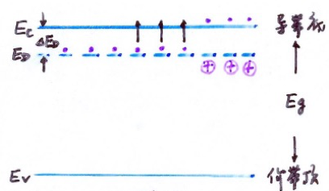
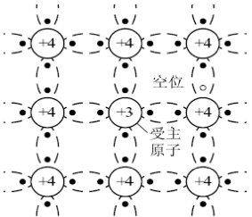
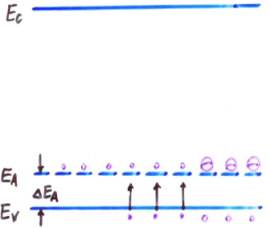
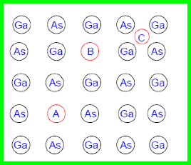
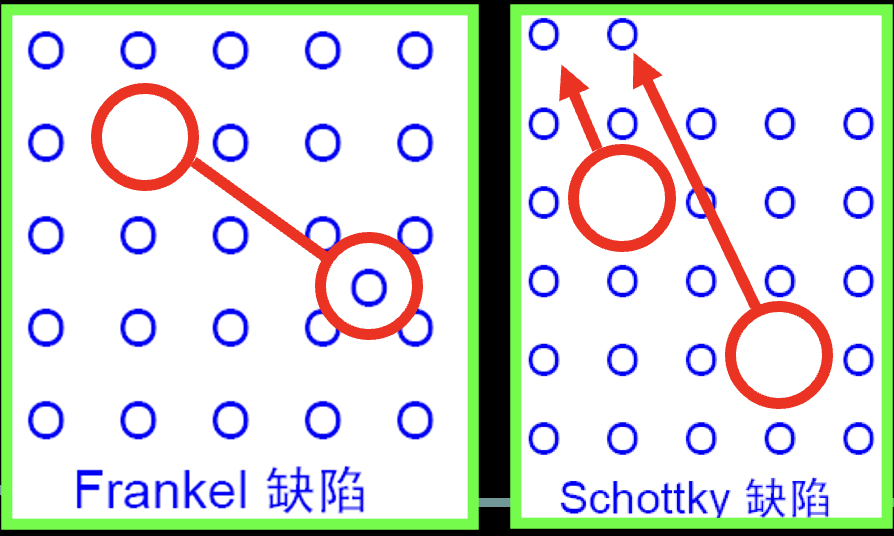
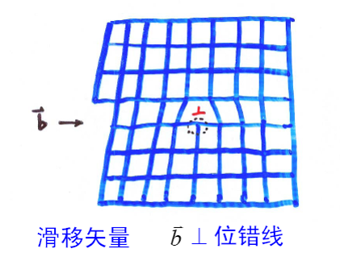

# 2 杂质和缺陷能级

## 2.1 硅/锗晶体中的杂质能级

本节重点（期末考试知识点）：

* 替位式杂质与间隙式杂质区别
* 施主杂质与施主能级
* 杂质电离与杂质电离能
* 施主杂质电离过程与原理
* 杂质电离能的计算
* 如何计算杂质补偿半导体的载流子数量
* 如何分辨半导体导电类型

### 2.1.1 间隙式杂质 / 替位式杂质

* 间隙式杂质：杂质原子存在于间隙位置
* 替位式杂质：杂质原子替换晶体原子

### 2.1.2 施主杂质 / 施主能级

V族元素在Si,Ge晶体中是替位式杂质

* **施主杂质 (N型杂质)**: ？？？的杂质
* **施主电离**: 释放电子的过程。指在半导体材料中掺入的施主杂质失去一个电子，形成正离子的过程。
* **施主能级 $E_D$**: 施主杂质多余电子被束缚时的能量状态

施主能级位于离导带底很近的禁带中

施主杂质未电离时，是电中性的，电离以后，成为正电中心
分别称为 中性态(束缚态) / 施主离化态

4价Si中掺入5价磷(P)，P的5个价电子中的4个与Si形成共价鍵，剩余一个价电子。

由于杂质浓度比较低，故没有杂质能带

杂质原子相距较远，所以现成相同能量的孤立能级

* 杂质能级用短线表示;
* $\Delta E_D \ll E_g$（分立能级，局域，未形成能带）

关于教材P39 图2-4（上图）的说明：待补充，详见网课回放

$T \neq 0K$，能带角度：电子从 $E_D$ 跃迁到 $E_C$ ，成为导带电子

### 2.1.3 受主杂质 / 受主能级

* **受主杂质 (P型杂质)**: 能够接受电子的杂质
* **受主电离**: 受主杂质获得电子的过程
* **受主能级 $E_A$**: 受主束缚电子的能量状态

4价Si中掺入3价的硼B，硼原子有3个价电子，与周围四个硅原子形成共价鍵，缺少一个电子，必须从周围获得一个电子，成为负电中心B-

N型半导体: 以电子导电为主

半导体掺入III族元素后，杂质电离使导电空穴增多，主要依靠空穴导电的半导体为P型半导体

受主能级位于离价带顶很近的禁带中

浅能级杂质 -- 电离能很小

classification (根据杂质向半导体提供载流子): n / p / 本征

类氢原子模型的计算 -- (源于Si中掺入P)

$$
E_n = - \frac {m_0 e^4}{8 \theta^2 h^2 n^2} = -\frac{13.6}{n^2} (eV)
$$

### 2.1.4 浅能级杂质电离能的简单计算

逆天人似乎没讲，可以参考教程

[半导体物理 西安电子科技大学 P27](https://www.bilibili.com/video/BV1fp4y1z7oF?t=670.3&p=27)

### 2.1.5 杂质的补偿作用

作用: 补偿作用可以用来形成PN结，例如在N型半导体中掺入P型杂质，或者在P型半导体中掺入N型杂质。

在半导体中既掺入施主杂质，又掺入受主杂质，施主杂质和受主杂质具有相互抵消的作用 -> 补偿半导体

施主杂质浓度 $N_D, (\mathrm{cm}^{-3})$
受主杂质浓度 $N_A, (\mathrm{cm}^{-3})$
导带电子浓度 $n, (\mathrm{cm}^{-3})$
价带空穴浓度 $p, (\mathrm{cm}^{-3})$

计算杂质补偿半导体的载流子数量:

case1: if $N_D \gg N_A$, then $n_0-N_D - N_A \approx N_D$

we call $N_D - N_A$ : 有效施主浓度

case2: if $N_A \gg N_D$, then $p = N_A - N_D \approx N_A$

we call $N_A - N_D$ : 有效受主浓度

case3: if $N_A \approx N_D$, we call it 过度补偿

### 2.1.6 深能级杂质

当半导体中存在非III，V 族杂质时，会引入深能级

产生的能级离导带底或者价带顶都比较远，而且往往有若干个能级。深能级杂质对半导体中的载流子浓度和导电类型影响不大，但对载流子的复合作用更强，故称为复合中心

## 2.2 III-V 族化合物中的杂质能级

本节重点（期末考试知识点）：
等电子杂质与等电子陷阱

III-V族化合物是两种元素1:1构成的物质。杂质进入后，可以成为间隙或替位式杂质。

* 替位式杂质：取代III 族、V 族位置
* 间隙式杂质：处于4 个III 族（V 族）原子围成的正四面体

一些重要实验结果

* II族元素掺入III、V族中，通常取代III族元素，而位于其格点位置上。因为比III族少一个价电子，倾向于接受1个电子，而起受主作用，引入浅受主能级
* VI族元素掺入III、V族中，通常取代V族元素，而位于其格点位置上。因为比V族多一个价电子，倾向于释放1个电子，而起施主作用，引入浅施主能级
* IV族元素掺入III、V族中，杂乱发布在格点位置上。效果取决于杂质浓度，以及样品所处条件
    if IV浓度低，then 取代 III族，施主作用
    if IV浓度高，then 取代 V族，受主作用

等电子杂质效应: 有些V族元素的取代会产生能级，此能级为等电子能级

等电子陷阱: 杂质电子与基质原子的价电子数量相等。替代格点原子后，仍为电中性。但是，原子序数不同导致了原子的“共价半径”和“电负性”不同，即对电子的束缚能力不同于格点原子，能俘获电荷成为带电中心，形成等电子陷阱

## 2.4 缺陷、错位能级

本节重点 (**考试要考**):

* 点缺陷（弗兰克尔缺陷，肖特基缺陷）
* 位错

### 2.4.1 点缺陷

在格点位置振动 -> 获得足够能量，挣脱周围原子的束缚，而挤入间隙位置

Frankel (弗兰克尔)缺陷: 间隙原子 / 相对空位 成对出现

Schottky (肖特基)缺陷: 若间隙原子运动到样品表面，形成新的表面，则样品体内只有空位存在

样品中，Frankel 缺陷与 Schottky 缺陷同时存在，Schottky 缺陷的浓度 $\gg$ Frankel 缺陷的浓度

空位周围... 起受主作用

空位：不饱和键，倾向于接受电子 -- 受主
间隙原子：4个多余的价电子 -- 施主 (也可能做受主)

在III、V族化合物半导体中，点缺陷的来源

二元化合物半导体: A取代B，记作 $A_B$

### 2.4.2 错位 (线缺陷)

最著名的位错是刃位错或称棱位错，从原子排列的状况看如同垂直于滑移面插进了一层原子

