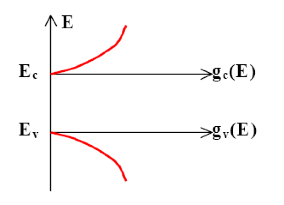
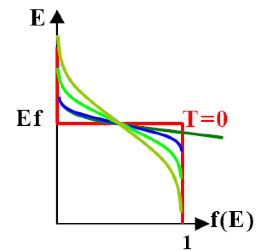
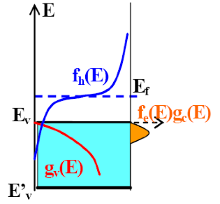
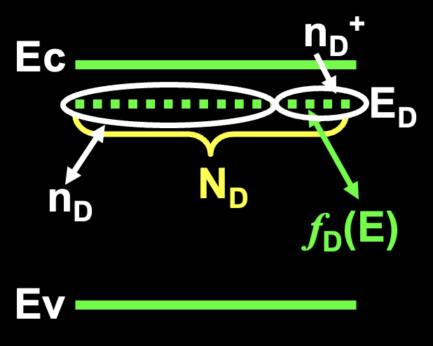
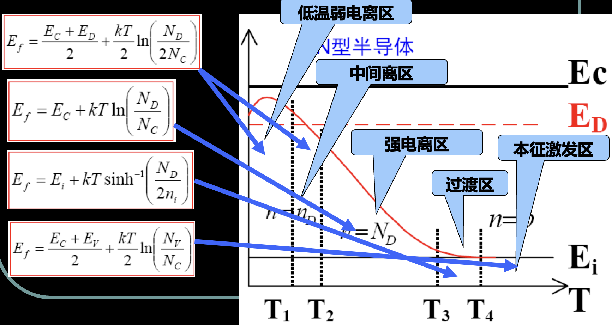
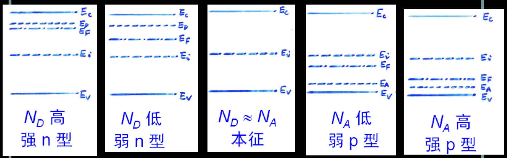

# 3 半导体中载流子的统计分布

本章重点：

* 费米分布函数与波尔兹曼分布函数；
* 费米能级的意义；
* 态密度；
* 简并半导体与非简并半导体的电子和空穴浓度；
* 费米能级位置的确定（载流子浓度出发）；
* 电荷中性方程极其重要意义；

## 3.1 状态密度

### 3.1.1 K 空间量子态的分布

定义：
a. 量子态：最多只能容纳一个电子的状态。
b. 状态密度：能带中，若能量在 $E - Ε + \mathrm{d}E$ 之间有 $\mathrm{d}Z$ 个量子态，则状态密度为:

$$
g(E) = \frac{\mathrm{d}Z}{\mathrm{d}E}
$$

---

状态密度的计算

K 空间的状态密度：k 空间单位体积内的量子态数

如何计算：

* k空间的状态密度
* 能量间隔 dE 对应的 k 空间体积
* 能量间隔 dE 对应的量子态数 dZ
* 根据上也公式计算状态密度 g(E)

---

电子在晶体中传播满足的条件

### 3.1.2 状态密度

在半导体的导带和价带中，能级密度很大，间隙很小。被认为是准连续的。表示其密度的大小，需要用状态密度表示。

状态密度求解过程：

a. 计算单位K空间中的量子态数—K空间状态密度；
b. K空间中E-Ε+dE之间所对应的体积；
c. K空间体积与K空间态密度相乘得到E-Ε+dE之间的量子态数dZ;
d. 利用公式求解态密度

导带底能量状态密度为

$$
\color{#E45F59} g_c(E) = V \frac{(m_n^*)^{\frac{3}{2}}}{2 \pi^2 h^3} (E - E_c)^\frac{1}{2}
$$

价带项能量状态密度为

$$
\color{#E45F59} g_v(E) = V \frac{(m_n^*)^{\frac{3}{2}}}{2 \pi^2 h^3} (E_v - E)^\frac{1}{2}
$$

$m_{dp}$: 价带顶空穴的状态密度有效质量

$m_{dn}$: 导带底电子的状态密度有效质量

以上两个变量的作用是为了计算状态密度

## 3.2 费米能级和载流子的统计分布

### 3.2.1 费米分布函数

热平衡状态下电子按能量大小服从费米统计分布。表示能量为 $E$ 的量子态被一个电子占据的几率是：

$$
\color{#E45F59} f(E) = \frac{1}{1 + \exp(\frac{E - E_F}{k_0T})}
$$

$E_F$ 是费米能级: 与温度导电类型、杂质含量等有关，标志了电子填充水平
$k_0$ 是波尔兹曼常数
$T$ 为热力学温度

热平衡状态下，电子在允许的量子态上如何分布的统计分布函数。

T = 0K (red line in the image)

当 $T > 0K$ 时
若 $E < E_f$ ，则 $f(E) > 1/2$
若 $E = E_f$，则 $f(E) = 1/2$
若 $E > E_f$，则 $f(E) < 1/2$

T=0K：所有电子将占满费米能级以下的低能级，高能级为空。外加一个电子，只能占据费米能级，即导致内能增加 $E_F$

for example:

T=300K时，$k_0 T = 0.026eV$, 所以, $Ε_c-Ε_F \gg k_0 T$
当 $Ε-Ε_F = 5k_0 T$ 时，电子填充的几率 $f(Ε)=0.007$
当 $Ε-Ε_F = -5k_0 T$ 时，电子填充的几率 $f(Ε)=0.993$

### 3.2.2 玻耳兹曼分布函数

1 电子的玻耳兹曼分布

$$
\color{#E45F59} f_B(E) = A e^{-\frac{E}{k_0T}}
$$

表明一定温度下电子占据能量为E的量子态的几率由指数因子决定

$-\frac{E}{k_0T}$ 表示能量的负指数关系分布

relationship between 费米分布函数 and 玻耳兹曼分布函数

$$
\begin{split}
f_B(E)
&= \frac{1}{1 + \exp(\frac{E - E_F}{k_0 T})} \\
&\approx \exp (-\frac{E - E_F}{k_0 T}) \\
&= e^{\frac{E_F}{k_0 T}} e^{- \frac{E}{k_0 T}} \\
&= A e^{-\frac{E}{k_0T}}
\end{split}
$$

两种函数适用范围

1. 当 $\color{#E45F59}E-E_f \approx  k_0 T$ ，**费米分布函数**适用；
2. 当 $\color{#E45F59}E-E_f \gg k_0 T$，**波尔兹曼分布函数**适用。

### 3.2.3 空穴分布函数

空穴的费米分布函数

能量为 $E$ 的量子态被电子分布函数为 $f(E)$，被空穴占据的几率:

$$ 1-f(E) = \frac{1}{1 + \exp(\frac{E_F - E}{k_0T})} $$

空穴的波尔兹曼分布函数

When $E-E_F \gg (k_0 T)$

$$
1-f(E) \approx \exp(\frac{E - E_F}{k_0 T}) = B e^{\frac{E}{k_0 T}}
$$

电子 + 空穴 (的分布函数) = 1

(1) 导带中的电子浓度的计算

可以参考院长PPT3 - P26

$Ε-Ε+ \mathrm{d}Ε$ 内的电子数为 $\mathrm{d}N = f_B(E) g_c(E) \mathrm{d}E$

导带中的电子数 （**考试要考**）

$n_0$ 导带电子浓度:

$$
\color{#E45F59} n_0 = N_c \exp(- \frac{E_c - E_F}{k_0 T})
$$

$N_c$ 有效状态密度:

$$
\color{#E45F59} N_c = 2 \frac{(2 \pi m_n^* k_0 T)^{\frac{3}{2}}}{h^3}
$$

(2) 价带中的空穴浓度

$$
\color{#E45F59} p_0 = N_v \exp(\frac{E_v - E_F}{k_0 T})
$$

$$
\color{#E45F59} N_v = 2 \frac{(2 \pi m_p^* k_0 T)^{\frac{3}{2}}}{h^3}
$$

温度的影响

$T \rightarrow 0K$ ：$N_c \rightarrow 0, \exp(-\frac{A}{T}) \rightarrow0 $, 则 $n_0 \rightarrow 0$ .

$T$ 增大，$N_c$ 增大，$\exp(-\frac{A}{T})$ 增大，$T$ 很大时，$\exp(-\frac{A}{T}) \sim 1$

费米能级的影响：

$E_F$ increase ，$E_c - E_F$ decrease ，$n_0$ increase

$E_F-E_v$ 越大，$p_0$ 越小

载流子浓度乘积 $n_0 p_0$

$$
\color{#E45F59} n_0 p_0 = 4 (\frac{2 \pi k_0}{h^2})^3 (m_n^* m_p^*)^{\frac{3}{2}} T^3 \exp(- \frac{E_g}{k_0 T})
$$

电子空穴浓度乘积讨论：

1.浓度乘积与费米能级无关；
2.浓度乘积与杂质浓度无关；
3.浓度乘积与温度有关，一定温度下乘积恒定；
4.浓度乘积公式对本征半导体和杂质半导体都适用

## 3.3 本征半导体的载流子浓度

本征半导体的电中性条件：$n_0 = p_0$

$$
N_c \exp(- \frac{E_c - E_F}{k_0 T}) = N_v \exp(\frac{E_v - E_F}{k_0 T})
$$

由上式得到本征半导体费米能级

$$
E_{i} = E_{F} = \frac{E_c + E_v}{2} + \frac{k_0 T}{2} \ln(\frac{N_v}{N_c})
$$

本征载流子浓度:
根据等式 $n_0=p_0$ ，将费米能级公式带入,可以算出 $n_0$ 等数值

$$
n_i = n_0 = p_0 = (N_c N_v)^{\frac{1}{2}} \exp(- \frac{E_g}{k_0 T})
$$

$$
n_0 p_0 = n_i^2
$$

本征载流子浓度 $n_i$ 与禁带宽度 $E_g$

**本征载流子浓度**随温度**升高**迅速**增大**

同一温度下,禁带宽度越大,本征载流子浓度越小.与所含杂质无关,适用于杂质半导体材料。

本征载流子浓度 $n_i$ 与温度 $T$ ，可以求得半导体的禁带宽度

$$
\ln(n_i T^{-\frac{3}{2}}) = - \frac{Eg}{2k}\frac{1}{T} + B
$$

本征半导体在室温不能正常工作

---

一般温度下，Si、Ge、GaAs等本征半导体的 $E_F$ 近似在禁带中央 $E_i$；只有温度较高时， $E_F$ 才会偏离 $E$

## 3.4 杂质半导体的载流子浓度

重点:

* 电子或空穴占据杂质能级的几率;
* N型半导体的电中性条件；
* 不同温度区间费米能级，电子和空穴的浓度；
* 各种条件下的电中性方程。

### 3.4.1 杂质能级上的电子和空穴

电子占据施主杂质能级的几率变为：

$$
f_D(E) = \frac{1}{1 + (g_D) \exp(\frac{E_D - E_F}{k_0 T})}
$$

$g_D=2$ 称为施主能级的基态简并度，$g_A=4$受主能级简并度。

$$
n_D = N_D f_D(E) = \frac{N_D}{1 + \frac{1}{g_D}\exp(\frac{E_D - E_f}{k_0 T})}
$$

$E_D$ 与 $E_F$ 的相对位置反映了电子占据杂质能级的情况

见PPT P47 -- 三种情况

case1 施主能级远在费米能级之上

case2 $E_D = E_F$ ...

case3 ...

### 3.4.2 n型半导体的载流子浓度

$$ n_0 = n_D^+ + p_0 $$

其中，$n_D^+$是施主杂质浓度，$p_0$是本征载流子浓度。

$$
\color{#E45F59} N_c \exp(- \frac{E_c - E_F}{k_0 T}) = N_v \exp(\frac{E_v - E_F}{k_0 T}) + \frac{N_D}{1 + 2\exp(- \frac{E_D - E_F}{k_0 T})}
$$

下面基于各种条件的变化对此式进行详细分析：(**考试要考**)

* a. 低温弱电离区
* b. 中间电离区
* c. 强电离区
* d. 过渡区
* e. 高温本征激发区

a. 低温弱电离区

温度很低，大部分施主杂质能级仍为电子占据，极少量施主杂质电离，极少量电子进入了导带，称之为**弱电离**。

温度极低时，忽略本征电离，导带电子由施主产生，故 $p_0 = 0$

$$
E_{F} = \frac{E_{c}+E_{D}}{2}+\left(\frac{k_{0} T}{2}\right) \ln \left(\frac{N_{D}}{2 N_{c}}\right)
$$

低温弱电离区计算出的电子浓度

$$
n_{0} = \left( \frac{N_{D} N_{c}}{2} \right)^{\frac{1}{2}} \exp\left(- \frac{\Delta E_D}{2 k_0 T} \right)
$$

式中 $\Delta E_D = E_c - E_D$ 为施主杂质电离能。

(1) 杂质越多(浓度越高)，导带电子浓度 $n_0$ 越大；
(2) $N_c$ 越大，导带电子浓度 $n_0$ 越大；
(3) $E_D$ 越小，导带电子浓度 $n_0$ 越大；
(4) 温度越高，导带电子浓度 $n_0$ 越大。

b. 中间电离区

掺杂半导体的载流子浓度和费米能级由温度和杂质浓度决定，杂质浓度一定时，随着温度的升高，载流子从以杂质电离为主要来源过渡到以本征激发为主要来源。

电中性条件 $n_0 = p_0 + n_D^+$

特征：

1、本征激发可以忽略， $p_0 \approx 0$
2、导带电子主要由电离杂质提供。
3、随着温度T的增加， $n_D^+$ 已足够大

c. 强电离区

温度升高使大部分杂质电离，称之为强电离。施主全部电离的标准是：90%

$$ n_0 = n_D^+ \approx N_D $$

温度升高使费米能级逐渐靠近本征能级。禁带的大小随温度变化。温度增加，禁带减小

施主杂质全部电离时，$n_0=N_D$ 。温度上升，载流子浓度将保持不变，显示出与温度无关。此区域为“**饱和区**”

d. 过渡区

杂质全电离的饱和区与本征激发之间的区域称之为过渡区。

比较复杂...

e. 高温本征激发区

公式 -- jpg

本征激发温度的高低与掺杂施主浓度的含量有关

院长之总结图，载流子浓度 and 费米能级

不同掺杂浓度下的费米能级

半导体的金属化

## 3.5 一般情况下的载流子统计分布

~~请重新排版，第三章已经结束力~~

## 3.6 简并半导体

费米能级进入导带，说明掺杂很高，导带底附近基本被电子占据，同理可以知道p型半导体重掺杂的情况。

### 3.6.1 简并半导体的载流子浓度

1 $E_F$ 非常接近或位于导带中

机构教师：这这不考吧

### 3.6.2 简并化条件

机构教师：**考试会考**

* $E_C － E_F > 2kT$，非简并
* $0 < E_C - E_F \leq 2kT$，弱简并
* $E_F - E_C \geq 0$ 或 $E_C - E_F \leq 0$，简并

n 型半导体的简并条件：$E_F - E_C \geq 0$
P型半导体的简并条件：$E_V - E_F \geq 0$
