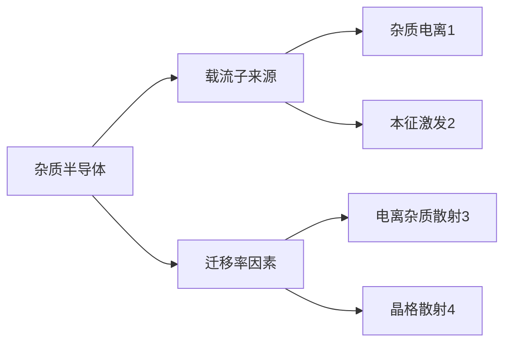

# 4 载流子的散射及电导

## 4.1 载流子的漂移运动  迁移率

利用电导率：$\sigma = \frac{1}{\rho}$ 得到欧姆定律的微分形式为: $\color{#E45F59}J = \sigma |Ε|$

漂移运动

平均漂移速度为：$\overline{v_d}$

电流强度：$I = -n q \overline{v_d} \times 1 \times s$

电流密度：$J = -n q \overline{v_d}$

总的电导率为：$\sigma = n q \mu_n + n q \mu_p$
n型、p型、本征从中提取即可

求载流子浓度: $n_i  = \frac{1}{\rho q (\mu_n + \mu_p)}$

## 4.2 载流子的散射

### 4.2.1 载流子散射概念

散射概念：

* 粒子性：载流子在半导体中运动，不断与热振动的晶格原子或电离杂质发生碰撞，改变了载流子的速度大小和方向。
* 波动性：电子波在半导体中传播时遭到散射。

散射过程：
a. 无电场时，无规则热运动，不形成电流；
b. 有电场时，载流子定向运动；
c. 载流子遭到散射，使其只能在两次散射之间获得加速度。

结论：
a. 在恒定电场作用下，电流密度是恒定的。
b. 电流产生的原因是电场对载流子的加速和散射对载流子运动的阻碍共同造成的。
c. 散射是半导体中电阻率产生的主要原因。

载流子以一定平均速度定向漂移

### 4.2.2 晶格振动的散射

主要散射机构

(1) 格波的概念

a.晶格原子在平衡位置附近振动；
b.晶格原子的振动由不同的基本波动按照波的叠加原理组合而成，基本波成为格波。

(2) 声学波和光学波 (**考试要考**)

a. 格波波矢：$q = \frac{2\pi}{\lambda}$
b. 相同q的格波数量取决于晶格原胞中所含的原子数。

原胞:

1个原子：一个q对应3个格波；
2个原子：一个q对应6个格波；

* 3支频率低，称声学波
* 3支频率高，称光学波

c. N个原胞构成的半导体，共有N个不同q的格波，每个q有6个不同频率格波，共有6N个不同的格波。下面3支为声学波，上面3支为光学波。

6种传播模式 有横波和纵波

长声学纵波 对散射影响比较大
影响其次的是 光学纵波

(3) 声学波与光学波区别：

原子振动方式：无论声学波还是光学波都是2横1纵

> **PPT P15** 有极霸图，但没看懂

(4) 声学波与光学波的频率

格波的频率是量子化变化的

$$
E_{\mathrm{phomon}} = (n + \frac{1}{2}) \hbar \omega_{a}
$$

最小声子单元: $\hbar \omega_{a}$
增加一个最小单元 -- 吸收声子
减少一个最小单元 -- 放出声子

格波的散射：电子与晶格碰撞 -- 产生、吸收声子

院长私藏了几张ppt --> 看HEIF

[旦又秒（bing之天书）](http://fdjpkc.fudan.edu.cn/_upload/article/files/b7/47/81b789084326983c6e01d04ea453/703103e0-674a-4ee2-954b-8c3030cc7ea9.pdf)

## 4.3 迁移率与杂质浓度和温度的关系

$$
\color{#E45F59}\mu = \frac{q}{m^{*}} \frac{1}{AT^{\frac{3}{2}} + \frac{B N_i}{T^{\frac{3}{2}}}}
$$

(1) 高纯和低掺杂样品：$N_i$ 很小，声学波散射起主要作用，$T \uparrow\mu \downarrow$
(2) 掺杂增加：杂质散射增加。$\mu$ 随温度 $T \uparrow$ 先增大而后下降，此时变为声学波散射为主。
(3) 轻掺杂时，多子与少子迁移率相同，迁移率数值恒定 $\mu_{\mathrm{少}} = \mu_{\mathrm{多}}$。
(4) 重掺杂后，杂质能级扩展为杂质能带，多子运动受电离杂质散射和施主能级俘获作用，受到影响减小，导致多子运动速度减慢。$\mu_{\mathrm{少}}$ 不变，$\mu_{\mathrm{少}} < \mu_{\mathrm{多}}$。
(5) 重掺杂后，作正常的漂移运动，所以少子迁移率受影响不大

## 4.4 电阻率及其杂质浓度和温度的关系

a. 轻掺杂，迁移率恒定，n等于杂质浓度
=> 电阻率与掺杂浓度成线性反比

b. 重掺杂，

case1 杂质不能全部电离
case2 迁移率随掺杂浓度增大降低

=> 电阻率与掺杂浓度非线性反比

建议看看PPT4 P20 的图，指出 考试要考 ，另外图是复旦人之ppt的

## 4.6 强电场下的效应、热载流子
