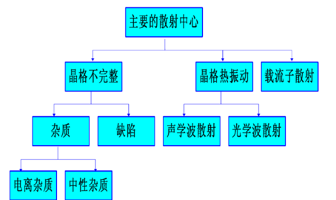
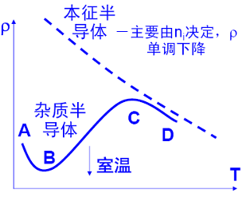
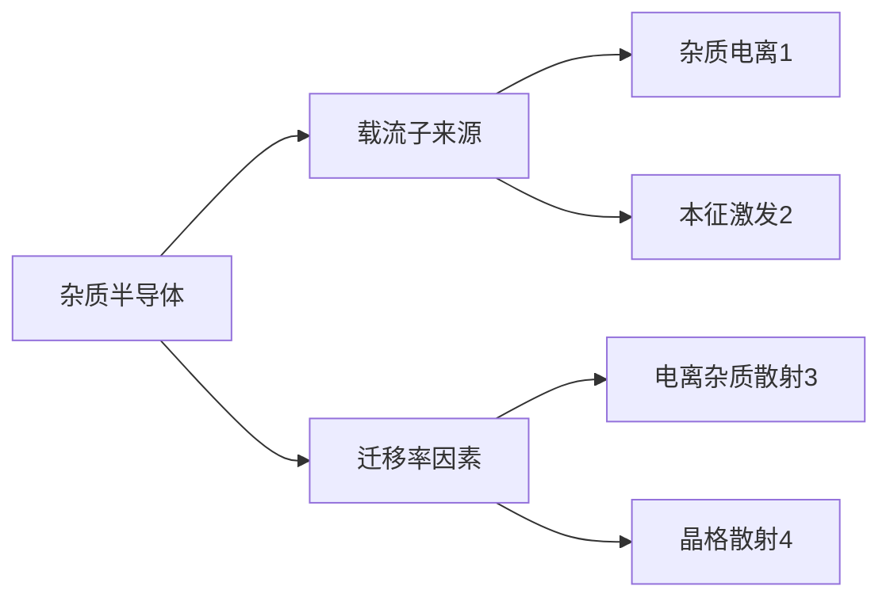

# 4 载流子的散射及电导

## 4.1 载流子的漂移运动和迁移率

### 4.1.1 欧姆定律

电流密度是指通过垂直于电流方向的单位面积的电流，即

$$
J = \frac{\Delta I}{\Delta S}
$$

其中 $\Delta I$ 是通过垂直于电流方向的面积元 $\Delta S$ 的电流，电流密度的单位为 $\mathrm{A/m^2}$

利用电导率：$\sigma = \frac{1}{\rho}$ 得到欧姆定律的微分形式为: $\color{#E45F59}J = \sigma |Ε|$

### 4.1.2 漂移速度和迁移率

漂移运动：有外加电压时，导体内部的自由电子受到电场力的作用，沿电场的反方向做定向运动构成电流。电子在电场力作用下的这种运动称为漂移运动，定向运动的速度称为漂移速度。

平均漂移速度为：$\overline{v_d} = \mu |E|$

迁移率：单位电场作用下，载流子获得的平均漂移速度，反映了载流子在外电场作用下作漂移运动的难易程度。迁移率的表达式为：

$$
\mu = \left|\frac{\overline{v_d}}{E}\right|
$$

单位是 $\mathrm{m^2/V \cdot s}$，或者 $\mathrm{cm^2/V \cdot s}$。可见，有效质量和弛豫时间（散射）是影响迁移率的因素。

电流强度：$I = -n q \overline{v_d} \times 1 \times s$

电流密度：$J = -n q \overline{v_d}$

总的电导率为：$\sigma = n q \mu_n + n q \mu_p$
n型、p型、本征从中提取即可

求载流子浓度: $n_i  = \frac{1}{\rho q (\mu_n + \mu_p)}$

## 4.2 载流子的散射

### 4.2.1 载流子散射概念

散射概念：

* 粒子性：载流子在半导体中运动，不断与热振动的晶格原子或电离杂质发生碰撞，改变了载流子的速度大小和方向。
* 波动性：电子波在半导体中传播时遭到散射。

散射过程：
a. 无电场时，无规则热运动，不形成电流；
b. 有电场时，载流子定向运动；
c. 载流子遭到散射，使其只能在两次散射之间获得加速度。

结论：
a. 在恒定电场作用下，电流密度是恒定的。
b. 电流产生的原因是电场对载流子的加速和散射对载流子运动的阻碍共同造成的。
c. 散射是半导体中电阻率产生的主要原因。

载流子以一定平均速度定向漂移

### 4.2.2 晶格振动的散射

主要散射机构

#### 4.2.2.2 晶格振动的散射

(1) 格波的概念

a.晶格原子在平衡位置附近振动；
b.晶格原子的振动由不同的基本波动按照波的叠加原理组合而成，基本波成为格波。

(2) 声学波和光学波 (**考试要考**)

a. 格波波矢：$q = \frac{2\pi}{\lambda}$
b. 相同q的格波数量取决于晶格原胞中所含的原子数。

原胞:

1个原子：一个q对应3个格波；
2个原子：一个q对应6个格波；

* 3支频率低，称声学波
* 3支频率高，称光学波

c. N个原胞构成的半导体，共有N个不同q的格波，每个q有6个不同频率格波，共有6N个不同的格波。下面3支为声学波，上面3支为光学波。

6种传播模式 有横波和纵波

长声学纵波 对散射影响比较大
影响其次的是 光学纵波

(3) 声学波与光学波区别：

原子振动方式：无论声学波还是光学波都是2横1纵

> **PPT P15** 有极霸图，但没看懂

(4) 声学波与光学波的频率

格波的频率是量子化变化的

$$
E_{\mathrm{phomon}} = (n + \frac{1}{2}) \hbar \omega_{a}
$$

最小声子单元: $\hbar \omega_{a}$
增加一个最小单元 -- 吸收声子
减少一个最小单元 -- 放出声子

格波的散射：电子与晶格碰撞 -- 产生、吸收声子

院长私藏了几张ppt --> 看HEIF

[旦又秒（bing之天书）](http://fdjpkc.fudan.edu.cn/_upload/article/files/b7/47/81b789084326983c6e01d04ea453/703103e0-674a-4ee2-954b-8c3030cc7ea9.pdf)

#### 4.2.2.3 其他因素引起的散射

（1）等同的能谷间散射

（2）中性杂质散射

（3）位错散射

（4）合金散射

## 4.3 迁移率与杂质浓度和温度的关系

### 4.3.1 平均自由时间和散射概率的关系

散射概率：用来描述散射的强弱，它代表单位时间内一个载流子受到散射的次数，其数值与散射机构有关。
平均自由时间：载流子在电场中做漂移运动时，只有在连续两次散射之间的时间内才做加速运动，这段时间称为自由时间。自由时间长短不一，若取极值多次而求得其平均值，则称为载流子的平均自由时间，常用 $\tau$ 来表示。
散射概率和平均自由时间互为倒数。

### 4.3.2 电导率、迁移率与平均自由时间的关系

各种类型材料的电导率：

* n 型半导体：$\sigma_n = n q \mu_n = \frac{n q^{2} \tau_n}{m_n^{*}}$
* p 型半导体：$\sigma_p = p q \mu_p = \frac{p q^{2} \tau_p}{m_p^{*}}$
* 混合型：$\sigma = n q \mu_n + p q \mu_p = \frac{n q^{2} \tau_n}{m_n^{*}} + \frac{p q^{2} \tau_p}{m_p^{*}}$

变化规律：

$\tau \uparrow \to \mu \uparrow \to \sigma \uparrow$

$m^{*} \uparrow \to \mu \downarrow$

$m_n^{*} < m_p^{*}$

$\to \mu_n > \mu_p$

---

$$
\frac{1}{m_c} = \frac{1}{3} \left( \frac{1}{m_l} + \frac{1}{m_t} \right)
$$

$m_c$ 电导有效质量

### 4.3.3 迁移率与杂质和温度的关系

因为 $\tau$ 是散射概率的倒数，根据式(4-19)、式(4-29)和式(4-30)，可以得到不同散射机构的平均自由时间与温度的关系为：

电离杂质散射 $\tau_i \propto N_i^{-1} T^{3/2}$ (4-51)

声学波散射 $\tau_s \propto T^{-3/2}$ (4-52)

光学波散射 $\tau_o \propto \left[\exp\left(\frac{h\omega_1}{k_0 T}\right)-1\right]$ (4-53)

上式 $\tau_i$、$\tau_s$ 和 $\tau_o$ 分别表示电离杂质散射、声学波和光学波散射的平均自由时间。

根据式(4-43)可以得到，对不同散射机构，迁移率与温度的关系为：

电离杂质散射 $\mu_i \propto N_i^{-1} T^{3/2}$ (4-54)

声学波散射 $\mu_s \propto T^{-3/2}$ (4-55)

光学波散射 $\mu_o \propto \left[\exp\left(\frac{\hbar\omega_1}{k_0 T}\right)-1\right]$ (4-56)

---

$$
\color{#E45F59}\mu = \frac{q}{m^{*}} \frac{1}{AT^{\frac{3}{2}} + \frac{B N_{\text{i}}}{T^{\frac{3}{2}}}}
$$

(1) 高纯和低掺杂样品：$N_i$ 很小，声学波散射起主要作用，$T \uparrow\mu \downarrow$
(2) 掺杂增加：杂质散射增加。$\mu$ 随温度 $T \uparrow$ 先增大而后下降，此时变为声学波散射为主。
(3) 轻掺杂时，多子与少子迁移率相同，迁移率数值恒定 $\mu_{\mathrm{少}} = \mu_{\mathrm{多}}$。
(4) 重掺杂后，杂质能级扩展为杂质能带，多子运动受电离杂质散射和施主能级俘获作用，受到影响减小，导致多子运动速度减慢。$\mu_{\mathrm{少}}$ 不变，$\mu_{\mathrm{少}} < \mu_{\mathrm{多}}$。
(5) 重掺杂后，作正常的漂移运动，所以少子迁移率受影响不大

## 4.4 电阻率及其杂质浓度和温度的关系

半导体电阻率可以用四探针法测量。

### 4.4.1 电阻率与杂质浓度的关系

关注 刘恩科课本 图4-15 锗、硅、砷化镓在300K时电阻率与杂质浓度的关系

a. 轻掺杂，迁移率恒定，n等于杂质浓度

=> 电阻率与掺杂浓度成线性反比

b. 重掺杂，

case1 杂质不能全部电离
case2 迁移率随掺杂浓度增大降低

=> 电阻率与掺杂浓度非线性反比

### 4.4.2 电阻率随温度的变化

建议看看PPT4 P20 的图，指出 考试要考 ，另外图是复旦人之ppt的

对纯半导体材料：对于纯半导体材料，电阻率主要由本征载流子浓度 $n_i$ 决定，即随着 $n_i$ 的增加而减小。而 $n_i$ 随温度上升而急剧增加，因此电阻率随温度升高而下降。
本征半导体电阻率随温度增加而单调下降，这是半导体区别于金属的一个重要特征。

对杂质半导体：

**AB段**: 温度很低，本征激发可以忽略，载流子主要由杂质电离提供，它随温度升高而增加，散射以电离杂质为主，迁移率也随温度升高而增大，因此电阻率随温度升高而下降。

**BC段**: 温度继续升高（包括室温），杂质全部电离，本征激发还不十分明显，载流子浓度基本不随温度变化，晶格振动散射开始起主导作用，迁移率随温度升高而降低，电阻率随温度升高而增大。

**C段**: 温度继续升高，本征激发很快增加，本征载流子数量快速增加，远远超过迁移率变化对电阻率的影响，电阻率随温度升高而急剧地下降。

## 4.6 强电场下的效应、热载流子

## 4.7 多能谷散射、耿氏效应

多能谷散射

在电场作用下，电子从电场中获取能量，可在能谷间转移，即能谷间散射，电子的准动量有较大的改变，伴随散射发射或吸收光学声子。同时，电子的有效质量、迁移率、平均漂移速度、电导率都将发生变化。

耿氏效应

在n型砷化镓两端电极上加以电压，当半导体内电场高于 \(3 \times 10^3 V/cm\) 时，半导体电流便以很高频率振荡，这种效应称为耿氏效应。

现在主要利用耿氏效应制造出多种工作模式的体效应微波器件。
