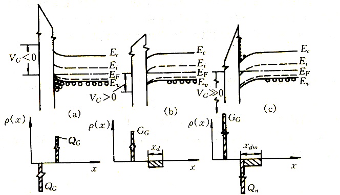

# 8 半导体表面与MIS结构

MIS 结构：金属-绝缘层-半导体结构

## 8.1 表面态

表面：

“表面”并不是一个几何面，而是指大块晶体的三维周期结构与真空之间的过渡区，它包括了所有不具有体内三维周期性的原子层。

理想表面：表面层中原子排列的对称性与体内原子完全相同，且表面不附着任何原子或分子的半无限晶体表面。在半导体表面，晶格不完整性使势场的周期性被破坏，在禁带中形成局部状态的能级分布（产生附加能级），这些状态称为**表面态**或**达姆能级**。
一定条件下，每个表面原子在禁带中对应一个表面能级。清洁表面的表面态所引起的表面能级，彼此靠得很近，形成准连续的能带，分布在禁带内。

由表面态（表面能级）的性质和费米能级的位置，它们可能成为施主或受主能级，或者成为电子-空穴对的复合中心。

与电子作用：

类施主态：空态时带正电，被一个电子占据后为中性的表面态类受主态：空态时为中性，被一个电子占据后带负电的表面态

表面态特性：

1. 可以成为半导体少数载流子有效的产生和复合中心，决定了表面复合的特性。
2. 对多数载流子起散射作用，降低表面迁移率，影响表面电导。
3. 产生垂直半导体表面的电场，引起**表面电场效应**。

## 8.2 表面电场效应

1. 表面电场产生的原因：
   1. 功函数不同的金属和半导体接触；
   2. 半导体具有表面态；
   3. MIS结构的金属和半导体功函数不同；
   4. 外加电压；
   5. 绝缘层中电荷。

2. 理想的MIS结构:
   1. $W_{m} = W_{s}$；
   2. 绝缘层中无电荷且完全不导电；
   3. 绝缘层/半导体接触界面间无界面态。

### 8.2.1 空间电荷层与表面势

表面势：空间电荷层内的电场从表面到体内逐渐减弱直到为零，电势发生相应变化，电势变化迭加在电子的电位能上，使得空间电荷层内的能带发生弯曲，表面势 $V_{\text{s}}$ 就是为描述能带变曲的方向和程度而引入的。

表面势：空间电荷层两端的电势差为表面势，以 $V_{\text{s}}$ 表示之，规定表面电势比内部高时，$V_{\text{s}}$ 取正值，反之 $V_{\text{s}}$ 取负值。

* 表面电势比内部高时取正值。
* 表面势及空间电荷区内电荷的分布情况随金属与半导体间所加电压 VG 而变化，分为**堆积、耗尽和反型**三种情况。
* 由玻耳兹曼统计，表面层载流子浓度 $n_s$、$p_s$ 和体内平衡载流子浓度 $n_0$、$p_0$ 的关系为：

$\dots$

理想MIS结构（p型）在各种 $V_G$ 下的表面势和空间电荷分布

（a）多子堆积；

多数载流子堆积状态（p型）表面势为负

此时 $V_G < 0$, 表面势 $V_{\text{s}} < 0$，空间电荷区内的空穴浓度增加，电子浓度减少，使得空间电荷区内的电场方向由表面指向体内，**使得半导体表面电子的能量高于体内**，**能带向上弯曲**，形成表面势垒。

（b）多子耗尽；

多数载流子耗尽状态（p型）表面势为正

此时 $V_G > 0$, 表面势 $V_{\text{s}} > 0$，**能带向下弯曲**，表面处空穴空穴浓度较体内空穴浓度低得多，表面层的负电荷基本上等于电离受主杂质浓度。

（c）反型

此时 $V_G$ 进一步增大，...

### 8.2.2 表面空间电荷层的电场、电势和电容

空间电荷层中电势满足的泊松方程为

$$
\frac{d^2 V}{dx^2} = -\frac{\rho(x)}{\varepsilon_{rs} \varepsilon_0}
$$

其中，$\varepsilon_{rs}$ 为半导体的相对介电常数，$\varepsilon_0$ 为真空介电常数，$\rho(x)$ 为总的空间电荷密度。

$\rho(x) = q(n_D^+ - p_A^- + p_p - n_p)$

其中，$n_D^+$, $p_A^-$ 为空间电荷区内的施主和受主电荷密度，$p_p$, $n_p$ 分别表示坐标 x 点的空穴和电子浓度。则在电势为 $V$ 的 x 点（取半导体内部电势为零），电子和空穴的浓度分别为

$n_{p} = n_{p0} \exp\left(\frac{qV}{k_0T}\right)$

$p_{p} = p_{p0} \exp\left(-\frac{qV}{k_0T}\right)$

... 跳过一些看不懂的公式 ... 感觉太复杂应该也不会考吧 （毕竟今年（2025）考研也不让用计算器）...

德拜长度 $L_D = \sqrt{\frac{\varepsilon_{rs} \varepsilon_0 k_0 T}{q^2 p_{p0}}}$

F函数 $F(\frac{q V}{k_0 T}) = \sqrt{\left[ \exp\left(-\frac{q V}{k_0 T}\right) + \frac{q V}{k_0 T} - 1 \right] + \frac{n_{p0}}{p_{p0}} \left[ \exp\left(\frac{q V}{k_0 T}\right) - \frac{q V}{k_0 T} - 1 \right]}$

#### 8.2.2.1 多子积累状态

当 $V_G < 0, V_{\text{s}} < 0, V < 0$ 时

#### 8.2.2.2 平带状态

当 $V_G = 0, V_{\text{s}} = 0, V = 0$ 时

$F(\frac{q V}{k_0 T}, \frac{n_{p0}}{p_{p0}}) = 0$

#### 8.2.2.3 耗尽状态

当 $V_G > 0, V_{\text{s}} > 0, \frac{n_{p0}}{p_{p0}} \ll 1$ 时，空穴耗尽

#### 8.2.2.4 反型状态

开始出现反型层的条件：$E_i = E_\text{F}$

强反型层的条件：$V_{\text{s}} \geq 2 V_b$

发生强反型的临界条件：$V_{\text{s}} = 2 V_b$ 此时金属板上施加的电压称为**开启电压** $V_{\text{T}}$

---

二维电子气 2DEG

#### 8.2.2.5 深耗尽状态

(加高频或脉冲电压)：

高频电压，反型层来不及形成，电中性条件靠耗尽层厚度 随电压的增加而展宽来实现。

空间电荷层中只存在电离杂质所形成的空间电荷， “耗尽层近似”仍适用。

深耗尽状态的应用：制备CCD等。

## 8.3 MIS结构的C-V特性

### 8.3.1 理想MIS结构的C-V特性

（1）$V_G < 0$ 时

$$
\frac{C}{C_0} = \frac{1}{1 + \frac{C_s}{C_0} \left(1 + \frac{q N_D}{\varepsilon_{rs} \varepsilon_0} x_d\right)}
$$

（2）$V_G = 0$ 时

（3）$V_G > 0$ 时

### 8.3.2 金属与半导体功函数差对C-V特性的影响

### 8.3.3 绝缘层中电荷对C-V特性的影响

## 8.4 Si-SiO2 系统的性质

硅－二氧化硅系统

1. 二氧化硅层中的可动离子 （Na + K + H+ ）
2. 二氧化硅层中的固定电荷 （位于Si-SiO2 界面附近20nm附近）
3. 界面态（位于禁带中，与半导体交换电荷）
4. 电离陷阱电荷 （各种辐射引起）

---

Si-SiO2系统中的电荷的作用：引起MOS结构C-V特性变化，影响器件性能。

---

减少Si-SiO2系统中的电荷的主要措施：

1. 防止沾污: 减少Na+ 等可动离子。
2. 退火，热处理: 减少固定电荷和陷阱电荷。
3. 选[100]晶向的单晶硅: 减少界面态。

## 8.5 表面电导及迁移率

* [ ] Wait to be filled.
