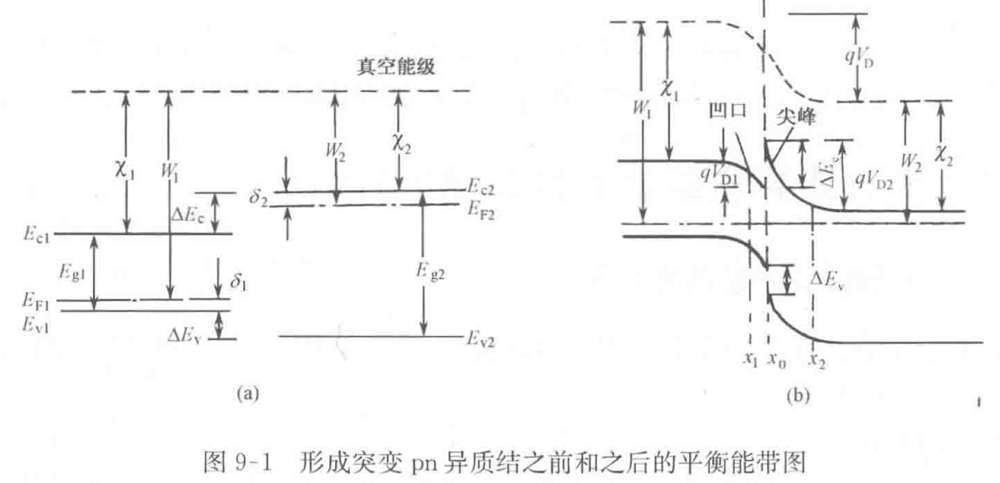

# 9-半导体异质结构

## 9.1 半导体异质结及其能带图

### 9.1.1 半导体异质结的能带图

@教材 P250

异质结：两种不同的半导体单晶材料组成的结

根据半导体单晶材料的导电类型

异质结

* 反型异质结：导电类型相反
* 同型异质结：导电类型相同

异质结也可分为 **突变异质结** 和 **缓变异质结**

突变异质结：从一种半导体材料向另一种半导体材料的过渡只发生于几个原子距离范围内。

缓变异质结：从一种半导体材料向另一种半导体材料的过渡发生在几个扩散长度范围内。

* 禁带宽度较小的半导体材料写（画）在前面（左）

---

（1）不考虑界面态时的能带图

首先，关于异质结，我们可以总结为以下两点:

1. 禁带宽度窄的画左边，禁带宽度宽的画右边。
2. 导带左边低右边高，价带左边高右边低。

$q V_{\text{D}}$, $W_1$, $W_2$, $\chi_1$, $\chi_2$, $E_{\text{C}}$, $E_{\text{V}}$ 如果这些量有具体的数值，请将字母表示和具体数值一起写上，例如 $qV_{\text{D}} = 0.2 \text{eV}$。如果没有具体数值，只标出字母表示即可。同时，请不要忘记标出 $E_0$，$E_{\text{c1}}$，$E_{\text{c2}}$，$E_{\text{v1}}$，$E_{\text{v2}}$ 的位置。

两种材料形成异质结后能带总的弯曲量=真空电子能级的弯曲量

$$
q V_{D} = q V_{D1} + q V_{D2} = E_{F2} - E_{F1}
$$

显然， $V_{D} = V_{D1} + V_{D2}$ ， $V_{D}$ 为接触电势差， $V_{D1} $ 和 $V_{D2}$ 分别为交界面两侧的 p 型半导体和 n 型半导体的内建电势差。

对异质结，在交界面处的突变

$$
\Delta E_c = \chi_1 - \chi_2
$$

价带顶突变

$$
\Delta E_v = \left(E_{g2} - E_{g1}\right) - \left(\chi_1 - \chi_2\right)
$$

（2）考虑界面态时的能带图

下面举一个例子，计算具有金刚石型结构的两块半导体所形成的异质结的悬挂键密度。如图 9-7(a)所示，取(111)晶面制造异质结。在晶胞中画出的(111)晶面为正三角形（图中画斜线部分），它的面积是 $\left(\sqrt{3} a^2\right)/ 2$，a为晶格常数。包含在这个面中的键数为 2，如图 9-7(b)所示。所以晶面(111)的键密度是 $4/\left(\sqrt{3} a^2\right)$。因此，对于晶格常数分别为 $a_1、 a_2$ [其中 $\left(a_1<a_2\right)$]的两块半导体形成的异质结，以(111)晶面为交界面时，悬挂键密度为

$$
\Delta N_{s}=\frac{4}{\sqrt{3}}\left[\frac{\left(a_{2}^2-a_{1}^2\right)}{a_{1}^2a_{2}^2}\right] \qquad(9-8)
$$

同理，对于(110)晶面，悬挂键密度为

$$
\Delta N_{s}=\frac{4}{\sqrt{2}}\left[\frac{\left(a_{2}^{2}-a_{1}^{2}\right)}{a_{1}^{2}a_{2}^{2}}\right] \qquad(9-9)
$$

对于(100)晶面，悬挂键密度为

$$
\Delta N_{s}=4\left[\frac{\left(a_{2}^{2}-a_{1}^{2}\right)}{a_{1}^{2}a_{2}^{2}}\right] \qquad(9-10)
$$

## 9.2 半导体异质pn结的电流电压特性及注入特性
