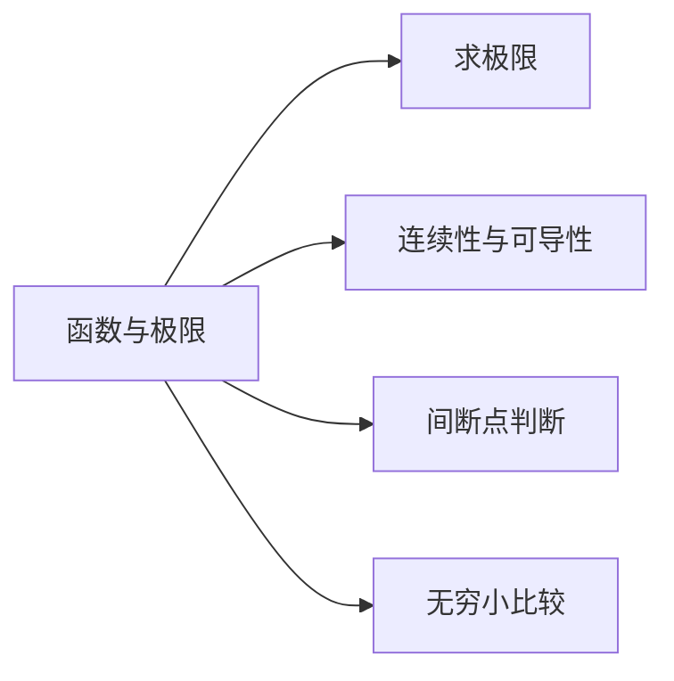

# 1 函数与极限

本章考点

* 函数的概念及表示法
* 函数的有界性、单调性、周期性和奇偶性 复合函教、反函数、分
* 函数和隐函数基本初等函数的性质及其图形
* 初等函数
* 函数关系的建立
* 数列极限与函数极限的定义及其性质函数的左极限和右极限无穷小量和无穷大量的概念及其关系
* 无穷小量的性质及无穷小量的比较
* 极限的四则运算
* 极限存在的两个准则：单调有界准则和夹逼准则并会利用它们求极限

## 1.1 函数

### 1.1.1 函数的概念及常见函数

#### 1.1.1.1 函数的定义

定义域 对应法则

#### 1.1.1.2 复合函数

定义

#### 1.1.1.3 反函数

$x=f^{-1}(y)$

单调函数一定有反函数，反之不一定。有反函数充要条件为 $xy$ 一一映射。

#### 1.1.1.4 初等函数

将幂函数、指数函数、对数函数、三角函数及反三角函数统称为初等函数。

### 1.1.2 函数的性质

1 单调性

2 奇偶性

3 周期性

4 有界性

## 1.2 极限

### 1.2.1 极限的概念

#### 1.2.1.1 数列的极限

数列极限的定义

$\forall \varepsilon > 0, \exist N > 0$，使得当 $n > N$ 时，不等式 $\vert x_n - A\vert < \varepsilon$ 成立，则称常数 $A$ 为数列 $\{x_n\}$ 的极限，记为: $\lim_{n \to \infty}x_n = A$

$$
\lim_{n \to \infty}x_n = a \Leftrightarrow \lim_{n \to \infty}x_{2n} = \lim_{n \to \infty}x_{2n+1} = a
$$

柯西收敛准则

---

#### 1.2.1.2 函数的极限

函数极限的定义

设函数$f(x)$在点$x_0$的某一个去心邻域有定义，若存在常数$A$，对于任意给定的$\xi>0$，总存在正数$\delta$，使得当$0<\vert x-x_0\vert<\delta$式，对应的函数值$f(x)$都满足不等式$\vert f(x)-A\vert <\xi$，则$A$就是函数$f(x)$当$x\to x_0$时的极限，记作$\lim\limits_{x\to x_0}f(x)=A$或$f(x)\rightarrow A(x\rightarrow x_0)$。

写成$\xi-\delta$语言：$\lim\limits_{x\to x_0}f(x)=A\Leftrightarrow\forall\xi>0,\exists\delta>0,\text{当}0<\vert x-x_0\vert<\delta$时，有$\vert f(x)-A\vert<\xi$。

而对于趋向无穷时，写成$\xi-X$语言：$\lim\limits_{x\to\infty}f(x)=A\Leftrightarrow\forall\xi>0,\exists X>0,\text{当}\vert x\vert>X$时，有$\vert f(x)-A\vert<\xi$。

注意：这里的趋向分为六种：$x\to x_0$、$x\to x_0^+$、$x\to x_0^-$、$x\to\infty$、$x\to\infty^+$、$x\to\infty^-$。

---

函数存在的充要条件是：

1. $\lim\limits_{x\to x_0}f(x)\Leftrightarrow\lim\limits_{x\to x_0^-}f(x)=\lim\limits_{x\to x_0^+}f(x)=A$。
2. 函数脱帽法：$\lim\limits_{x\to x_0}f(x)\Leftrightarrow f(x)=A+\alpha(x),\lim\limits_{x\to x_0}\alpha(x)=0$，后面的$\alpha(x)$就是函数与极限值的误差。

---

$e^{\infty}$ 型极限 （如 $\lim\limits_{x\to0}e^{\frac{1}{x}}, \lim\limits_{x\to\infty}e^x, \lim\limits_{x\to\infty}e^{-x}$）

函数的局部有界性 / 函数的局部保号性

极限运算法则

1. 有限个无穷小的和是无穷小。
2. 有界函数与无穷小的乘积是无穷小。
3. 有限个无穷小的乘积是无穷小

关于**求极限方法**

洛必达、极限存在准则

极限四则运算，需要满足 $\lim_{}f(x)=A, \lim_{}g(x)=B$

等价替换

两个重要极限

$ \lim_{x \to 0}\frac{sinx}{x} = 1 $

$ \lim_{x \to \infty}(1 + \frac{1}{x})^x = e $

$ \lim_{x \to 0}(1 + x)^\frac{1}{x} = e $

连续性定义: $\lim_{x \to x_0}f(x)=f(x_0)$

左连续 右连续

变上限积分

放缩法

### 1.2.2 极限的性质

~~唯一性: 若极限存在，则极限唯一。~~

~~局部有界性: 若极限存在且为$A$，则存在正常数$M$和$\delta$，使得当$0<\vert x-x_0\vert<\delta$时，有$\vert f(x)\vert\leqslant M$。~~

TODO: 以下内容需要修改

#### 1.2.2.1 有界性

(数列) 若数列 $\{x_n\}$ 有极限，则数列 $\{x_n\}$ 有界。

(函数) 若函数 $f(x)$ 在 $x_0$ 的某一去心邻域内有定义，且 $\lim_{x \to x_0}f(x) = A$，则函数 $f(x)$ 在 $x_0$ 处有界。

#### 1.2.2.2 保号性

(数列) 设 $\lim_{n \to \infty} x_n = A$

(1) 如果 $A > 0$，则存在正整数 $N$，使得当 $n > N$ 时，有 $x_n > 0$。

(2) 如果 $A < 0$，则存在正整数 $N$，使得当 $n > N$ 时，有 $x_n < 0$。

(函数) 设 $f(x)$ 在 $x_0$ 的某一去心邻域内有定义，且 $\lim_{x \to x_0}f(x) = A$。

(1) 如果 $A > 0$，则存在正数 $\delta$，使得当 $0 < \vert x - x_0\vert < \delta$ 时，有 $f(x) > 0$。

(2) 如果 $A < 0$，则存在正数 $\delta$，使得当 $0 < \vert x - x_0\vert < \delta$ 时，有 $f(x) < 0$。

若函数 $f(x)$ 在 $x_0$ 的某一去心邻域内有定义，且 $\lim_{x \to x_0}f(x) = A$，且 $A > 0$，则存在正数 $\delta$，使得当 $0 < \vert x - x_0\vert < \delta$ 时，有 $f(x) > 0$。

### 1.2.3 极限存在准则

#### 1.2.3.1 夹逼准则

$$
a_n \le b_n \le c_n \\
\lim_{n \to \infty}a_n = \lim_{n \to \infty}c_n = A \Rightarrow \lim_{n \to \infty}b_n = A
\\
f(x) \le g(x) \le h(x) \\
\lim_{x \to x_0}f(x) = \lim_{x \to x_0}h(x) = A \Rightarrow \lim_{x \to x_0}g(x) = A
$$

#### 1.2.3.2 单调有界定理

设 $\{a_n\}$ 为数列，若数列 $\{a_n\}$ 单调且有界，则 $\lim_{n \to \infty}a_n$ 一定存在

---

2个重要极限

$$
\lim_{x \to 0}\frac{\sin x}{x} = 1 \\
\lim_{x \to \infty}(1 + \frac{1}{x})^x = e
$$

#### 1.2.3.3 Cauchy 极限存在准则

TAG: [补充, 老头]

设函数 $f(x)$ 在 $x_0$ 的某一去心邻域内有定义，若 $\forall \epsilon > 0, \exists \delta > 0$，当 $x_1, x_2$ 满足 $0 < |x_1 - x_0| < \delta, 0 < |x_2 - x_0| < \delta$ 时，有 $|f(x_1) - f(x_2)| < \epsilon$，则称函数 $f(x)$ 在 $x_0$ 处满足 Cauchy 条件，或称 $f(x)$ 在 $x_0$ 处满足 Cauchy 极限存在准则。

### 1.2.4 无穷小量

#### 1.2.4.1 无穷小的概念

若函数 $f(x)$ 当  $x \to x_0$ 或 $x \to \infty$ 时的极限为 0，则称 $f(x)$ 为 $x \to x_0$ 或 $x \to \infty$ 时的无穷小量。

#### 1.2.4.2 无穷小的比较

设 $\lim_{x \to x_0}\alpha(x) = 0，\lim_{x \to x_0}\beta(x) = 0$

若 $\lim_{x \to x_0}\frac{\beta(x)}{\alpha(x)} = C \ne 0$，则称 $\alpha(x)$ 与 $\beta(x)$ 是同阶无穷小，记为 $\alpha(x) \sim \beta(x)$
若 $\lim_{x \to x_0}\frac{\beta(x)}{\alpha(x)} = 0$，则称 $\alpha(x)$ 是 $\beta(x)$ 的高阶无穷小，记为 $\alpha(x) = o(\beta(x))$
若 $\lim_{x \to x_0}\frac{\beta(x)}{\alpha(x)} = \infty$，则称 $\alpha(x)$ 是 $\beta(x)$ 的低阶无穷小，记为 $\alpha(x) = O(\beta(x))$
若 $\lim_{x \to x_0}\frac{\beta(x)}{\alpha(x)} = 1$，则称 $\alpha(x)$ 与 $\beta(x)$ 是等价无穷小，记为 $\alpha(x) \approx \beta(x)$

#### 1.2.4.3 无穷小的性质

1. 有限个无穷小的和是无穷小。
2. 有限个无穷小的积是无穷小。
3. 无穷小与有界量的乘积是无穷小。

---

关于等价替换的补充

(1) 和差代替规则

若 $\alpha(x) \sim \alpha'(x), \beta(x) \sim \beta'(x)$，且 $\alpha$ 与 $\beta$ 不等价，则 ...

(2) 因式代替规则

无穷小的阶数

### 1.2.5 无穷大量

#### 1.2.5.2 常用的一些无穷大量的比较

(1) 当 $x \to +\infty$ 时，

$$
\ln^{\alpha} x \ll x^{\beta} \ll a^x
$$

(2) 当 $n \to \infty$ 时，

$$
\ln^{\alpha} n \ll n^{\beta} \ll a^n \ll n! \ll n^n
$$

#### 1.2.5.3 无穷大量的性质

1. 两个无穷大量的积是无穷大量。
2. 无穷大量与有界量之和是无穷大量。

#### 1.2.5.4 无穷大量与无界变量的关系

无穷大量必为无界变量，但无界变量不一定为无穷大量。

#### 1.2.5.5 无穷大量与无穷小量的关系

在同一极限过程中，如果 $f(x)$ 是无穷大量，那么 $\frac{1}{f(x)}$ 是无穷小量，反之亦然。

## 1.3 函数的连续性

~~函数的连续性与间断点~~

### 1.3.1 连续性的概念

设 $f(x)$ 在点 $x_0$ 的某一去心邻域内有定义，若

$$
\lim_{\Delta x \to 0}\Delta y = \lim_{\Delta x \to 0}[f(x_0 + \Delta x) - f(x_0)] = 0
$$

则称函数 $f(x)$ 在点 $x_0$ 处连续。

### 1.3.2 间断点及其分类

关于间断点判断

若左右极限都存在，则为第一类间断点，否则，为第二类间断点。

1. $\lim_{x \to x_0}f(x) = \infty, x_0$ 为无穷间断点
2. $\lim_{x \to x_0}f(x)$ 震荡不存在, $x_0$ 为震荡间断点
3. $\lim_{x \to x_0}f(x) =  A \ne f(x_0),x_0$ 为可去间断点
4. $\lim_{x \to x_0-}f(x) \ne lim_{x \to x_0+}f(x),x_0$ 为跳跃间断点

### 1.3.3 连续性的运算与性质

设函数 $f(x)$ 和 $g(x)$ 在 $x_0$ 处连续，则 $f(x) \pm g(x), f(x)g(x), \frac{f(x)}{g(x)}(g(x) \ne 0)$ 在 $x_0$ 处连续。

设函数 $u = \varphi(x)$ 在点 $x=x_0$ 处连续，函数 $\varphi(x_0) = u_0$ ,而函数 $y = f(u)$ 在点 $u=u_0$ 处连续，则复合函数 $y = f[\varphi(x)]$ 在点 $x=x_0$ 处连续。

基本初等函数在其定义域内连续。

初等函数在其定义区间内连续。

### 1.3.4 闭区间上连续函数的性质

零点定理：设 $f(x)$ 在 $[a,b]$ 上连续，且 $f(a)f(b) < 0$，则在 $(a,b)$ 内至少存在一点 $\xi$，使得 $f(\xi) = 0$

介值定理：设 $f(x)$ 在 $[a,b]$ 上连续，且 $f(a) < f(b)$，则对任意 $u \in (f(a),f(b))$，在 $(a,b)$ 内至少存在一点 $\xi$，使得 $f(\xi) = u$

### 1.3 常考题型与典型例题

看后面还内置了114个习题，不过这里不做记录了。
