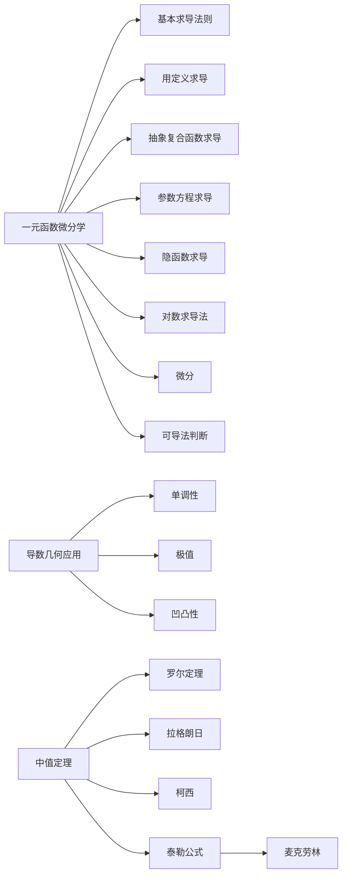

# 2 一元函数微分学

本章考点

* 导数和微分的概念
* 导数的几何意义和物理意义
* 函数的可导性与连续性之间的关系
* 平面曲线的切线和法线
* 导数和微分的四则运算
* 基本初等函数的导数
* 复合函数、反函数、隐函数以及参数方程所确定的函数的导数（数学三不要求参数方程）
* 高阶导数
* 一阶微分形式的不变性
* 中值定理
* 不等式与零点问题
* 导数应用

## 2.1 导数的概念

### 2.1.1 导数的概念及几何意义

导数的定义

$f^\prime(x_0) = \lim_{x \to x_0}\frac{f(x)-f(x_0)}{x-x_0}$

$f^\prime(x_0) =\lim_{h \to 0}\frac{f(x_0+h)-f(x_0)}{h}$

$f^\prime(x_0) =\lim_{h \to 0}\frac{f(x_0)-f(x_0-h)}{h}$

导数存在的条件：函数在某点可导的充分必要条件是函数在该点的左右导数存在且相等

利用导数的定义可以求极限：若 $f(x)$ 在 $x_0$ 处可导，则有

$$
\lim_{\Delta x \to 0}\frac{f(x_0 + \alpha\Delta x) - f(x_0)}{\Delta x} = \alpha f^\prime(x_0) \\
\lim_{\Delta x \to 0}\frac{f(x_0) - f(x_0 + \alpha\Delta x)}{\Delta x} = - \alpha f^\prime(x_0) \\
\lim_{\Delta x \to 0}\frac{f(x_0 + \alpha\Delta x) - f(x_0 + \beta \Delta x)}{\Delta x} = (\alpha - \beta)f^\prime(x_0)
$$

---

导数的几何意义

1. 切线方程 $y = f(x_0) + f^\prime(x_0)(x-x_0)$
2. 法线方程 $y = f(x_0) - \frac{1}{f^\prime(x_0)}(x-x_0)$

### 2.1.2 微分的概念及几何意义

微分 --> 别忘了写dx

导数 Differentions

### 2.1.3 连续、可导与可微之间的关系

可导一定连续

见 [【金榜时代】2025考研数学 复习全书・基础篇][] P67

## 2.2 导数与微分的计算

### 2.2.1 导数的计算

#### 2.2.1.1 基本初等函数的导数公式

1. $(C)' = 0$
2. $(x^\mu)' = \mu x^{\mu-1}$
3. $(a^x)' = a^x \ln a$
4. $(\log_ax)' = \frac{1}{x \ln a}$
5. $c' = 0$
6. $(x^\mu)' = \mu x^{\mu-1}$
7. $(a^x)' = a^x \ln a$
8. $(\log_ax)' = \frac{1}{x \ln a}$
9. $(\sin x)' = \cos x$
10. $(\cos x)' = -\sin x$
11. $(\tan x)' = \sec^2x$
12. $(\cot x)' = -\csc^2x$
13. $(\sec x)' = \sec x \tan x$
14. $(\csc x)' = -\csc x \cot x$
15. $(\arcsin x)' = \frac{1}{\sqrt{1-x^2}}$
16. $(\arccos x)' = -\frac{1}{\sqrt{1-x^2}}$
17. $(\arctan x)' = \frac{1}{1+x^2}$
18. $(\mathrm{arccot} x)' = -\frac{1}{1+x^2}$
19. $(e^x)' = e^x$
20. $\ln x' = \frac{1}{x}$

#### 2.2.1.2 四则运算求导法则

$[u(x) \pm v(x)]' = u'(x) \pm v'(x)$

$[u(x) \cdot v(x)]' = u'(x) \cdot v(x) + u(x) \cdot v'(x)$

$[\frac{u(x)}{v(x)}]' = \frac{u'(x) \cdot v(x) - u(x) \cdot v'(x)}{v^2(x)}$

#### 2.2.1.3 复合函数求导法则

$(f[g(x)])' = f'[g(x)] \cdot g'(x)$

即为

$\frac{dy}{dx} = \frac{dy}{du} \cdot \frac{du}{dx}$

#### 2.2.1.4 反函数求导法则

$(f^{-1}(x))' = \frac{1}{f'(f^{-1}(x))}$

互为反函数的导数互为倒数

#### 2.2.1.5 隐函数求导法则

见 [【金榜时代】2025考研数学 复习全书・基础篇][] P74

#### 2.2.1.6 对数求导法则

将函数等式两边同时取对数，然后化为隐函数形式，再求导

幂指函数 $y = f(x)^{g(x)} \rightarrow \ln y = g(x) \ln f(x)$

#### 2.2.1.7 参数方程求导法则

见 [【金榜时代】2025考研数学 复习全书・基础篇][] P77

$$
y = \begin{cases}
    x = \epsilon(t) \\
    y = \rho(t)
\end{cases}
$$

### 2.2.2 高阶导数的计算

高阶导数的四则运算法则

$\left[ u(x) \pm v(x) \right]^{(n)} = u^{(n)}(x) \pm v^{(n)}(x)$

莱布尼茨公式

$$
\begin{aligned}
    (fg)^{(n)}
    &= \sum_{k=0}^nC_n^kf^{(k)}g^{(n-k)} \\
    &= f^{(n)}g + C_n^1f^{(n-1)}g^{(1)} + \dots + C_n^k f^{(n-k)}(x)g^{(k)}(x) + \dots f^{(1)}g^{(n-1)} + fg^{(n)} \\
    \frac{d^nf}{dx^n} &= \frac{d^n}{dx^n}(f(x)g(x)) = \sum_{k=0}^nC_n^kf^{(k)}(x)g^{(n-k)}(x)
\end{aligned}
$$

常用的n阶导数公式

1. $(x^n)^{(n)} = n!$
2. $(e^{x})^{(n)} = e^x \rightarrow (e^{ax+b})^{(n)} = a^ne^{ax+b}$
3. $(a^x)^{(n)} = a^x \ln^na$
4. $(\sin x)^{(n)} = \sin(x+\frac{n\pi}{2})$
5. $(\cos x)^{(n)} = \cos(x+\frac{n\pi}{2})$
6. $(x^\alpha)^{(n)} = \alpha(\alpha-1)\dots(\alpha-n+1)x^{\alpha-n}$
7. $\ln x^{(n)} = (-1)^{n-1}\frac{(n-1)!}{x^{n}}$
8. $(\frac{1}{ax+b})^{(n)} = (-1)^n \frac{n!}{(ax+b)^{n+1}}$

### 2.2.3 微分的计算

微分的四则运算法则

## 2.3 微分中值定理、不等式与零点问题

### 2.3.1 中值定理

费马定理

设 $f(x)$ 在 $x = x_0$ 的某邻域 $U(x_0)$ 内有定义，$f(x_0)$ 是 $f(x)$ 的极值，且 $f'(x_0)$ 存在，则 $f'(x_0) = 0$

---

罗尔定理

设 $f(x)$ 在 $[a,b]$ 上连续，在 $(a,b)$ 内可导，且 $f(a) = f(b)$，则至少存在一点 $\xi \in (a,b)$ 使得 $f'(\xi) = 0$

---

拉格朗日中值定理

设 $f(x)$ 在 $[a,b]$ 上连续，在 $(a,b)$ 内可导，则至少存在一点 $\xi \in (a,b)$ 使得$f(b) - f(a) = f'(\xi)(b-a)$

拉格朗日中值定理是拉格朗日定理在两个函数情形下的推广

---

柯西中值定理

设 $f(x)$ 和 $g(x)$ 在 $[a,b]$ 上连续，在 $(a,b)$ 内可导，且 $g'(x) \ne 0$，则至少存在一点 $\xi \in (a,b)$ 使得 $\frac{f(b) - f(a)}{g(b) - g(a)} = \frac{f'(\xi)}{g'(\xi)}$

---

Taylor 公式

$$
f(x) = f(x_0) + f'(x_0)(x-x_0) + \frac{f''(x_0)}{2!}(x-x_0)^2+ \dots +\frac{f^{n}(x_0)}{n!}(x-x_0)^n + R_n(x)
$$

* 佩亚诺型余项 $R_n(x) = o((x-x_0)^n),(x \to x_0)$
* 拉格朗日余项 $R_n(x) = \frac{f^{(n + 1)}(\xi)}{(n + 1)!}(x - x_0)^{n + 1}$ , $\xi$ 在 $x_0$ 与 $x$ 之间
* 柯西余项

以上几种余项的区别和使用场景 -> [【金榜时代】2025考研数学 复习全书・基础篇][] P92

如果 Taylor 公式中的余项 $x_0 = 0$，则称为麦克劳林公式

几个初等函数的**麦克劳林公式**

$$
e^x = 1 + x + \frac{1}{2!}x^2 + \dots + \frac{1}{n!}x^n + \frac{e^{\theta x}}{(n + 1)!}x^{n + 1}
$$

$$
\sin x = x - \frac{1}{3!}x^3 + \frac{1}{5!}x^5 + \dots + \frac{(-1)^{n-1}}{(2n - 1)!}x^{2n - 1} + R_{2n}(x)
$$

$$
\cos x = x - \frac{1}{2!}x^2 + \frac{1}{4!}x^4 + \dots +  \frac{(-1)^n}{(2n)!}x^{2n} + \dots
$$

$$
\ln (1 + x) = x - \frac{x^2}{2} + \frac{x^3}{3} + \dots + (-1)^{n - 1}\frac{x^n}{n} + R_n(x)
$$

$$
(1 + x)^\mu = 1 + \mu x + C^2_\mu(x^2) + \dots + C^k_\mu(x^k) + R_n(x) \\
\rightarrow C^k_\mu = \frac{\mu(\mu - 1) \dots (\mu - k + 1)}{k!} \leftarrow
$$

### 2.3.2 不等式的证明

1. 单调性
2. 最值
3. 拉格朗日中值定理
4. 拉格朗日余项 Taylor 公式

以上，详见 [【金榜时代】2025考研数学 复习全书・基础篇][] P94

### 2.3.3 零点问题

1. 由连续函数介值定理或连续函数零点定理证明
2. 由罗尔定理证明

详见 [【金榜时代】2025考研数学 复习全书・基础篇][] P97

## 2.4 导数的应用

函数的**单调性**

1. $x \in (a,b)$ , $f'(x) > 0$ , $f(x)$ 单调递增
2. $x \in (a,b)$ , $f'(x) < 0$ , $f(x)$ 单调递减

---

函数的**极值**

极值的必要条件: 设 $y = f(x)$ 在 $x_0$ 可导，且 $f(x)$ 在 $x_0$ 处取极值，则 $f'(x_0) = 0$

驻点: $f'(x_0) = 0$ 的点称为驻点

极值的第一充分条件: $f'(x_0) = 0$

1. 若 $x < x_0$ , $f'(x) > 0$ , $x > x_0$ , $f'(x) < 0$ , 则 $f(x)$ 在 $x_0$ 处取极大值
2. 若 $x < x_0$ , $f'(x) < 0$ , $x > x_0$ , $f'(x) > 0$ , 则 $f(x)$ 在 $x_0$ 处取极小值
3. 若 $f'(x)$ 在 $x_0$ 处不变号，则 $f(x)$ 在 $x_0$ 处不取极值

极值的第二充分条件: $f'(x_0) = 0 , f''(x) \ne 0$

1. $f''(x) < 0$ , $f(x)$ 在 $x_0$ 处取极大值
2. $f''(x) > 0$ , $f(x)$ 在 $x_0$ 处取极小值
3. $f''(x) = 0$ , 无法判断

若在定义区间内只有一个驻点 $x_0$ ，则 $f(x_0)$ 一定是最值

---

曲线的**凹凸性**

1. $x \in (a,b)$ , $f''(x) > 0$ , $f(x)$ 在 $[a, b]$ 上的图形是凹的
2. $x \in (a,b)$ , $f''(x) < 0$ , $f(x)$ 在 $[a, b]$ 上的图形是凸的

**拐点**的必要条件: $f''(x_0) = 0$

拐点的第一充分条件:

1. $f''(x)$ 在 $x_0$ 的左右两侧异号，则点 $x_0, f(x_0)$ 是拐点
2. $f''(x)$ 在 $x_0$ 的左右两侧同号，则点 $x_0, f(x_0)$ 不是拐点

拐点的第二充分条件: 设 $f(x)$ 在 $x_0$ 处三阶可导，且 $f''(x_0) = 0$ , 则

1. $f'''(x_0) \ne 0$ , 则 $f(x)$ 在 $x_0$ 处的拐点
2. $f'''(x_0) = 0$ , 则不能判断

---

函数图形描绘中的**渐近线**

水平渐近线: 若 $\lim_{x \to \infty}f(x) = A$ , 则 $y = A$ 是 $f(x)$ 的水平渐近线

铅直渐近线: 若 $\lim_{x \to x_0}f(x) = \infty$ , 则 $x = x_0$ 是 $f(x)$ 的铅直渐近线

斜渐近线: 若 $\lim_{x \to \infty}[f(x) - (ax + b)] = 0$ , 则 $y = ax + b$ 是 $f(x)$ 的斜渐近线

---

曲线的弧微分与曲率

设 $y = f(x)$ 在 $(a, b)$ 内有连续导数，则 **弧微分** $ds = \sqrt{1 + [f'(x)]^2}dx$

设 $y = f(x)$ 在 $(a, b)$ 内有连续二阶导数，则 **曲率** $k = \frac{|f''(x)|}{[1 + (f'(x))^2]^{3/2}}$

由参数方程 $x = \phi(t)$ , $y = \psi(t)$ 所确定的曲线的弧微分 $ds = \sqrt{(\phi'(t))^2 + (\psi'(t))^2}dt$

由参数方程 $x = \phi(t)$ , $y = \psi(t)$ 所确定的曲线的曲率 $k = \frac{|\phi'(t)\psi''(t) - \phi''(t)\psi'(t)|}{[(\phi'(t))^2 + (\psi'(t))^2]^{3/2}}$

称 $\rho = \frac{1}{k}$ 为曲线的**曲率半径**

曲率圆：设曲线 $y = f(x)$ 在点 $M(x_0, y_0)$ 处的曲率为 $K (K \neq 0)$ ，则在点 $M$ 处的曲线的法线上，在凹的一侧取一点 $D$ ，使 $|DM| = \frac{1}{K}$ ，以 $D$ 为圆心，$M$ 为半径作圆，这个圆叫做曲线在点 $M$ 处的曲率圆，曲率圆的圆心 $D$ 叫做曲线在点 $M$ 处的曲率中心，曲率圆的半径 $\rho$ 叫做曲线在点 $M$ 处的曲率半径

---

[【金榜时代】2025考研数学 复习全书・基础篇]: https://www.google.com
