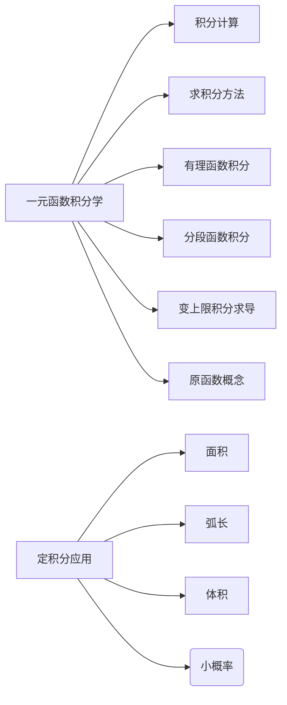

# 3 一元函数积分学

一元函数积分学: 包含不定积分与定积分，为了文档的统一与可读性，故拆分

## 3.1 不定积分与定积分的概念、性质

### 3.1.1 原函数、不定积分、定积分

**原函数**概念

如果在区间 $I$ 上,可导函数 $F(x)$ 的导函数为 $f(x)$, 即对任一 $x$ 属于 $I$ ,都有
$F'(x) = f(x) 或 dF(x) = f(x)dx$
那么函数 $F(x)$ 就称为 $f(x)$ 在区间 $I$ 上的一个**原函数**.

### 3.1.2 积分的基本性质

---

【总结】【变限积分常用性质】

设 $f(x)$ 在 $[a, b]$ 上连续，则 $\int_{a}^{x}f(t)dt$ 在 $[a, b]$ 上可导，且 $\frac{d}{dx}\int_{a}^{x}f(t)dt = f(x)$

1. 若 $f(x)$ 在 $[a, b]$ 上可积，则 $F(x) = \int_{a}^{x}f(t)dt$ 在 $[a, b]$ 上连续
2. 若 $f(x)$ 在 $[a, b]$ 上连续，则 $F(x) = \int_{a}^{x}f(t)dt$ 在 $[a, b]$ 上可导，且 $F'(x) = f(x)$
3. 若 $f(x)$ 在 $[a, b]$ 上有第一类间断点 $x_0$，在其他点连续，则
   1. 若 $x = x_0 \in [a, b]$ 是可去间断点，则 $F(x) = \int_{a}^{x}f(t)dt$ 在 $x = x_0$ 处可导，且 $F'(x_0) = \lim_{x \to x_0}f(x)$
   2. 若 $x = x_0 \in [a, b]$ 是跳跃间断点，则 $F(x) = \int_{a}^{x}f(t)dt$ 在 $x = x_0$ 处不可导

---

关于变上限积分奇偶性

1. 若 $f(x)$ 为奇函数，则 $\int_{a}^{x}f(t)dt$ 为偶函数
2. 若 $f(x)$ 为偶函数，则 $\int_{a}^{x}f(t)dt$ 为奇函数

---

【结论】设 $f(x)$ 是 $R$ 上的周期为 $T > 0$ 的连续函数，则 $\lim_{x \to \infty} \frac{\int_{0}^{x}f(t)dt}{x} = \frac{1}{T}\int_{0}^{T}f(t)dt$

---

$\int_{0}^{\frac{\pi}{2}} \frac{1}{\sin x}dx = +\infty$

**原函数存在定理**: 连续函数一定有原函数

## 3.2 不定积分与定积分的计算

### 3.2.1 基本积分公式

$$
\begin{align*}
    \int{e^x\, dx} = e^x + C \\
    \int{a^x\, dx} = \frac{a^x}{\ln a} + C \\
\end{align*}
$$

几个**不太熟悉**的积分公式

$$
\begin{align*}
    \int{\sec x \tan x \, dx} = \sec x + C \\
    \int{\csc x \cot x \, dx} = -\csc x + C \\
    \int{\tan x \, dx} = -\ln\lvert \cos x \rvert + C \\
    \int{\cot x \, dx} = \ln\lvert \sin x \rvert + C \\
    \int{\sec x \, dx} = \ln\lvert \sec x + \tan x \rvert + C \\
    \int{\csc x \, dx} = \ln\lvert \csc x - \cot x \rvert + C \\
\end{align*}
$$

$$
\int{\frac{1}{\sqrt{x^2 + a^2}}\, dx} = \ln(x + \sqrt{x^2 + a^2}) + C
$$

$$
\int{\frac{1}{\sqrt{x^2 - a^2}}\, dx} = \ln(x + \sqrt{x^2 - a^2}) + C
$$

### 3.2.2 基本积分方法

常见的几种典型类型的换元法

---

常用的定积分结论

(1)

$$
\int_{a}^{b}f(x)\, dx = \int_{a}^{b}f(a + b - x)\, dx
$$

(5)

$$
\int_{0}^{\pi}x f(\sin x)\, dx = \frac{\pi}{2}\int_{0}^{\pi}f(\sin x)\, dx
$$

(7) 点火公式

$$
\int_{0}^{\frac{\pi}{2}}\sin^{n}x\, dx = \int_{0}^{\frac{\pi}{2}}\cos^{n}x\, dx =
\begin{cases}
    \frac{n - 1}{n} \cdot \frac{n - 3}{n - 2}\cdots\frac{2}{3}\cdot 1 , & n为奇数\\
    \frac{n - 1}{n} \cdot \frac{n - 3}{n - 2}\cdots\frac{1}{2}\cdot\frac{\pi}{2} , & n为偶数 \\
\end{cases}
$$

## 3.3 反常积分及其计算

* [ ] 待补充

 Start from P121

### 3.3.1 反常积分

### 3.3.2 反常积分收敛的比较判别法

不等式形式

设 $f(x)$ 和 $g(x)$ 是区间 $[a, +\infty)$ 上的连续函数，且 $0 \leq f(x) \leq g(x)$，则

1. 若 $\int_{a}^{+\infty}g(x)dx$ 收敛，则 $\int_{a}^{+\infty}f(x)dx$ 收敛
2. 若 $\int_{a}^{+\infty}f(x)dx$ 发散，则 $\int_{a}^{+\infty}g(x)dx$ 发散

极限形式

设 $f(x)$ 和 $g(x)$ 是区间 $[a, +\infty)$ 上的非负连续函数，且 $\lim_{x \to +\infty}\frac{f(x)}{g(x)} = \lambda$，则

1. 若 $\lambda > 0$，则 $\int_{a}^{+\infty}f(x)dx$ 与 $\int_{a}^{+\infty}g(x)dx$ 同时收敛或同时发散
2. 若 $\lambda = 0$，则 $\int_{a}^{+\infty}g(x)dx$ 收敛，则 $\int_{a}^{+\infty}f(x)dx$ 收敛

---

$\int_{1}^{+\infty} \frac{1}{x^p}dx$

1. 当 $p > 1$ 时，收敛
2. 当 $p \leq 1$ 时，发散

$\int_{0}^{1} \frac{1}{x^p}dx$

1. 当 $p < 1$ 时，收敛
2. 当 $p \geq 1$ 时，发散

### 3.3.3 对称区间上奇偶函数的反常积分

一个重要的反常积分

$$
\int_{-\infty}^{+\infty} e^{-x^2}dx = \sqrt{\pi}
$$

## 3.4 定积分的应用

### 3.4.2 几何应用

#### 3.4.2.1 平面图形面积

$A = \int_{a}^{b}f(x)dx$

(极坐标)$A = \int_{\alpha}^{\beta}\frac{1}{2}[\rho(\theta)]^2d\theta$

#### 3.4.2.2 旋转体体积

绕 $x$ 轴旋转: $V_x = 2\pi \iint_{D}{y}d\sigma = \pi \int_{b}^{a}{[f(x)]^2}dx$

绕 $y$ 轴旋转: $V_y = 2\pi \iint_{D}{x}d\sigma = 2\pi \int_{a}^{b}{x f(x)}dx$

#### 3.4.2.5 平面曲线的弧长

$\begin{cases}
x = \varphi(t) \\
y = \psi(t) \\
\end{cases}$

$S = \int_{\beta}^{\alpha}\sqrt{[\varphi'(t)]^2 + [\psi'(t)]^2}dt$

$\begin{cases}
x = x \\
y = f(x) \\
\end{cases}$

$S = \int_{\beta}^{\alpha}\sqrt{1 + y'^2(x)}dx$

$\begin{cases}
x = x(\theta) = \rho(\theta) \cos\theta \\
y = y(\theta) = \rho(\theta) \sin\theta \\
\end{cases}$

$S = \int_{\beta}^{\alpha}\sqrt{\rho^2(\theta) + \rho'^2(\theta)}d\theta$

#### 3.4.2.6 旋转曲面面积

在区间 $[a, b]$ 上的曲线 $y = f(x)$ 的弧绕 $x$ 轴旋转一周所得的曲面的面积为

$A = \int_{a}^{b}2\pi y \sqrt{1 + y'^2}dx, a < b$

若为参数方程

$\begin{cases}
x = x(t) \\
y = y(t) \\
\end{cases}$

$A = \int_{\alpha}^{\beta}2\pi |y(t)| \sqrt{[x'(t)]^2 + [y'(t)]^2}dt$

由曲线 $r = r(\theta)$ 绕极轴旋转一周所得的曲面的面积为

$A = \int_{\alpha}^{\beta}2\pi r(\theta) \sin\theta \sqrt{r^2(\theta) + [r'(\theta)]^2}d\theta$

物理应用

* [ ] 待补充

质心

## 3.5 定积分的综合题

* [ ] 待补充

Start from P130
