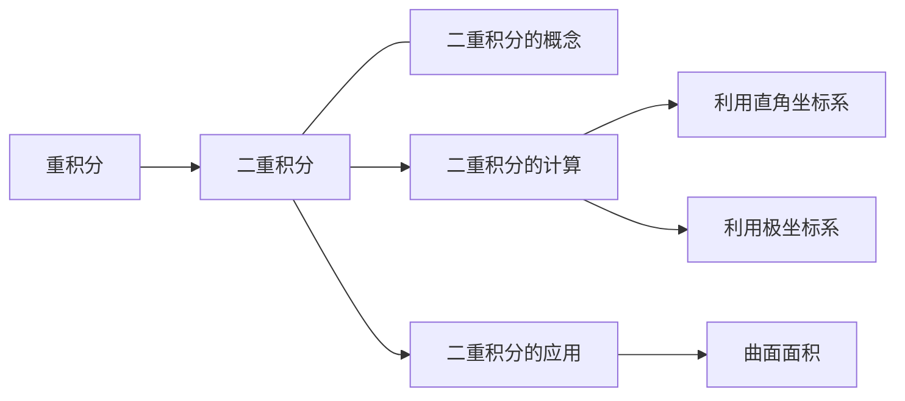

# 6 多元函数积分学

## 6.1 重积分

### 6.1.1 二重积分

#### 6.1.1.1 二重积分的定义及几何意义

$$
\iint\limits_D f(x,y) d\sigma = \lim_{\lambda \to 0} \sum_{i=1}^{n} f(\xi_i, \eta_i) \Delta \sigma_i
$$

#### 6.1.1.2 二重积分的性质

1 比较定理

如果 $f(x, y) \leq g(x, y)$，那么 $\iint\limits_D f(x, y) d\sigma \leq \iint\limits_D g(x, y) d\sigma$。

2 估值定理

如果 $m \leq f(x, y) \leq M$，$S$ 是 $D$ 的面积，那么 $mS \leq \iint\limits_D f(x, y) d\sigma \leq MS$。

3 中值定理

如果 $f(x, y)$ 在 $D$ 上连续，那么存在 $(\xi, \eta) \in D$，使得 $\iint\limits_D f(x, y) d\sigma = f(\xi, \eta) S$。

#### 6.1.1.3 二重积分的计算

##### 6.1.1.3.1 利用直角坐标系

1 适合先 $y$ 后 $x$ 的积分域

积分域 $D = \{(x, y) | a \leq x \leq b, \varphi_1(x) \leq y \leq \varphi_2(x)\}$，那么

$$
\iint\limits_D f(x, y) d\sigma = \int_{a}^{b} dx \int_{\varphi_1(x)}^{\varphi_2(x)} f(x, y) dy
$$

2 适合先 $x$ 后 $y$ 的积分域

积分域 $D = \{(x, y) | \varphi_1(y) \leq x \leq \varphi_2(y), c \leq y \leq d\}$，那么

$$
\iint\limits_D f(x, y) d\sigma = \int_{c}^{d} dy \int_{\varphi_1(y)}^{\varphi_2(y)} f(x, y) dx
$$

##### 6.1.1.3.2 利用极坐标系

前置知识: 极坐标的概念与和直角坐标的关系

---

##### 6.1.1.3.3 利用对称性和奇偶性进行计算
