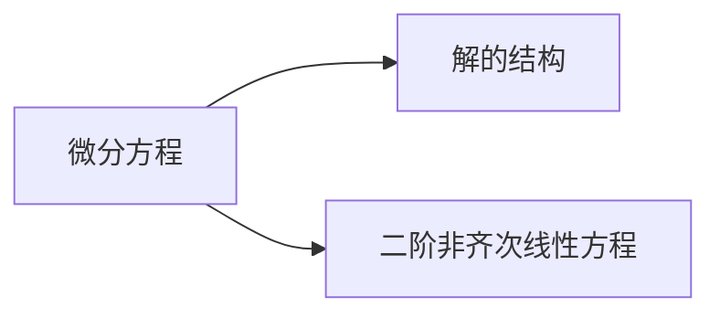

# 8 微分方程

本章考点

* 常徽分方程的基本概念
* 变量可分离的微分方程
* 齐次微分方程
* 一阶线性徽分方程
* 线性微分方程解的性质及解的结构定理
* 二阶常系数齐次线性微分方程
* 简单的二阶常系数非齐次线性微分方程
* 微分方程的简单应用

（仅数学一）

* 伯努利（Bernoulli）方程
* 全微分方程
* 可用简单的变量代换求解的某些微分方程欧拉（Euler）方程

（仅数学一、二）

* 可降阶的高阶微分方程
* 高于二阶的某些常系数齐次线性微分方程

（仅数学三）

* 差分与差分方程
* 差分方程的通解与特解一阶常系数线性差分方程的求解

## 8.1 一阶微分方程

### 8.1.1 微分方程的概念

总结 n阶线性微分方程的特点：

1. 各阶导数 $y^{(k)}$ 的次幂为1次或者0次，最高阶导数 $y^{(n)}$ 的次幂一定为1次；
2. 各阶导数 $y^{(k)}$ 只能以线性组合的形式出现。

### 8.1.2 几种特殊类型的一阶微分方程及其解法

#### 8.1.2.1 变量可分离的微分方程

$$
\frac{dy}{dx} = f(x)g(y)
$$

分离变量，两边积分

$$
\int \frac{dy}{g(y)} = \int f(x)dx + C
$$

#### 8.1.2.2 齐次微分方程

$$
\frac{dy}{dx} = f(x, y)
$$

令 $y = ux$，则 $f(x, y) = f(x, ux) = \phi(u)$

$$
u + x\frac{du}{dx} = \phi(u) \\
$$

分离变量，两边积分

$$
\int \frac{du}{\phi(u) - u} = \int \frac{dx}{x} + C = \ln|x| + C
$$

#### 8.1.2.3 一阶线性微分方程

$$
y' + p(x)y = q(x)
$$

其通解为

$$
y = e^{-\int p(x)dx} \left[\int q(x)e^{\int p(x)dx}dx + C\right]
$$

#### 8.1.2.5 全微分方程

若存在 $u(x, y)$，使得 $du = P(x, y)dx + Q(x, y)dy$，则微分方程 $P(x, y)dx + Q(x, y)dy = 0$ 为全微分方程。

$u(x, y) = C$ 为微分方程的通解。

为全微分方程的充要条件是 $\frac{\partial P}{\partial y} = \frac{\partial Q}{\partial x}, (x, y) \in D$

## 8.2 二阶及高阶微分方程

### 8.2.1 线性微分方程

### 8.2.2 线性微分方程解的性质

**解的结构**
若 $y_1(x), y_2(x)$ 为齐次方程 $y'' + p(x)y' + q(x)y = 0$ 的两个特解，则 $c_1y_1(x) + c_2y_2(x)$ 是原式的解。
若 $y_1(x), y_2(x)$ 线性无关，则原式通解为 $ y = c_1y_1(x) + c_2y_2(x)$

若 $ y_1(x) , y_2(x) $ 为非齐次方程 $y'' + p(x)y' + q(x)y = f(x)$ 的两个特解，则 $y_1(x) - y_2(x)$ 为对应齐次方程的**特解**

设 $y*$ 为...**@P178《基础巩固》**

**叠加原理**
若 $y_1(x), y_2(x)$ 分别为 $y'' + p(x)y' + q(x)y = f_1(x)$ 与 $y'' + p(x)y' + q(x)y = f_2(x)$ 的两个特解，
则 $y_1(x) + y_2(x) $ 为 $ y'' + p(x)y' + q(x)y = f_1(x) + f_2(x) $ 的特解

常系数非齐次线性微分方程

一般形式 $y'' + py' + qy = f(x)$

case1 $f(x) = e^{\lambda x}P_m(x)$
$y^{*}  = x^{k}R_m(x)e^{\lambda x}$

case 2 $f(x) = e^{\lambda x}[P_l(x)\cos\omega x + Q_n(x)\sin\omega x]$
$y^{*} = x^{k}e^{\lambda x}[R_m^{(1)}(x)\cos\omega x + R_m^{(2)}(x)\sin\omega x]$

## 8.3 微分方程的应用

### 8.3.1 几何问题

### 8.3.2 变化率问题
