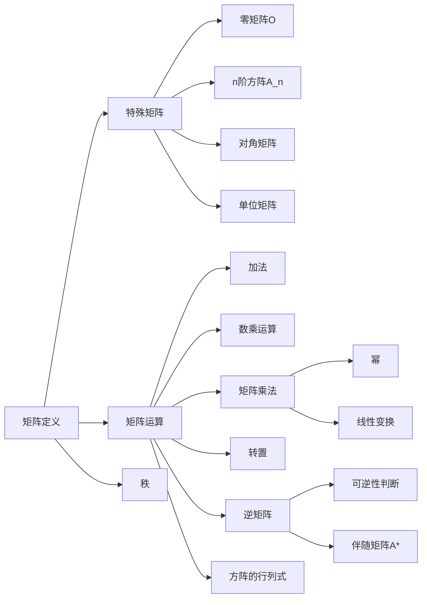
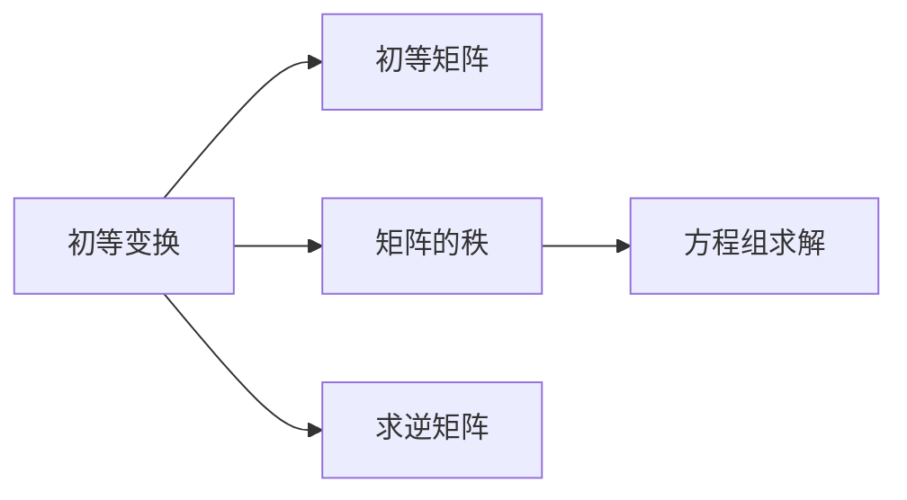

# 2 矩阵

---

原 -- 第三章 矩阵的初等变换与线性方程组的求解

## 2.1 矩阵的概念及运算

### 2.1.1 矩阵的概念

一个 $m$ 行 $n$ 列的矩阵可以表示为：

$$
\begin{bmatrix}
a_{11} & a_{12} & \cdots & a_{1n} \\
a_{21} & a_{22} & \cdots & a_{2n} \\
\vdots & \vdots & \ddots & \vdots \\
a_{m1} & a_{m2} & \cdots & a_{mn}
\end{bmatrix}
$$

其中，$a_{ij}$ 表示第 $i$ 行第 $j$ 列的元素。

所有元素都为 0 的矩阵称为零矩阵，记作 $O$。

n 阶方阵：行数和列数相等的矩阵，记作 $A_n = [a_{ij}]_{n \times n}$

对角阵：记为 $D = \mathrm{diag}(d_1, d_2, \cdots, d_n)$，其中 $d_1, d_2, \cdots, d_n$ 为对角线上的元素，其余元素为 0。

数量阵：对角元素都相等的对角阵，记作 $kE$，其中 $E$ 为单位矩阵。

单位矩阵：对角线上的元素都为 1，其余元素为 0 的矩阵，记作 $E$ 或 $I$。

列向量：只有一列的矩阵，记作 $\begin{bmatrix} a_1 \\ a_2 \\ \vdots \\ a_n \end{bmatrix}$

### 2.1.2 矩阵的运算

加乘乘转方逆

1 矩阵加法

$A = [a_{ij}], B = [b_{ij}]$ 为 $m \times n$ 矩阵，则 $C = [c_{ij}] = [a_{ij}+b_{ij}] = A+B$ 称为矩阵 $A$ 与 $B$ 的和

对应元素相加

---

2 矩阵乘法

$A = [a_{ij}]$ 为 $m \times n$ 矩阵， $B = [b_{ij}]$ 为 $n \times s$ 矩阵，则 $m \times s$ 矩阵 $C = [c_{ij}] = AB$ ，其中

$$
c_{ij} = \sum_{k=1}^n a_{ik} b_{kj}
$$

（前一个矩阵的行乘以后一个矩阵的列，前面的行数和后面的列数要相等）

也就是说，要计算 $C$ 的第 $i$ 行第 $j$ 列的元素，我们要把 $A$ 的第 $i$ 行的元素和 $B$ 的第 $j$ 列的元素一一相乘，然后把这些乘积加起来。

矩阵乘法的法则

* 结合律：$(AB)C = A(BC)$
* 分配律：$A(B+C) = AB + AC$，$(B+C)A = BA + CA$
* 数乘结合律：$(rs)A = r(sA)$
* 数乘分配律：$r(A+B) = rA + rB$，$(A+B)r = Ar + Br$
* 单位矩阵：$AE = EA = A$，其中 $E$ 是单位矩阵
* 零矩阵：$AO = OA = O$，其中 $O$ 是零矩阵

需要注意的是，矩阵乘法**不满足**交换律，即一般来说 $AB \neq BA$。

关于对角矩阵

$$
\begin{bmatrix}
a_1 & 0 & \cdots & 0 \\
0 & a_2 & \cdots & 0 \\
\vdots & \vdots & \ddots & \vdots \\
0 & 0 & \cdots & a_n
\end{bmatrix} \times
\begin{bmatrix}
b_1 & 0 & \cdots & 0 \\
0 & b_2 & \cdots & 0 \\
\vdots & \vdots & \ddots & \vdots \\
0 & 0 & \cdots & b_n
\end{bmatrix} =
\begin{bmatrix}
a_1b_1 & 0 & \cdots & 0 \\
0 & a_2b_2 & \cdots & 0 \\
\vdots & \vdots & \ddots & \vdots \\
0 & 0 & \cdots & a_nb_n
\end{bmatrix}
$$

---

$(A B C)^T = C^T B^T A^T$

$$
A A^* = \begin{bmatrix}
a_{11} & a_{12} & a_{13} \\
a_{21} & a_{22} & a_{23} \\
a_{31} & a_{32} & a_{33}
\end{bmatrix}
\begin{bmatrix}
A_{11} & A_{21} & A_{31} \\
A_{12} & A_{22} & A_{32} \\
A_{13} & A_{23} & A_{33}
\end{bmatrix} \\
= \begin{bmatrix}
|A| & 0 & 0 \\
0 & |A| & 0 \\
0 & 0 & |A|
\end{bmatrix}
= |A|^3 E
$$

---

矩阵逆的性质

1. $A^* A = A A^* = |A|E$
2. $A \frac{A^*}{|A|} = E \to A^{-1} = \frac{A^*}{|A|}$
3. $\frac{A^*}{|A|} A^* = \frac{A^* A}{|A|} = E \to (A^*)^{-1} = \frac{A^*}{|A|}$
4. $A^* = |A| A^{-1}$
5. $|A^*| = |A|^n |A^{-1}| = |A|^{n-1}$
6. $(A^*)^* = |A|^{n-2} A$
7. $｜(A^*)^*｜ = |A|^{n(n-2)} |A| = |A|^{n^2 - 2n + 1}$
8. $(kA) (\frac{1}{k}A^{-1}) = E \to (kA)^{-1} = \frac{1}{k} A^{-1}$
9. $(ABC) (C^{-1}B^{-1}A^{-1}) = E \to (ABC)^{-1} = C^{-1}B^{-1}A^{-1}$

建议将「伴随」问题转化为「逆」问题

---

矩阵的高次幂运算

1. $A = \alpha \beta^T \Rightarrow A^n = \alpha \beta^T \alpha \beta^T \cdots \alpha \beta^T = \alpha (\beta^T \alpha)^{n-1} \beta^T$
2. $A = E + B$，其中 $B$ 特殊
3. 归纳法

## 2.3 特殊矩阵

$A^{T}$ : 转置矩阵。将一个矩阵沿着对角线翻转，即交换矩阵的行和列，得到另一个矩阵。用数学符号来表示，如果

$$
A = [a_{ij}]_{m \times n}
$$

那么

$$
A^T = [a_{ij}]_{n \times m}
$$

也就是说，要求 $A$ 的转置矩阵，我们只需要把 $A$ 的第 $i$ 行变成 $A^T$ 的第 $i$ 列，把 $A$ 的第 $j$ 列变成 $A^T$ 的第 $j$ 行。

(from GoodNotes)

1. $(A^T)^T = A$
2. $(A + B)^T = A^T + B^T$
3. $(rA)^T = rA^T$
4. $(AB)^T = B^TA^T$

---

3 伴随矩阵

$A^*$ : 伴随矩阵。将一个方阵的每个元素替换为它的余子式，然后将这个矩阵转置，得到另一个方阵。用数学符号来表示，如果

$$
A = [a_{ij}]_{n \times n}
$$

那么

$$
A^* = [A_{ij}]_{n \times n}^T
$$

其中，$A_{ij}$ 表示 $a_{ij}$ 的代数余子式，即去掉第 $i$ 行第 $j$ 列后的子式的行列式乘以 $(-1)^{i+j}$。

$A* =$ 代数余子式转置

---

4 可逆矩阵

矩阵 $B$ 使得 $AB = BA =E$，$B$ 是 $A$ 的逆矩阵

$A$ 可逆 $\Leftrightarrow |A| \neq 0$

$A$ 可逆 $\Leftrightarrow r(A) = n$

$A$ 可逆 $\Leftrightarrow A$ 的行列式不为零

$A$ 可逆 $\Leftrightarrow A$ 的伴随矩阵可逆

$A$ 可逆 $\Leftrightarrow A$ 的行(列)向量组线性无关

$A$ 可逆 $\Leftrightarrow Ax = 0$ 有非零解

$A$ 可逆 $\Leftrightarrow A^TA$ 为正定矩阵

---

6 正交矩阵

满足

$$
AA^{T} = A^{T}A = E \\
\Leftrightarrow A^T = A^{-1} \\
\Leftrightarrow \space |A|^2 = 1
$$

---

(重要定理)

行列式乘法公式 $A, B$ 为 $n$ 阶方阵，则

$$
|AB| = |A| \cdot |B|
$$

$n$ 阶矩阵 $A$ 可逆

$$
\Leftrightarrow |A| \neq 0 \\
\Leftrightarrow r(A) = n \\
\Leftrightarrow \mathrm{线性无关} \\
\Leftrightarrow \dots
$$

* A 与单位矩阵等价
* 0 不是矩阵 A 的特征值

若 $A$ 是 $n$ 阶矩阵且满足 $AB = E$，则必有 $BA = E$

---

主要公式

1 转置

$$
(A^{T})^{T} = A
$$

$$
(A+B)^{T} = A^{T} + B^{T}
$$

$$
(kA)^{T} = k A^{T}
$$

$$
(AB)^{T} = B^{T} A^{T}
$$

2 可逆

$$
(A^{-1})^{-1} = A; (kA)^{-1} = \frac{1}{k} A^{-1}
$$

$$
(AB)^{-1} = B^{-1} A^{-1}; (A^{n})^{-1} = (A^{-1})^{n}
$$

$$
(A^{-1})^{T} = (A^{T})^{-1}; |A^{-1}| = \frac{1}{|A|}
$$

$$
A^{-1} = \frac{1}{|A|}A^{*}
$$

3 伴随

1. $AA^* = |A|E$
2. $A^* = |A|A^{-1}$
3. $(kA^*) = \frac{1}{k}A^*$
4. $(AB)^{-1} = B^{-1}A^{-1}$
5. $(A^n)^{-1} = (A^{-1})^n$
6. $(A^{-1})^T = (A^T)^{-1}$
7. $|A^{-1}| = \frac{1}{|A|}$
8. $A^{-1} = \frac{1}{|A|}A^*$

## 2.3 矩阵的初等变换、初等矩阵

### 2.3.1 初等变换与初等矩阵的概念

* 互换变换
* 倍乘变换
* 倍称转加变换

1. 两行互换
2. 某一行乘以非零常数 $k$
3. 某一行的 $k$ 倍加到另一行

通过引入初等矩阵，可以将矩阵的初等行变换表示为矩阵乘法
左乘变行，右乘变列

$A \cong B$: $A$ 经过有限次初等变换可以变成矩阵 $B$，称为 $A$ 与 $B$ 等价

### 2.3.2 初等矩阵与初等变换的性质

初等矩阵的逆

1 $E_{ij}^{-1} = E_{ij}$

$$
\begin{bmatrix}
    0 & 0 & 1 \\
    0 & 1 & 0 \\
    1 & 0 & 0
\end{bmatrix}
\begin{bmatrix}
    0 & 0 & 1 \\
    0 & 1 & 0 \\
    1 & 0 & 0
\end{bmatrix}
= \begin{bmatrix}
    1 & 0 & 0 \\
    0 & 1 & 0 \\
    0 & 0 & 1
\end{bmatrix}
$$

2 $(E_{i}(k))^{-1} = E_{i}(\frac{1}{k})$

3 $(E_{ij}(k))^{-1} = E_{ij}(-k)$

### 2.3.3 行阶梯形矩阵、行最简形矩阵、标准形矩阵

用初等变换求 $A^{-1}$

## 2.6 秩 Rank

矩阵 $A$ 的秩是指 $A$ 通过初等变换，化为行阶梯形矩阵，非零行的行数，记作 $r(A)$

秩数不等式

1. $r(A+B) \leq r(A) + r(B)$ 越加越小
2. $r(AB) \leq \min(r(A), r(B))$ 越乘越小
3. $r(A_{m \times n}) \leq \min(m, n)$ 小于行数或列数
4. $A_{m \times n} \cdot B_{n \times p} = 0 \Rightarrow r(A) + r(B) \leq n$ 重要！
5. $r(A) + r(B) \geq n + r(AB)$ （据说是没考过）
6. $r(B_n) = n \Rightarrow r(A B_n) = r(A)$ 可逆矩阵不改变秩数
7. $|A_n| \neq 0 \Leftrightarrow r(A_n) = n$ 可逆矩阵的秩数等于阶数
   $|A_n| = 0 \Leftrightarrow r(A_n) < n$ 不可逆矩阵的秩数小于阶数
