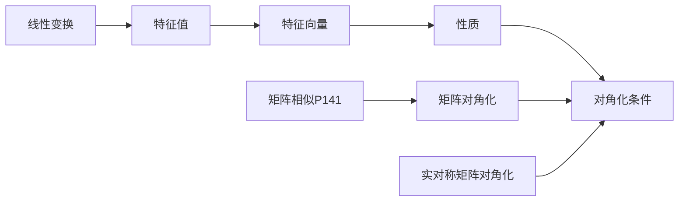

# 5 特征值与特征向量

## 5.1 特征值与特征向量

定义1 设 $A$ 是 $n$ 阶方阵，如果存在数 ${\lambda}$ 和 $n$ 维非零向量 $x$, 使 $Ax = {\lambda}x$ 成立
则称 ${\lambda}$ 为方阵 $A$ 的特征值，非零向量 $x$ 称为 $A$ 的对应于特征值 ${\lambda}$ 的一个特征向量

求解特征值和特征向量的步骤：

第一步：解关于入的一元n次方程 $\lvert A - {\lambda}E\rvert = 0$,求出方程的所有根,每一个根 ${\lambda}_i$，就是一个特征值；

第二步：依次对每个特征值求其对应的特征向量．对于 ${\lambda} = {\lambda}_i$,由齐次线性方程组 $ (A- {\lambda}_iE)=0 $,可求得其基础解系 $p_1,p_2, ... ,p_s$，则得到 $A$ 的对应于特征值 ${\lambda}$ 的全部特征向量,即为 $p = k_1p_1 + k_2p_2 + k_s p_s$（k_1, ... ,k_s是不全为0的任意数）

## 5.2 相似矩阵

设 $A, B$ 是两个 $n$ 阶矩阵，如果存在可逆矩阵 $P$，使得 $B = P^{-1}AP$，则称 $B$ 是 $A$ 的相似矩阵，$A$ 相似于 $B$，记作 $A \sim B$

若 $A \sim \Lambda$，其中 $\Lambda$ 是对角矩阵，则称 $A$ 可对角化，$\Lambda$ 是 $A$ 的相似标准形

相似的性质：

1. 反身性：$A \sim A$
2. 对称性：若 $A \sim B$，则 $B \sim A$
3. 传递性：若 $A \sim B$，$B \sim C$，则 $A \sim C$

相似的必要条件：

1. 特征多项式相同，即 $\lvert A - {\lambda}E\rvert = \lvert B - {\lambda}E\rvert$
2. $A, B$ 有相同的特征值
3. $r(A) = r(B)$
4. $|A| = |B| = \prod_{i=1}^{n}{\lambda}_i$
5. $\sum_{i=1}^{n}a_{ii} = \sum_{i=1}^{n}b_{ii} = \sum_{i=1}^{n}{\lambda}_i$

求可逆矩阵 $P$ 使 $B = P^{-1}AP$ 的步骤：

1. 求出 $A$ 的特征值 ${\lambda}_1, {\lambda}_2, ... , {\lambda}_n$，并求出对应于每个特征值的特征向量 $a_1, a_2, ... , a_n$
2. 将特征向量 $a_1, a_2, ... , a_n$ 组成矩阵 $P = (a_1, a_2, ... , a_n)$，则 $P$ 是可逆矩阵

## 5.3 实对称矩阵

实对称矩阵的性质：

1. 实对称矩阵必可相似对角化
2. 实对称矩阵的.....
