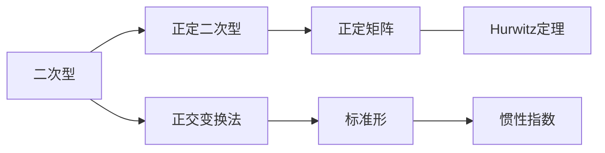

# 6 二次型

## 6.1 二次型及其标准型

二次型的定义

n 个变量 $ x_1, x_2, ... , x_n $ 的二次齐次多项式

$$
f(x_1, x_2, ... , x_n) = \sum_{i=1}^{n}\sum_{j=1}^{n}a_{ij}x_ix_j
$$

可以用矩阵的形式表示为

$$
f(x) = \sum_{i=1}^{n}\sum_{j=1}^{n}a_{ij}x_ix_j \\
= \begin{bmatrix} x_1 & x_2 & ... & x_n \end{bmatrix} \begin{bmatrix} a_{11} & a_{12} & ... & a_{1n} \\ a_{21} & a_{22} & ... & a_{2n} \\ ... & ... & ... & ... \\ a_{n1} & a_{n2} & ... & a_{nn} \end{bmatrix} \begin{bmatrix} x_1 \\ x_2 \\ ... \\ x_n \end{bmatrix} = x^TAx
$$

其中 $ A = (a_{ij}) $ 是一个对称矩阵

二次型的标准形
二次型的规范形

二次型的秩: 二次型 $x^TAx$ 矩阵 $A$ 的秩

正惯性指数: 在二次型 $x^TAx$ 的标准型中, 正平方项的个数 $p$
负惯性指数: 在二次型 $x^TAx$ 的标准型中, 负平方项的个数 $q$

---

合同

设 $A, B$ 是两个 $n$ 阶矩阵, 如果存在可逆矩阵 $C$, 使得 $B = C^TAC$, 则称 $A$ 和 $B$ 是合同的

合同的性质:

1. 反身性: $A \cong A$
2. 对称性: 若 $A \cong B$, 则 $B \cong A$
3. 传递性: 若 $A \cong B$, $B \cong C$, 则 $A \cong C$

n 阶矩阵 $A$ 和 $B$ 合同的充要条件:

1. 存在可逆矩阵 $C$, 使得 $B = C^TAC$
2. $A$ 经过有限次初等变换可以化为 $B$
3. $A^T$ 与 $B^T$ 合同

n 阶对称矩阵 $A$ 和 $B$ 合同的充要条件:

1. $A$ 和 $B$ 具有相同的正惯性指数和负惯性指数
2. $r(A) = r(B)$ 且 $A$ 与 $B$ 的有相同的正惯性指数

n 阶矩阵 $A$ 和 $B$ 合同的必要条件:

1. $r(A) = r(B)$
2. $|A|$ 与 $|B|$ 同号
3. $A$ 与 $B$ 均为对称矩阵或均为非对称矩阵
4. $A + A^T$ 与 $B + B^T$ 合同

n 阶矩阵 $A$ 和 $B$ 合同的充分条件:

1. n阶对称矩阵 $A$ 和 $B$ 相似

---

用正交变换法将二次型化为标准型

1. 写出二次型矩阵 $A$ 的特征值和特征向量
2. 将特征向量单位化
3. 构造正交矩阵 $Q = (\lambda_1, \lambda_2, ... , \lambda_n)$ ........

## 6.2 正定二次型

正定二次型的定义

$$
f(x_1, x_2, ... , x_n) = \sum_{i=1}^{n}\sum_{j=1}^{n}a_{ij}x_ix_j = x^TAx > 0
$$

对任何非零向量 $x = (x_1, x_2, ... , x_n)^T$ 都有 $x^TAx > 0$, 则称二次型 $f(x)$ 是正定的，对应的矩阵 $A$ 是正定矩阵

$f$ 是正定的充要条件：

1. $A$ 的正惯性指数 $p = n$
2. $A \cong E$ , 即存在可逆矩阵 $C$, 使得 $C^TAC = E$
3. $A = D^TD$, 其中 $D$ 是可逆矩阵
4. $A$ 的特征值全为正数
5. $A$ 的顺序主子式全为正数

$f$ 是正定的充分条件：

1. $A$ 的主对角线元素全为正数
2. $A$ 的行列式 $|A| > 0$
